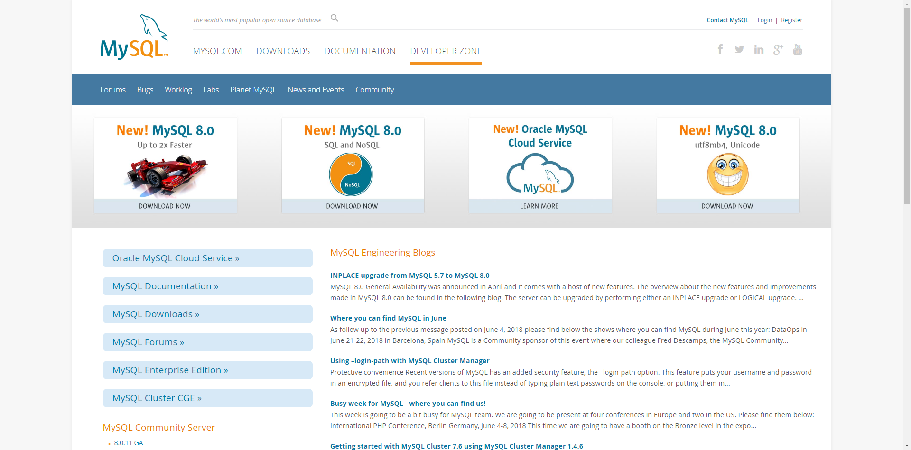
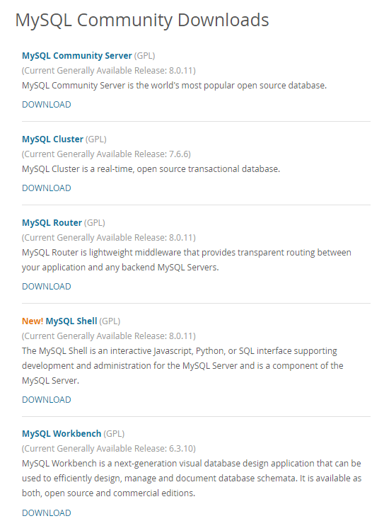
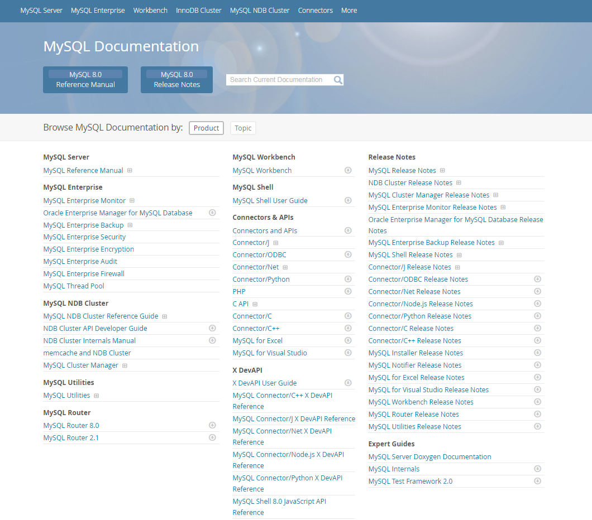
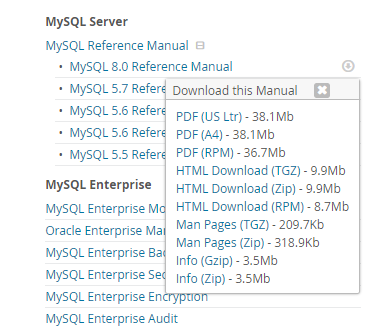

<!-- toc --> 

* * * * *


# 一、MySQL版本的选择
MySQL5.6以后，推荐采用官方的版本
percona：percona提供的工具集很多可以多多使用，但是还是用官方的吧
mariadb：无innodb；核心代码较老

# 二、官网介绍
## 1.官方网站： https://dev.mysql.com/


## 2.企业版：略过
## 3.社区版介绍



* MySQL Community Server： MySQL server
* MySQL Cluster： MySQL Cluster是一个实时的事务数据库，专为在高吞吐量条件下快速、始终开启数据访问而设计
* MySQL Router ：轻量级的中间件，可在应用程序和任何后端MySQL服务器之间提供透明路由。
* MySQL Shell：MySQL Shell是一个交互式Javascript，Python或SQL接口，支持MySQL服务器的开发和管理，并且是MySQL服务器的一个组件。
* MySQL Workbench ：MySQL Workbench是新一代可视化数据库设计应用程序，可用于高效设计，管理和记录数据库模式。
* MySQL Connectors：MySQL提供标准数据库驱动程序连接，以便将MySQL与具有与行业标准ODBC和JDBC兼容的应用程序和工具一起使用。
* MySQL Utilities ：MySQL应用的程序包，新版本已经迁移到MySQL shell上面去了。

## 4.MySQL文档
https://dev.mysql.com/doc/

离线文档下载：


## 5.MySQL下载介绍


> 推荐下载linux-generic的版本
> source版本主要用来调试，自己编译对性能提升不明显而且耗时间
> 推荐使用5.6以上版本，现在8.0已经GA了，所以更要用高版本了！

# 三、二进制方式的MySQL安装
## 1.下载二进制包
https://dev.mysql.com/downloads/mysql/  

https://dev.mysql.com/downloads/mysql/5.7.html#downloads
linux操作系统下,下载linux-generic

> **注意! 不要用自己编译的!直接用编译好的版本即可!!!**

## 2.阅读官方的安装文档
## 大致的步骤如下:
```
shell> groupadd mysql
shell> useradd -r -g mysql -s /bin/false mysql
shell> cd /usr/local
shell> tar zxvf /path/to/mysql-VERSION-OS.tar.gz
shell> ln -s full-path-to-mysql-VERSION-OS mysql
shell> cd mysql
shell> mkdir mysql-files
shell> chown mysql:mysql mysql-files
shell> chmod 750 mysql-files
shell> bin/mysqld --initialize --user=mysql
shell> bin/mysql_ssl_rsa_setup               # 5.6这一步是可选的,5.7是必需的!
shell> bin/mysqld_safe --user=mysql &
# Next command is optional
shell> cp support-files/mysql.server /etc/init.d/mysql.server
```

5.6版本的过程是这样的，有些差别（初始化数据库的时候命令不一样）
```
shell> groupadd mysql
shell> useradd -r -g mysql -s /bin/false mysql
shell> cd /usr/local
shell> tar zxvf /path/to/mysql-VERSION-OS.tar.gz
shell> ln -s full-path-to-mysql-VERSION-OS mysql
shell> cd mysql
shell> scripts/mysql_install_db --user=mysql
shell> bin/mysqld_safe --user=mysql &
# Next command is optional
shell> cp support-files/mysql.server /etc/init.d/mysql.server
```
另外，在初始化的时候，可能会报错:FATAL ERROR: please install the following Perl modules before executing scripts/mysql_install_db: Data::Dumper
解决方法：安装包autoconf


```
卸载已经默认安装的包
shell> rpm -e --nodeps pks-name
```

## 3.安装依赖包
MySQL依赖于libaio 库。如果这个库没有在本地安装, 数据目录初始化和后续的服务器启动步骤将会失败。  
故需要先将这个包安装上去.
```
shell> yum install libaio
```

## 4.创建mysql用户和用户组
```
shell> groupadd mysql
shell> useradd -r -g mysql -s /bin/false mysql
```
<kbd>因为只想让mysql用户仅用于运行mysql服务，而不是登录；此使用useradd -r和-s /bin/false的命令选项来创建对服务器主机没有登录权限的用户。</kbd>

## 5.解压到指定的目录
```
shell> cd /usr/local
shell> tar zxvf /path/to/mysql-VERSION-OS.tar.gz
shell> ln -s full-path-to-mysql-VERSION-OS mysql
```

## 6.配置数据库目录
```
数据目录：/u01/mysql/mysql_data
参数文件my.cnf：/etc/my.cnf
错误日志log-error：/u01/mysql/log/mysql_error.log
二进制日志log-bin：/u01/mysql/log/mysql_bin.log
慢查询日志slow_query_log_file：/u01/mysql/log/mysql_slow_query.log
```

```
shell> mkdir -p /u01/mysql/{mysql_data,log,mysql_undolog,mysql_redolog}
shell> chown -R mysql.mysql /u01/mysql
```

> 注意:
> 建议在生产环境安装的时候,将data目录和日志目录单独存放,这样对升级较为方便,减少不必要的麻烦
> 另外一般来说,只有data目录的是mysql.mysql,其实是mysql.root


## 7.配置my.cnf
my.cnf的内容,建议如下:
```
[mysqld]
####basic settings####
server-id = 11
port = 3306
user = mysql
#bind_address = 192.168.0.175
#autocommit = 0
character_set_server=utf8mb4
skip_name_resolve = 1
max_connections = 800
max_connect_errors = 1000
datadir = /u01/mysql/mysql_data/
transaction_isolation = READ-COMMITTED
explicit_defaults_for_timestamp = 1
join_buffer_size = 134217728
tmp_table_size = 67108864
tmpdir = /tmp
max_allowed_packet = 16777216
sql_mode = "STRICT_TRANS_TABLES,NO_ENGINE_SUBSTITUTION,NO_ZERO_DATE,NO_ZERO_IN_DATE,ERROR_FOR_DIVISION_BY_ZERO,NO_AUTO_CREATE_USER"
interactive_timeout = 1800
wait_timeout = 1800
read_buffer_size = 16777216
read_rnd_buffer_size = 33554432
sort_buffer_size = 33554432
####log settings####
log_error = /u01/mysql/log/mysql_error.log
slow_query_log = 1
slow_query_log_file = /u01/mysql/log/mysql_slow_query.log
log_queries_not_using_indexes = 1
log_slow_admin_statements = 1
log_slow_slave_statements = 1
log_throttle_queries_not_using_indexes = 10
expire_logs_days = 90
long_query_time = 2
min_examined_row_limit = 100
####replication settings####
master_info_repository = TABLE
relay_log_info_repository = TABLE
log_bin = bin.log
sync_binlog = 1
gtid_mode = on
enforce_gtid_consistency = 1
log_slave_updates
binlog_format = row
relay_log = relay.log
relay_log_recovery = 1
binlog_gtid_simple_recovery = 1
slave_skip_errors = ddl_exist_errors
####innodb settings####
innodb_page_size = 8192
innodb_buffer_pool_size = 4G
innodb_buffer_pool_instances = 8
innodb_buffer_pool_load_at_startup = 1
innodb_buffer_pool_dump_at_shutdown = 1
innodb_lru_scan_depth = 2000
innodb_lock_wait_timeout = 5
innodb_io_capacity = 4000
innodb_io_capacity_max = 8000
innodb_flush_method = O_DIRECT
innodb_file_format = Barracuda
innodb_file_format_max = Barracuda
innodb_log_group_home_dir = /u01/mysql/mysql_redolog/
innodb_undo_directory = /u01/mysql/mysql_undolog/
innodb_undo_logs = 128
innodb_undo_tablespaces = 3
innodb_flush_neighbors = 1
innodb_log_file_size = 1G   #注意,生产环境建议调成4G+
innodb_log_buffer_size = 16777216
innodb_purge_threads = 4
innodb_large_prefix = 1
innodb_thread_concurrency = 64
innodb_print_all_deadlocks = 1
innodb_strict_mode = 1
innodb_sort_buffer_size = 67108864
####semi sync replication settings####
plugin_dir=/usr/local/mysql/lib/plugin
plugin_load = "rpl_semi_sync_master=semisync_master.so;rpl_semi_sync_slave=semisync_slave.so"
loose_rpl_semi_sync_master_enabled = 1
loose_rpl_semi_sync_slave_enabled = 1
loose_rpl_semi_sync_master_timeout = 5000

[mysqld-5.7]
innodb_buffer_pool_dump_pct = 40
innodb_page_cleaners = 4
innodb_undo_log_truncate = 1
innodb_max_undo_log_size = 2G
innodb_purge_rseg_truncate_frequency = 128
binlog_gtid_simple_recovery=1
log_timestamps=system
transaction_write_set_extraction=MURMUR32
show_compatibility_56=on
```

## 8.初始化
需要注意的一个地方是:5.7较5.6的改进和替换的脚本
```
5.7版本：
bin/mysqld --initialize --user=mysql  

5.6版本：
scripts/mysql_install_db --user=mysql
```
5.7初始化的时候默认会给root用户生成一个随机的密码，可以在error.log日志中找到
```
shell> grep 'temporary password' /u01/mysql/log/mysql_error.log
```
如果不想要随机密码，而是和5.6一样采用免密码的方式，则需要在初始化的时候加上参数--initialize-insecure
生成ssl
```
shell> bin/mysql_ssl_rsa_setup    
```

## 9.配置服务
```
[root@nazeebo mysql]# cp support-files/mysql.server /etc/init.d/suremysql
[root@nazeebo mysql]# chkconfig --add suremysql  #自启动
[root@nazeebo mysql]# chkconfig --list
```
从上面的命名可以看到，suremysql是自己命名的，所以生产上看需要来自定义

## 10.启动服务
```
[root@nazeebo mysql]# service suremysql start
Starting MySQL...                                          [  OK  ]
[root@nazeebo mysql]# ps -ef | grep mysql
root       333     1  1 15:32 pts/2    00:00:00 /bin/sh /usr/local/mysql/bin/mysqld_safe --datadir=/u01/mysql/mysql_data/ --pid-file=/u01/mysql/mysql_data//nazeebo.pid
mysql     1300   333 33 15:32 pts/2    00:00:01 /usr/local/mysql/bin/mysqld --basedir=/usr/local/mysql --datadir=/u01/mysql/mysql_data --plugin-dir=/usr/local/mysql/lib/plugin --user=mysql --log-error=/u01/mysql/log/mysql_error.log --pid-file=/u01/mysql/mysql_data//nazeebo.pid --port=3306
root      1345 32073  0 15:32 pts/2    00:00:00 grep mysql
root     32697 32371  0 15:28 pts/3    00:00:00 tail -f mysql_error.log
```

注意：如果没有按照第9步去配置一个service，那么可以直接用
```
mysqld_safe --user=mysql &
```
来进行启动，mysqld_safe是一个守护进程

## 11.配置环境变量
在/etc/profile 中加入:
export PATH=$PATH:/usr/local/mysql/bin

## 12.进行安全的配置
```
[root@nazeebo bin]# mysql_secure_installation

Securing the MySQL server deployment.

Enter password for user root:

The existing password for the user account root has expired. Please set a new password.

New password:

Re-enter new password:

VALIDATE PASSWORD PLUGIN can be used to test passwords
and improve security. It checks the strength of password
and allows the users to set only those passwords which are
secure enough. Would you like to setup VALIDATE PASSWORD plugin?

Press y|Y for Yes, any other key for No: y

There are three levels of password validation policy:

LOW    Length >= 8
MEDIUM Length >= 8, numeric, mixed case, and special characters
STRONG Length >= 8, numeric, mixed case, special characters and dictionary                  file

Please enter 0 = LOW, 1 = MEDIUM and 2 = STRONG: 0
Using existing password for root.

Estimated strength of the password: 100
Change the password for root ? ((Press y|Y for Yes, any other key for No) : no

 ... skipping.
By default, a MySQL installation has an anonymous user,
allowing anyone to log into MySQL without having to have
a user account created for them. This is intended only for
testing, and to make the installation go a bit smoother.
You should remove them before moving into a production
environment.

Remove anonymous users? (Press y|Y for Yes, any other key for No) : y
Success.


Normally, root should only be allowed to connect from
'localhost'. This ensures that someone cannot guess at
the root password from the network.

Disallow root login remotely? (Press y|Y for Yes, any other key for No) : y
Success.

By default, MySQL comes with a database named 'test' that
anyone can access. This is also intended only for testing,
and should be removed before moving into a production
environment.


Remove test database and access to it? (Press y|Y for Yes, any other key for No) : y
 - Dropping test database...
Success.

 - Removing privileges on test database...
Success.

Reloading the privilege tables will ensure that all changes
made so far will take effect immediately.

Reload privilege tables now? (Press y|Y for Yes, any other key for No) : y
Success.

All done!
```

注意:在MySQL5.7中修改密码用下面的SQL语句:
```
sql> update mysql.user set authentication_string=password('123456') where user='root';

或者:
sql> SET PASSWORD = 'new passwd';
sql> SET PASSWORD = PASSWORD(‘new password’); #5.6的写法
```

##  13.将时区导入mysql数据库
```
shell> mysql_tzinfo_to_sql /usr/share/zoneinfo | mysql -u root -p mysql
```
> 说明:  
> mysql内部有一个时区变量time_zone，会影响函数NOW()与CURTIME()的显示，而且会影响TIMESTAMP列的存储，因为TIMESTAMP列的值在存储时会从当前时区转换到UTC，取数据时再从UTC转换为当前时区。
time_zone的默认值时System，也可以设置为'+10:00' or '-8:00'.意思是与UTC的偏移一样。
如果需要设置为Europe/Helsinki', 'US/Eastern', or 'MET'.之类的名称，需要手动load数据到mysql的time zone information table,命令如上。

## 14.验证安装
```
[root@nazeebo bin]#  mysqladmin version -u root -p
Enter password:
mysqladmin  Ver 8.42 Distrib 5.7.21, for linux-glibc2.12 on x86_64
Copyright (c) 2000, 2018, Oracle and/or its affiliates. All rights reserved.

Oracle is a registered trademark of Oracle Corporation and/or its
affiliates. Other names may be trademarks of their respective
owners.

Server version		5.7.21-log
Protocol version	10
Connection		Localhost via UNIX socket
UNIX socket		/tmp/mysql.sock
Uptime:			22 min 14 sec

Threads: 1  Questions: 8648  Slow queries: 0  Opens: 121  Flush tables: 1  Open tables: 114  Queries per second avg: 6.482
```

## 参考
> https://dev.mysql.com/doc/refman/5.7/en/binary-installation.html

# 四、安装完成后要干的事情
* 1.注意安装过程中的第12步“进行安全的配置”
* 2.修改root用户的默认密码
* 3.创建应用使用的用户
* 4.授予权限


# 五、my.cnf参数简要说明
下面列举一些重要的参数说明
## 1.常规部分
```
[mysqld]
####basic settings####
server-id = 11  //用于标识
port = 3306 //端口号
user = mysql //哪个用户
#bind_address = 192.168.0.175
#autocommit = 0 //是否自动提交事务，0代表不自动，1代表自动
character_set_server=utf8mb4 //字符集
skip_name_resolve = 1
max_connections = 800 
max_connect_errors = 1000
datadir = /u01/mysql/mysql_data/
transaction_isolation = READ-COMMITTED
explicit_defaults_for_timestamp = 1
join_buffer_size = 134217728
tmp_table_size = 67108864
tmpdir = /tmp
max_allowed_packet = 16777216
sql_mode = "STRICT_TRANS_TABLES,NO_ENGINE_SUBSTITUTION,NO_ZERO_DATE,NO_ZERO_IN_DATE,ERROR_FOR_DIVISION_BY_ZERO,NO_AUTO_CREATE_USER"
interactive_timeout = 1800
wait_timeout = 1800
read_buffer_size = 16777216
read_rnd_buffer_size = 33554432
sort_buffer_size = 33554432
```

## 2.日志设定部分
```
####log settings####
log_error = /u01/mysql/log/mysql_error.log
slow_query_log = 1
slow_query_log_file = /u01/mysql/log/mysql_slow_query.log
log_queries_not_using_indexes = 1
log_slow_admin_statements = 1
log_slow_slave_statements = 1
log_throttle_queries_not_using_indexes = 10
expire_logs_days = 90
long_query_time = 2
min_examined_row_limit = 100
```

## 3.复制部分
```
####replication settings####
master_info_repository = TABLE
relay_log_info_repository = TABLE
log_bin = bin.log
sync_binlog = 1
gtid_mode = on
enforce_gtid_consistency = 1
log_slave_updates
binlog_format = row
relay_log = relay.log
relay_log_recovery = 1
binlog_gtid_simple_recovery = 1
slave_skip_errors = ddl_exist_errors

####semi sync replication settings####
plugin_dir=/usr/local/mysql/lib/plugin
plugin_load = "rpl_semi_sync_master=semisync_master.so;rpl_semi_sync_slave=semisync_slave.so"
loose_rpl_semi_sync_master_enabled = 1
loose_rpl_semi_sync_slave_enabled = 1
loose_rpl_semi_sync_master_timeout = 5000
```

## 4.innodb专属部分
```
####innodb settings####
innodb_page_size = 8192
innodb_buffer_pool_size = 4G 
innodb_buffer_pool_instances = 8
innodb_buffer_pool_load_at_startup = 1
innodb_buffer_pool_dump_at_shutdown = 1
innodb_lru_scan_depth = 2000
innodb_lock_wait_timeout = 5
innodb_io_capacity = 4000
innodb_io_capacity_max = 8000
innodb_flush_method = O_DIRECT
innodb_file_format = Barracuda
innodb_file_format_max = Barracuda
innodb_log_group_home_dir = /u01/mysql/mysql_redolog/
innodb_undo_directory = /u01/mysql/mysql_undolog/
innodb_undo_logs = 128 //建议提前规划好，后期改较为麻烦
innodb_undo_tablespaces = 3 //建议提前规划好，后期改较为麻烦
innodb_flush_neighbors = 1
innodb_log_file_size = 1G   //注意,生产环境建议调成4G+
innodb_log_buffer_size = 16777216
innodb_purge_threads = 4
innodb_large_prefix = 1
innodb_thread_concurrency = 64
innodb_print_all_deadlocks = 1
innodb_strict_mode = 1
innodb_sort_buffer_size = 67108864
```
## 5. 5.7版本专属
```
[mysqld-5.7]
innodb_buffer_pool_dump_pct = 40
innodb_page_cleaners = 4
innodb_undo_log_truncate = 1
innodb_max_undo_log_size = 2G
innodb_purge_rseg_truncate_frequency = 128
binlog_gtid_simple_recovery=1
log_timestamps=system
transaction_write_set_extraction=MURMUR32
show_compatibility_56=on
```
# 六、其他
有可能同一个系统下有多个my.cnf文件，所以my.cnf文件的读取顺序可以通过命令来查看
```
[root@nazeebo ~]# mysqld --help -vv|grep my.cnf
/etc/my.cnf /etc/mysql/my.cnf /usr/local/mysql/etc/my.cnf ~/.my.cnf 
                      my.cnf, $MYSQL_TCP_PORT, /etc/services, built-in default

```
可以在mysql启动的时候加上 --defaults-files来指定配置文件；
如果没有指定的话，则会读取所有的my.cnf文件中的配置，如果有相同的项，则会覆盖之前的值 


# 七、升级与降级
一般来说，建议数据文件(datadir所对应的位置)的存放位置和MySQL的相关二进制文件位置分开，这样方便对数据库做版本的升级和降级。

## 1.升级方法
* 就地升级：关闭旧的MySQL版本，用新版本替换旧的MySQL二进制文件或包，在现有的数据目录下重新启动MySQL，并运行 mysql_upgrade。

* 逻辑升级：使用 mysqldump从旧的MySQL版本导出现有数据 ，安装新的MySQL版本，将转储文件加载到新的MySQL版本，并运行 mysql_upgrade。

## 2.升级路径
* 仅在通用可用性（GA）版本之间支持升级。
* 支持从MySQL 5.6升级到5.7。在升级到下一个版本之前，建议升级到最新版本。例如，在升级到MySQL 5.7之前升级到最新的MySQL 5.6版本。
* 不支持跳过版本的升级。例如，不支持从MySQL 5.5直接升级到5.7。
* 支持发布系列中的升级。例如，从MySQL 5.7.x到5.7.y被支持。跳过发布也支持。例如，从MySQL 5.7.x到5.7.z。

## 3.升级前的准备
* 在升级之前，创建当前数据库和日志文件的备份。备份应包含mysql系统数据库，其中包含MySQL系统表。

* 查看 release note，其中提供了有关MySQL 5.7中新增功能的信息，或与老版本中的功能不同，其中一些更改可能导致不兼容。

* 参阅 [MySQL 5.7中删除的功能](https://dev.mysql.com/doc/refman/5.7/en/mysql-nutshell.html#mysql-nutshell-removals)。如果使用其中任何一项功能，升级需要对这些功能进行更改。

* 参阅[MySQL 5.7中添加，弃用或删除服务器和状态变量和选项](https://dev.mysql.com/doc/refman/5.7/en/added-deprecated-removed.html)。如果使用这些项目中的任何一项，则升级需要进行配置更改。

* 参阅[影响升级到MySQL 5.7的更改](https://dev.mysql.com/doc/refman/5.7/en/upgrading-from-previous-series.html)。注意在升级之前或之后可能需要采取操作的更改。

* 参阅[升级复制设置](https://dev.mysql.com/doc/refman/5.7/en/replication-upgrade.html)

* 如果使用了分布式事务InnoDB，XA RECOVER在升级之前运行以检查未提交的XA事务。如果返回结果，则通过发出XA COMMIT或 XA ROLLBACK声明来提交或回滚XA事务。

* 建议在安装或升级到新的MySQL版本时重建和重新安装MySQL语言界面。这适用于MySQL接口，例如PHP mysql扩展，Perl DBD::mysql模块和Python MySQLdb模块。

## 4.升级步骤
下面将展示一个简单的升级过程，目标是将5.6.40升级到5.7.22。
大致步骤如下：
1. 安全的停库
2. 去掉mysql的软link
3. 用新的版本link mysql (这个类似Oracle的数据库软件升级)
4. 修改相应的my.cnf配置文件
5. 启动mysql服务
6. 查看mysql的err log
7. upgrade系统表 (这个类似Oracle的数据库实例升级)


## 4.1 环境：
```
//软件
[root@nazeebo local]# ll |grep mysql
lrwxrwxrwx   1 root root        35 Jun 13 14:09 mysql -> mysql-5.6.40-linux-glibc2.12-x86_64
drwxr-xr-x  13 root root      4096 Jun 13 14:23 mysql-5.6.40-linux-glibc2.12-x86_64
-rw-r--r--   1 root root 328563044 Feb 26 20:10 mysql-5.6.40-linux-glibc2.12-x86_64.tar.gz
-rw-r--r--   1 root root 643790848 Mar  4 21:18 mysql-5.7.22-linux-glibc2.12-x86_64.tar.gz

//版本
[root@nazeebo local]# mysqladmin version -u root -p
Enter password: 
mysqladmin  Ver 8.42 Distrib 5.6.40, for linux-glibc2.12 on x86_64
Copyright (c) 2000, 2018, Oracle and/or its affiliates. All rights reserved.

Oracle is a registered trademark of Oracle Corporation and/or its
affiliates. Other names may be trademarks of their respective
owners.

Server version		5.6.40-log
Protocol version	10
Connection		Localhost via UNIX socket
UNIX socket		/tmp/mysql.sock
Uptime:			20 min 55 sec

Threads: 2  Questions: 10  Slow queries: 0  Opens: 70  Flush tables: 1  Open tables: 63  Queries per second avg: 0.007
[root@nazeebo local]# 

```

## 4.2 安全地停库
```
[root@nazeebo local]# systemctl stop suremysql

[root@nazeebo log]# tail -f  /u01/mysql/log/mysql_error.log 
2018-06-13 14:53:34 23144 [Note] Shutting down plugin 'CSV'
2018-06-13 14:53:34 23144 [Note] Shutting down plugin 'MEMORY'
2018-06-13 14:53:34 23144 [Note] Shutting down plugin 'MRG_MYISAM'
2018-06-13 14:53:34 23144 [Note] Shutting down plugin 'MyISAM'
2018-06-13 14:53:34 23144 [Note] Shutting down plugin 'sha256_password'
2018-06-13 14:53:34 23144 [Note] Shutting down plugin 'mysql_old_password'
2018-06-13 14:53:34 23144 [Note] Shutting down plugin 'mysql_native_password'
2018-06-13 14:53:34 23144 [Note] Shutting down plugin 'binlog'
2018-06-13 14:53:34 23144 [Note] /usr/local/mysql/bin/mysqld: Shutdown complete

```

## 4.3 unlink mysql
```
[root@nazeebo local]# unlink mysql
[root@nazeebo local]# ll
total 949620
drwxr-xr-x   5 root root      4096 Jun 13 11:42 aegis
drwxr-xr-x.  2 root root      4096 Nov  5  2016 bin
drwxr-xr-x.  2 root root      4096 Nov  5  2016 etc
drwxr-xr-x.  2 root root      4096 Nov  5  2016 games
drwxr-xr-x.  2 root root      4096 Nov  5  2016 include
drwxr-xr-x.  2 root root      4096 Nov  5  2016 lib
drwxr-xr-x.  2 root root      4096 Nov  5  2016 lib64
drwxr-xr-x.  2 root root      4096 Nov  5  2016 libexec
drwxr-xr-x  13 root root      4096 Jun 13 14:23 mysql-5.6.40-linux-glibc2.12-x86_64
-rw-r--r--   1 root root 328563044 Feb 26 20:10 mysql-5.6.40-linux-glibc2.12-x86_64.tar.gz
-rw-r--r--   1 root root 643790848 Mar  4 21:18 mysql-5.7.22-linux-glibc2.12-x86_64.tar.gz
drwxr-xr-x.  2 root root      4096 Nov  5  2016 sbin
drwxr-xr-x.  6 root root      4096 Jun 13 11:42 share
drwxr-xr-x.  2 root root      4096 Nov  5  2016 src
```

## 4.4 链接新的版本目录为mysql
```
[root@nazeebo local]# ln -s mysql-5.7.22-linux-glibc2.12-x86_64 mysql
[root@nazeebo local]# ll
total 949624
drwxr-xr-x   5 root root      4096 Jun 13 11:42 aegis
drwxr-xr-x.  2 root root      4096 Nov  5  2016 bin
drwxr-xr-x.  2 root root      4096 Nov  5  2016 etc
drwxr-xr-x.  2 root root      4096 Nov  5  2016 games
drwxr-xr-x.  2 root root      4096 Nov  5  2016 include
drwxr-xr-x.  2 root root      4096 Nov  5  2016 lib
drwxr-xr-x.  2 root root      4096 Nov  5  2016 lib64
drwxr-xr-x.  2 root root      4096 Nov  5  2016 libexec
lrwxrwxrwx   1 root root        35 Jun 13 14:57 mysql -> mysql-5.7.22-linux-glibc2.12-x86_64
drwxr-xr-x  13 root root      4096 Jun 13 14:23 mysql-5.6.40-linux-glibc2.12-x86_64
-rw-r--r--   1 root root 328563044 Feb 26 20:10 mysql-5.6.40-linux-glibc2.12-x86_64.tar.gz
drwxr-xr-x   9 root root      4096 Jun 13 14:56 mysql-5.7.22-linux-glibc2.12-x86_64
-rw-r--r--   1 root root 643790848 Mar  4 21:18 mysql-5.7.22-linux-glibc2.12-x86_64.tar.gz
drwxr-xr-x.  2 root root      4096 Nov  5  2016 sbin
drwxr-xr-x.  6 root root      4096 Jun 13 11:42 share
drwxr-xr-x.  2 root root      4096 Nov  5  2016 src
[root@nazeebo local]# 

```
注意此时只是软件的版本升级到了5.7.22，而之间建立好的数据库本身还是在5.6

## 4.5 启动mysql数据库
```
因为只是重新链接了mysql的目录到新的版本上，所以环境变量、服务之类的不需要变更
[root@nazeebo local]# systemctl start suremysql
```
## 4.6 查看mysql的error日志
```
这个时候在mysql的error日志中会发现有大量的报错，我们接下来需要upgrade数据字典
2018-06-13T15:00:18.514744+08:00 0 [ERROR] Native table 'performance_schema'.'replication_group_member_stats' has the wrong structure
2018-06-13T15:00:18.514765+08:00 0 [ERROR] Native table 'performance_schema'.'prepared_statements_instances' has the wrong structure
2018-06-13T15:00:18.514791+08:00 0 [ERROR] Native table 'performance_schema'.'user_variables_by_thread' has the wrong structure
2018-06-13T15:00:18.514818+08:00 0 [ERROR] Native table 'performance_schema'.'status_by_account' has the wrong structure
2018-06-13T15:00:18.514844+08:00 0 [ERROR] Native table 'performance_schema'.'status_by_host' has the wrong structure
2018-06-13T15:00:18.514865+08:00 0 [ERROR] Native table 'performance_schema'.'status_by_thread' has the wrong structure
2018-06-13T15:00:18.514885+08:00 0 [ERROR] Native table 'performance_schema'.'status_by_user' has the wrong structure
2018-06-13T15:00:18.514905+08:00 0 [ERROR] Native table 'performance_schema'.'global_status' has the wrong structure
2018-06-13T15:00:18.514923+08:00 0 [ERROR] Native table 'performance_schema'.'session_status' has the wrong structure
2018-06-13T15:00:18.514940+08:00 0 [ERROR] Native table 'performance_schema'.'variables_by_thread' has the wrong structure
2018-06-13T15:00:18.514969+08:00 0 [ERROR] Native table 'performance_schema'.'global_variables' has the wrong structure
2018-06-13T15:00:18.514990+08:00 0 [ERROR] Native table 'performance_schema'.'session_variables' has the wrong structure
2018-06-13T15:00:18.515103+08:00 0 [ERROR] Incorrect definition of table mysql.db: expected column 'User' at position 2 to have type char(32), found type char(16).
2018-06-13T15:00:18.515124+08:00 0 [ERROR] mysql.user has no `Event_priv` column at position 28
2018-06-13T15:00:18.515265+08:00 0 [ERROR] Event Scheduler: An error occurred when initializing system tables. Disabling the Event Scheduler.
2018-06-13T15:00:18.515461+08:00 0 [Note] /usr/local/mysql/bin/mysqld: ready for connections.
Version: '5.7.22-log'  socket: '/tmp/mysql.sock'  port: 3306  MySQL Community Server (GPL)

```
另外，此时进去看database的列表
```
mysql> show databases;
+--------------------+
| Database           |
+--------------------+
| information_schema |
| mysql              |
| performance_schema |
| test               |
+--------------------+
4 rows in set (0.00 sec)

```
发现5.7的sys库还没有安装上

## 4.7 upgrade系统表
```
[root@nazeebo local]# mysql_upgrade -s -p
Enter password: 
The --upgrade-system-tables option was used, databases won't be touched.
Checking if update is needed.
Checking server version.
Running queries to upgrade MySQL server.
Upgrading the sys schema.
Upgrade process completed successfully.
Checking if update is needed.
```
> 注意，参数-s 一定要加，代表的是只更新系统表，不会去更新数据表
> 如果不加-s参数，则会将库里面的所有表都是5.7.22的方式重新创建一次，生产环境慎用！
> 因为数据文件是二进制的，所以无需升级
> 唯一不需要加-s参数的时候是：对一些老版本的存储格式需要新的特性来提升性能的时候

完成upgrade之后，再进去查询版本和库的列表
```
[root@nazeebo local]# mysql -uroot -p
Enter password: 
Welcome to the MySQL monitor.  Commands end with ; or \g.
Your MySQL connection id is 5
Server version: 5.7.22-log MySQL Community Server (GPL)

Copyright (c) 2000, 2018, Oracle and/or its affiliates. All rights reserved.

Oracle is a registered trademark of Oracle Corporation and/or its
affiliates. Other names may be trademarks of their respective
owners.

Type 'help;' or '\h' for help. Type '\c' to clear the current input statement.

mysql> show databases;
+--------------------+
| Database           |
+--------------------+
| information_schema |
| mysql              |
| performance_schema |
| sys                |
| test               |
+--------------------+
5 rows in set (0.00 sec)

mysql> select version();
+------------+
| version()  |
+------------+
| 5.7.22-log |
+------------+
1 row in set (0.00 sec)
```
发现已经多出了5.7专有的sys库，以及版本以及变更为5.7.22
最后，我们再查询一下error日志，看是否还有报错等待去解决。

## 降级步骤
与升级的步骤类似，最后的upgrade，替换为执行一段downgrade的脚本，来让系统表回到指定的版本去

# 八、常用工具
workbench的使用