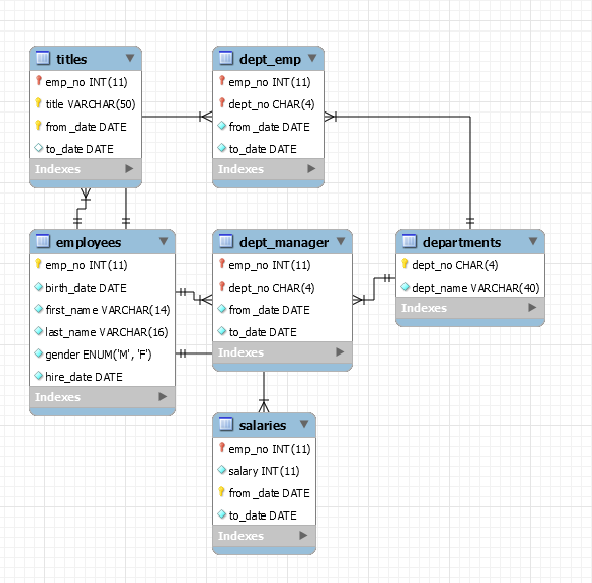

<!-- toc -->

* * * * *


终于到SQL语句了！

## SELECT语法树：
```
SELECT
-- -------------------------不推荐使用--------------------------
[ALL | DISTINCT | DISTINCTROW ]
[HIGH_PRIORITY]
[MAX_STATEMENT_TIME = N]
[STRAIGHT_JOIN]
[SQL_SMALL_RESULT] [SQL_BIG_RESULT] [SQL_BUFFER_RESULT]
[SQL_CACHE | SQL_NO_CACHE] [SQL_CALC_FOUND_ROWS]
-- -------------------------------------------------------------
select_expr [, select_expr ...]
[FROM table_references
[PARTITION partition_list]
[WHERE where_condition]
[GROUP BY {col_name | expr | position}
[ASC | DESC], ... [WITH ROLLUP]]
[HAVING where_condition]
[ORDER BY {col_name | expr | position}
[ASC | DESC], ...]
[LIMIT {[offset,] row_count | row_count OFFSET offset}]
[PROCEDURE procedure_name(argument_list)]
[INTO OUTFILE 'file_name'
[CHARACTER SET charset_name]
export_options
| INTO DUMPFILE 'file_name'
| INTO var_name [, var_name]]
[FOR UPDATE | LOCK IN SHARE MODE]]
```

## limit 和 order by
从employees中 随机 取出一条数据，结果是不确定的
```
mysql> use employees;
Database changed
mysql> select * from employees limit 1;
+--------+------------+------------+-----------+--------+------------+
| emp_no | birth_date | first_name | last_name | gender | hire_date  |
+--------+------------+------------+-----------+--------+------------+
|  10001 | 1953-09-02 | Georgi     | Facello   | M      | 1986-06-26 |
+--------+------------+------------+-----------+--------+------------+
1 row in set (0.00 sec)

```
使用order by col_name asc进行升序排序
```
mysql>  select * from employees order by emp_no asc limit 1;
+--------+------------+------------+-----------+--------+------------+
| emp_no | birth_date | first_name | last_name | gender | hire_date  |
+--------+------------+------------+-----------+--------+------------+
|  10001 | 1953-09-02 | Georgi     | Facello   | M      | 1986-06-26 |
+--------+------------+------------+-----------+--------+------------+
1 row in set (0.00 sec)
```
默认就是升序的
```
mysql> select * from employees order by emp_no limit 1;
+--------+------------+------------+-----------+--------+------------+
| emp_no | birth_date | first_name | last_name | gender | hire_date  |
+--------+------------+------------+-----------+--------+------------+
|  10001 | 1953-09-02 | Georgi     | Facello   | M      | 1986-06-26 |
+--------+------------+------------+-----------+--------+------------+
1 row in set (0.00 sec)
```
desc表示降序
通过order by排序后 limit 1 才是确定的
在这里，emp_no 是主键，order by 主键 不会创建临时表的，主键(索引)本身有序
```
mysql>  select * from employees order by emp_no desc limit 1;
+--------+------------+------------+-----------+--------+------------+
| emp_no | birth_date | first_name | last_name | gender | hire_date  |
+--------+------------+------------+-----------+--------+------------+
| 499999 | 1958-05-01 | Sachin     | Tsukuda   | M      | 1997-11-30 |
+--------+------------+------------+-----------+--------+------------+
1 row in set (0.00 sec)

mysql> show create table employees\G
*************************** 1. row ***************************
       Table: employees
Create Table: CREATE TABLE `employees` (
  `emp_no` int(11) NOT NULL,
  `birth_date` date NOT NULL,
  `first_name` varchar(14) NOT NULL,
  `last_name` varchar(16) NOT NULL,
  `gender` enum('M','F') NOT NULL,
  `hire_date` date NOT NULL,
  PRIMARY KEY (`emp_no`),   //注意：emp_no 是主键，order by 主键 不会创建临时表的，主键(索引)本身有序
  KEY `idx_emp_2` (`hire_date`)
) ENGINE=InnoDB DEFAULT CHARSET=utf8mb4
1 row in set (0.00 sec)
```
limit的语法
limit start, offset --从第5条开始取，取5条出来
```
mysql> select * from employees order by emp_no asc limit 5,5;
+--------+------------+------------+-----------+--------+------------+
| emp_no | birth_date | first_name | last_name | gender | hire_date  |
+--------+------------+------------+-----------+--------+------------+
|  10006 | 1953-04-20 | Anneke     | Preusig   | F      | 1989-06-02 |
|  10007 | 1957-05-23 | Tzvetan    | Zielinski | F      | 1989-02-10 |
|  10008 | 1958-02-19 | Saniya     | Kalloufi  | M      | 1994-09-15 |
|  10009 | 1952-04-19 | Sumant     | Peac      | F      | 1985-02-18 |
|  10010 | 1963-06-01 | Duangkaew  | Piveteau  | F      | 1989-08-24 |
+--------+------------+------------+-----------+--------+------------+
5 rows in set (0.00 sec)
```
以上这个语法有一种分页的效果，但是会随着start的增加，性能会下降，因为会扫描表(从 1 到 start)

相对比较推荐的方法
```
mysql> select * from employees where emp_no > 20000 order by emp_no limit 5;
+--------+------------+------------+-----------+--------+------------+
| emp_no | birth_date | first_name | last_name | gender | hire_date  |
+--------+------------+------------+-----------+--------+------------+
|  20001 | 1962-05-16 | Atreye     | Eppinger  | M      | 1990-04-18 |
|  20002 | 1955-12-25 | Jaber      | Brender   | M      | 1988-01-26 |
|  20003 | 1953-04-11 | Munehiko   | Coors     | F      | 1991-02-07 |
|  20004 | 1952-03-07 | Radoslaw   | Pfau      | M      | 1995-11-24 |
|  20005 | 1956-02-20 | Licheng    | Przulj    | M      | 1992-07-17 |
+--------+------------+------------+-----------+--------+------------+
5 rows in set (0.05 sec)

```

## where
WHERE 是将查询出来的结果，通过 WHERE 后面的条件(condition)，对结果进行过滤
### 示例

不加order by的limit是不确定的SQL
```
mysql> select * from employees  limit 4;
+--------+------------+------------+-----------+--------+------------+
| emp_no | birth_date | first_name | last_name | gender | hire_date  |
+--------+------------+------------+-----------+--------+------------+
|  10001 | 1953-09-02 | Georgi     | Facello   | M      | 1986-06-26 |
|  10002 | 1964-06-02 | Bezalel    | Simmel    | F      | 1985-11-21 |
|  10003 | 1959-12-03 | Parto      | Bamford   | M      | 1986-08-28 |
|  10004 | 1954-05-01 | Chirstian  | Koblick   | M      | 1986-12-01 |
+--------+------------+------------+-----------+--------+------------+
4 rows in set (0.00 sec)
```

对emp_no进行过滤
```
mysql> select * from employees where emp_no > 30000  limit 4;
+--------+------------+------------+-----------+--------+------------+
| emp_no | birth_date | first_name | last_name | gender | hire_date  |
+--------+------------+------------+-----------+--------+------------+
|  30001 | 1953-03-27 | Izaskun    | Morton    | M      | 1988-05-21 |
|  30002 | 1960-08-23 | Branimir   | Snedden   | M      | 1998-09-24 |
|  30003 | 1952-11-25 | Takahito   | Vilarrasa | M      | 1990-08-22 |
|  30004 | 1957-11-26 | Lucian     | Penttonen | F      | 1992-10-08 |
+--------+------------+------------+-----------+--------+------------+
4 rows in set (0.00 sec)

mysql> select * from employees where emp_no > 40000 order by emp_no limit 4;
+--------+------------+------------+-----------+--------+------------+
| emp_no | birth_date | first_name | last_name | gender | hire_date  |
+--------+------------+------------+-----------+--------+------------+
|  40001 | 1956-03-28 | Akemi      | Maliniak  | F      | 1987-08-06 |
|  40002 | 1960-03-15 | Nakhoon    | Badr      | M      | 1990-02-13 |
|  40003 | 1960-01-26 | Jacopo     | Marshall  | F      | 1991-09-30 |
|  40004 | 1955-09-09 | Anneke     | Stiles    | F      | 1986-03-05 |
+--------+------------+------------+-----------+--------+------------+
4 rows in set (0.01 sec)
```
可以用 and 进行 逻辑与
```
mysql>  select * from employees
    ->  where emp_no > 40000
    ->  and hire_date > '1991-01-01'
    ->  order by emp_no limit 4;
+--------+------------+------------+------------+--------+------------+
| emp_no | birth_date | first_name | last_name  | gender | hire_date  |
+--------+------------+------------+------------+--------+------------+
|  40003 | 1960-01-26 | Jacopo     | Marshall   | F      | 1991-09-30 |
|  40005 | 1961-02-27 | Zsolt      | Fairtlough | F      | 1991-07-08 |
|  40012 | 1955-02-07 | Chinhyun   | Ozeri      | F      | 1995-08-12 |
|  40015 | 1964-10-08 | Ioana      | Lemarechal | M      | 1997-08-07 |
+--------+------------+------------+------------+--------+------------+
4 rows in set (0.00 sec)
```
使用()明确条件的逻辑规则,可以使用 or 做 逻辑或
```
mysql> select * from employees
    -> where (emp_no > 40000 and birth_date > '1961-01-01') -- 使用()明确条件的逻辑规则
    -> or (emp_no > 40000 and hire_date > '1991-01-01') -- 可以使用 or 做 逻辑或
    -> order by emp_no limit 5;
+--------+------------+------------+------------+--------+------------+
| emp_no | birth_date | first_name | last_name  | gender | hire_date  |
+--------+------------+------------+------------+--------+------------+
|  40003 | 1960-01-26 | Jacopo     | Marshall   | F      | 1991-09-30 |
|  40005 | 1961-02-27 | Zsolt      | Fairtlough | F      | 1991-07-08 |
|  40006 | 1962-11-07 | Basim      | Panienski  | F      | 1986-12-27 |
|  40012 | 1955-02-07 | Chinhyun   | Ozeri      | F      | 1995-08-12 |
|  40015 | 1964-10-08 | Ioana      | Lemarechal | M      | 1997-08-07 |
+--------+------------+------------+------------+--------+------------+
5 rows in set (0.00 sec)

```

## JOIN
相关的employees库的ER图

### SQL89的语法
关联employees表和titles表，要求 employees的emp_no 等于 titles的emp_no
```
mysql> select * from employees,titles where employees.emp_no = titles.emp_no limit 5;
+--------+------------+------------+-----------+--------+------------+--------+-----------------+------------+------------+
| emp_no | birth_date | first_name | last_name | gender | hire_date  | emp_no | title           | from_date  | to_date    |
+--------+------------+------------+-----------+--------+------------+--------+-----------------+------------+------------+
|  10001 | 1953-09-02 | Georgi     | Facello   | M      | 1986-06-26 |  10001 | Senior Engineer | 1986-06-26 | 9999-01-01 |
|  10002 | 1964-06-02 | Bezalel    | Simmel    | F      | 1985-11-21 |  10002 | Staff           | 1996-08-03 | 9999-01-01 |
|  10003 | 1959-12-03 | Parto      | Bamford   | M      | 1986-08-28 |  10003 | Senior Engineer | 1995-12-03 | 9999-01-01 |
|  10004 | 1954-05-01 | Chirstian  | Koblick   | M      | 1986-12-01 |  10004 | Engineer        | 1986-12-01 | 1995-12-01 |
|  10004 | 1954-05-01 | Chirstian  | Koblick   | M      | 1986-12-01 |  10004 | Senior Engineer | 1995-12-01 | 9999-01-01 |
+--------+------------+------------+-----------+--------+------------+--------+-----------------+------------+------------+
5 rows in set (0.04 sec)
```
在上面的基础上只显示emp_no，名字，性别和职位名称
```
mysql> select emp_no, concat(last_name,' ', first_name), gender, title
    -> from employees,titles
    -> where employees.emp_no = titles.emp_no limit 5;
ERROR 1052 (23000): Column 'emp_no' in field list is ambiguous
```
发现上面报错了，原因是因为emp_no在两个表中都有，在select后面需要指定取的是哪个表的emp_no
```
mysql> select employees.emp_no, concat(last_name,' ', first_name), gender, title
    -> from employees,titles
    -> where employees.emp_no = titles.emp_no limit 5;
+--------+-----------------------------------+--------+-----------------+
| emp_no | concat(last_name,' ', first_name) | gender | title           |
+--------+-----------------------------------+--------+-----------------+
|  10001 | Facello Georgi                    | M      | Senior Engineer |
|  10002 | Simmel Bezalel                    | F      | Staff           |
|  10003 | Bamford Parto                     | M      | Senior Engineer |
|  10004 | Koblick Chirstian                 | M      | Engineer        |
|  10004 | Koblick Chirstian                 | M      | Senior Engineer |
+--------+-----------------------------------+--------+-----------------+
5 rows in set (0.00 sec)
```
别名的使用，可以对列，对表取别名
对列使用别名
```
mysql> select employees.emp_no,
    -> concat(last_name,' ', first_name) as emp_name, gender, title -- 对名字的列取一个别名叫emp_name
    -> from employees,titles
    -> where employees.emp_no = titles.emp_no limit 5;
+--------+-------------------+--------+-----------------+
| emp_no | emp_name          | gender | title           |
+--------+-------------------+--------+-----------------+
|  10001 | Facello Georgi    | M      | Senior Engineer |
|  10002 | Simmel Bezalel    | F      | Staff           |
|  10003 | Bamford Parto     | M      | Senior Engineer |
|  10004 | Koblick Chirstian | M      | Engineer        |
|  10004 | Koblick Chirstian | M      | Senior Engineer |
+--------+-------------------+--------+-----------------+
5 rows in set (0.00 sec)
```
对表名使用别名。
在后面的where条件中，可以直接使用别名
```
mysql> select e.emp_no, -- 使用表的别名
    -> concat(last_name,' ', first_name) as emp_name, gender, title
    -> from employees as e,titles as t -- 对表做别名
    -> where e.emp_no = t.emp_no limit 5; -- 使用报表的别名
+--------+-------------------+--------+-----------------+
| emp_no | emp_name          | gender | title           |
+--------+-------------------+--------+-----------------+
|  10001 | Facello Georgi    | M      | Senior Engineer |
|  10002 | Simmel Bezalel    | F      | Staff           |
|  10003 | Bamford Parto     | M      | Senior Engineer |
|  10004 | Koblick Chirstian | M      | Engineer        |
|  10004 | Koblick Chirstian | M      | Senior Engineer |
+--------+-------------------+--------+-----------------+
5 rows in set (0.00 sec)

```

### SQL92语法
inner join ... on ...语法
```
mysql> select e.emp_no,
    -> concat(last_name,' ', first_name) as emp_name, gender, title
    -> from employees as e inner join titles as t -- inner join 可以省略inner关键字
    -> on e.emp_no = t.emp_no limit 5; -- 配合join使用on
+--------+-------------------+--------+-----------------+
| emp_no | emp_name          | gender | title           |
+--------+-------------------+--------+-----------------+
|  10001 | Facello Georgi    | M      | Senior Engineer |
|  10002 | Simmel Bezalel    | F      | Staff           |
|  10003 | Bamford Parto     | M      | Senior Engineer |
|  10004 | Koblick Chirstian | M      | Engineer        |
|  10004 | Koblick Chirstian | M      | Senior Engineer |
+--------+-------------------+--------+-----------------+
5 rows in set (0.00 sec)
```
SQL89 和 SQL02 两者效率其实是一样的，只是写法不一样，可以看执行计划即可得到这个结论
```
mysql> explain
    -> select e.emp_no, -- 使用表的别名
    -> concat(last_name,' ', first_name) as emp_name, gender, title
    -> from employees as e,titles as t -- 对表做别名
    -> where e.emp_no = t.emp_no limit 5; -- 使用报表的别名
+----+-------------+-------+------------+------+---------------+---------+---------+--------------------+--------+----------+-------------+
| id | select_type | table | partitions | type | possible_keys | key     | key_len | ref                | rows   | filtered | Extra       |
+----+-------------+-------+------------+------+---------------+---------+---------+--------------------+--------+----------+-------------+
|  1 | SIMPLE      | e     | NULL       | ALL  | PRIMARY       | NULL    | NULL    | NULL               | 298124 |   100.00 | NULL        |
|  1 | SIMPLE      | t     | NULL       | ref  | PRIMARY       | PRIMARY | 4       | employees.e.emp_no |      1 |   100.00 | Using index |
+----+-------------+-------+------------+------+---------------+---------+---------+--------------------+--------+----------+-------------+
2 rows in set, 1 warning (0.00 sec)

mysql> explain
    -> select e.emp_no,
    -> concat(last_name,' ', first_name) as emp_name, gender, title
    -> from employees as e inner join titles as t -- inner join 可以省略inner关键字
    -> on e.emp_no = t.emp_no limit 5; -- 配合join使用on
+----+-------------+-------+------------+------+---------------+---------+---------+--------------------+--------+----------+-------------+
| id | select_type | table | partitions | type | possible_keys | key     | key_len | ref                | rows   | filtered | Extra       |
+----+-------------+-------+------------+------+---------------+---------+---------+--------------------+--------+----------+-------------+
|  1 | SIMPLE      | e     | NULL       | ALL  | PRIMARY       | NULL    | NULL    | NULL               | 298124 |   100.00 | NULL        |
|  1 | SIMPLE      | t     | NULL       | ref  | PRIMARY       | PRIMARY | 4       | employees.e.emp_no |      1 |   100.00 | Using index |
+----+-------------+-------+------------+------+---------------+---------+---------+--------------------+--------+----------+-------------+
2 rows in set, 1 warning (0.00 sec)
```
通过上面的对比，可以看到两者的执行计划是完全一致的。

## OUTER JOIN
环境准备
```
mysql> create table test_join_1(a int);
Query OK, 0 rows affected (0.03 sec)

mysql>  create table test_join_2(b int);
Query OK, 0 rows affected (0.03 sec)

mysql> insert into test_join_2 values (1);
Query OK, 1 row affected (0.01 sec)

mysql> insert into test_join_1 values (1);
Query OK, 1 row affected (0.00 sec)

mysql> insert into test_join_1 values (2);
Query OK, 1 row affected (0.00 sec)

mysql> select * from test_join_1;
+------+
| a    |
+------+
|    1 |
|    2 |
+------+
2 rows in set (0.00 sec)

mysql> select * from test_join_2;
+------+
| b    |
+------+
|    1 |
+------+
1 row in set (0.00 sec)
```
### LEFT JOIN
left join ： 左表 left join 右表 on 条件；
左表全部显示，右表是匹配表，
如果右表的某条记录满足 [on 条件]匹配，则该记录显示
如果右表的某条记录 不 满足 匹配，则该记录显示NULL
```
mysql> select * from
    ->  test_join_1 as t1
    ->  left join -- 使用left join
    ->  test_join_2 as t2
    ->  on t1.a = t2.b;
+------+------+
| a    | b    |
+------+------+
|    1 |    1 |
|    2 | NULL |
+------+------+
2 rows in set (0.00 sec)
```

### RIGHT JOIN
right join ： 左表 right join 右表 on 条件
右表全部显示，左边是匹配表
同样和left join一样，满足则显示，不满足且右表中有值，则填充NULL
```
1.t2 中再增加一条记录
mysql> insert into test_join_2 values (3);
Query OK, 1 row affected (0.01 sec)

2.右表存在，左表没有，用NULL填充
mysql> select * from
    -> test_join_1 as t1
    -> right join
    -> test_join_2 as t2
    -> on t1.a = t2.b;
+------+------+
| a    | b    |
+------+------+
|    1 |    1 |
| NULL |    3 |
+------+------+
2 rows in set (0.00 sec)
```

查找在t1表，而不在t2表的数据
```
mysql> select * from
    -> test_join_1 as t1
    -> left join
    -> test_join_2 as t2
    -> on t1.a = t2.b where t2.b is null;
+------+------+
| a    | b    |
+------+------+
|    2 | NULL |
+------+------+
1 row in set (0.00 sec)
```
## 连接的总结
> left join ： left outer join , outer关键字可以省略
> right join： right outer join , outer 关键字可以省略
> join无论inner还是outer，列名不需要一样，甚至列的类型也可以不一样，会进行转换。
> 一般情况下，表设计合理，需要关联的字段类型应该是一样的

### 条件位置的区别
* 在 inner join中，过滤条件放在where或者on中都是可以的
* 在 outer join中 条件放在where和on中是不一样的

ON 参与 OUTER JOIN 的结果的生成，而 WHERE 只是对结果的一个过滤
```
mysql> select * from
    -> test_join_1 as t1
    -> left join
    -> test_join_2 as t2
    -> on t1.a = t2.b
    -> where t2.b is null;
+------+------+
| a    | b    |
+------+------+
|    2 | NULL |
+------+------+
1 row in set (0.00 sec)

mysql> select * from
    -> test_join_1 as t1
    -> left join
    -> test_join_2 as t2
    -> on t1.a = t2.b
    -> and t2.b is null;
+------+------+
| a    | b    |
+------+------+
|    1 | NULL |
|    2 | NULL |
+------+------+
2 rows in set (0.00 sec)
```


### 范例：
查找哪些员工不是经理
```
mysql> select e.emp_no,
    -> concat(last_name,' ', first_name) as emp_name, gender, d.dept_no
    -> from employees as e left join dept_manager as d
    -> on e.emp_no = d.emp_no
    -> where d.emp_no is null limit 5;
+--------+-------------------+--------+---------+
| emp_no | emp_name          | gender | dept_no |
+--------+-------------------+--------+---------+
|  10001 | Facello Georgi    | M      | NULL    |
|  10002 | Simmel Bezalel    | F      | NULL    |
|  10003 | Bamford Parto     | M      | NULL    |
|  10004 | Koblick Chirstian | M      | NULL    |
|  10005 | Maliniak Kyoichi  | M      | NULL    |
+--------+-------------------+--------+---------+
5 rows in set (0.02 sec)
```
## GROUP BY
* GROUP BY 子句中列出的每一列都必须是检索列或有效的表达式（但不能是聚集函数）。
* 如果在SELECT中使用表达式，则必须在 GROUP BY 子句中指定相同的表达式，而不能使用别名。
* 除聚集计算语句外， SELECT语句中的每一列都必须在GROUP BY子句中给出 。

找出同一个部门的员工数量
```
mysql> select dept_no, count(dept_no) -- count是得到数量，这里就是分组函数
    -> from dept_emp
    -> group by dept_no; -- 通过 dept_no 分组
+---------+----------------+
| dept_no | count(dept_no) |
+---------+----------------+
| d001    |          20211 |
| d002    |          17346 |
| d003    |          17786 |
| d004    |          73485 |
| d005    |          85707 |
| d006    |          20117 |
| d007    |          52245 |
| d008    |          21126 |
| d009    |          23580 |
+---------+----------------+
9 rows in set (0.68 sec)
```
选出部门人数 > 50000
对分组的聚合函数做过滤，使用having，用where报语法错误
```
mysql> select dept_no, count(dept_no)
    -> from dept_emp
    -> group by dept_no
    -> having count(dept_no) > 50000;
+---------+----------------+
| dept_no | count(dept_no) |
+---------+----------------+
| d004    |          73485 |
| d005    |          85707 |
| d007    |          52245 |
+---------+----------------+
3 rows in set (0.10 sec)
```

## 子查询
子查询就是指在一个select语句中嵌套另一个select语句。同时，子查询必须包含括号。
在MySQL5.6.x版本之前，MySQL的子查询性能较差，但是从5.6开始，性能上有了较大的提升

`select a from t1 where a > any(select a from t2);`
1. select a from t1是外部查询(out query)
2. (select a from t2)是子查询
3. 一般说来，子查询嵌套于外部查询中，可以将两个或两个以上的子查询进行嵌

### 子查询的使用

#### any/some（任何满足一个就返回记录）
如果外部查询的列的结果和子查询的列的结果比较得到为True的话，则返回比较值为True的（外查询）的记录
环境准备
```
mysql> create table t1 (a int);
Query OK, 0 rows affected (0.02 sec)

mysql> create table t2 (a int);
Query OK, 0 rows affected (0.03 sec)

mysql>  insert into t1 values(10),(4);
Query OK, 2 rows affected (0.01 sec)
Records: 2  Duplicates: 0  Warnings: 0

mysql> insert into t2 values(12),(13),(5);
Query OK, 3 rows affected (0.00 sec)
Records: 3  Duplicates: 0  Warnings: 0

mysql> select a from t1;
+------+
| a    |
+------+
|   10 |
|    4 |
+------+
2 rows in set (0.00 sec)

mysql> select a from t2;
+------+
| a    |
+------+
|   12 |
|   13 |
|    5 |
+------+
3 rows in set (0.00 sec)
```

any/some示例
```
mysql> select a from t1
    -> where a > any
    -> (select a from t2);
+------+
| a    |
+------+
|   10 |
+------+
1 row in set (0.00 sec)
```
t1中a列的值，只要大于(12,13,5)中任意一值，即t1.a > t2.a为True，则返回对应的t1.a。
对于t1.a来说，10满足大于5；4不满足任何>条件，所以最终返回的结果集为10。
这个查询可以解释为，t1表内a列的值 大于 t2表中a列的任意(any)一个值（t1.a > any(t2.a) == true）,则返回t1.a的记录。

> ANY关键词必须与一个比较操作符一起使用：=,>,<,>=,<=,<>(这个是!=的意思)
> 子查询中SOME和ANY是同一个意思

#### IN
n是ANY的一种特殊情况："in" 等同于 "=any"
```
1.向t1中插入一个t2中存在的值 5
mysql> insert into t1 values(5);
Query OK, 1 row affected (0.01 sec)

mysql> select * from t1;
+------+
| a    |
+------+
|   10 |
|    4 |
|    5 |
+------+
3 rows in set (0.00 sec)

mysql> select * from t2;
+------+
| a    |
+------+
|   12 |
|   13 |
|    5 |
+------+
3 rows in set (0.01 sec)

2. t1.a==t2.a 的只有5
mysql> select a from t1 where a = any(select a from t2);
+------+
| a    |
+------+
|    5 |
+------+
1 row in set (0.00 sec)

3. in的结果等同于 =any 的结果
mysql> select a from t1 where a in (select a from t2);
+------+
| a    |
+------+
|    5 |
+------+
1 row in set (0.00 sec)
```

#### ALL (全部满足才会返回记录)
如果外部查询的列的结果和子查询的列的所有结果比较得到为True的话，则返回比较值为True的（外查询）的记录
```
mysql> truncate t1;
Query OK, 0 rows affected (0.04 sec)

mysql> truncate t2;
Query OK, 0 rows affected (0.01 sec)

mysql>  insert into t1 values(10),(4);
Query OK, 2 rows affected (0.01 sec)
Records: 2  Duplicates: 0  Warnings: 0

mysql>  insert into t1 values(10),(4);^C
mysql> insert into t2 value(5),(4),(3);
Query OK, 3 rows affected (0.00 sec)
Records: 3  Duplicates: 0  Warnings: 0

// (10 > 5, 4, 3 为 True) 而 (4 >5, 4, 3 为 False)
mysql> select a from t1 where a > all(select a from t2);
+------+
| a    |
+------+
|   10 |
+------+
1 row in set (0.00 sec)
```

> ALL关键词必须与一个比较操作符一起使用
> NOT IN 等同于<>ALL
>

### 子查询的分类
* 独立子查询
	* 不依赖外部查询而运行的子查询

```
mysql> select a from t1 where a in (1,2,3,4,5);
+------+
| a    |
+------+
|    4 |
+------+
1 row in set (0.00 sec)

```
* 相关子查询
	* 引用了外部查询列的子查

```
mysql> select a from t1 where a in (select * from t2 where t1.a = t2.a);
+------+
| a    |
+------+
|    4 |
+------+
1 row in set (0.00 sec)
```

### 子查询的优化
在5.6之前，优化器会把子查询重写为exists的形式
```
1.这个是一条独立的子查询，时间复杂度 O(M+N)
mysql> select a from t1 where a in (select a from t2);
+------+
| a    |
+------+
|    4 |
+------+
1 row in set (0.00 sec)

2.经过优化器重写后
这是相关子查询，复杂度O(M*N + M)
mysql> select a from t1 where exists (select 1 from t2 where t1.a = t2.a);
+------+
| a    |
+------+
|    4 |
+------+
1 row in set (0.00 sec)

3.部分的子查询需要重写成join的形式
mysql> select t1.a from t1 join t2 on t1.a = t2.a;
+------+
| a    |
+------+
|    4 |
+------+
1 row in set (0.00 sec)
```

在5.6之后，优化器不会将子查询重写成exists的形式，而是自动优化，性能有了大幅提
可以通过查看执行计划来查看子查询优化的结果。(explain extended)

### 包含null 值的 in 和 not in
MySQL 数据库的比较操作，除了返回1(True),0(False)之外，还会返回NULL


NULL和NULL的比较，返回的还是NULL
```
mysql>  select null in ('a', 'b', null);
+--------------------------+
| null in ('a', 'b', null) |
+--------------------------+
|                     NULL |
+--------------------------+
1 row in set (0.00 sec)
```

null不在('a', 'b', null)中，返回的还是null，因为有null和null的比较
```
mysql> select null not in ('a', 'b', null);
+------------------------------+
| null not in ('a', 'b', null) |
+------------------------------+
|                         NULL |
+------------------------------+
1 row in set (0.00 sec)
```

a 不在 ('a', 'b', null)中，返回0,即False
```
mysql> select 'a' not in ('a', 'b', null);
+-----------------------------+
| 'a' not in ('a', 'b', null) |
+-----------------------------+
|                           0 |
+-----------------------------+
1 row in set (0.00 sec)
```

'c'不在('a', 'b')中，返回1，即为True
```
mysql>  select 'c' not in ('a', 'b');
+-----------------------+
| 'c' not in ('a', 'b') |
+-----------------------+
|                     1 |
+-----------------------+
1 row in set (0.00 sec)
```

理论上应该是返回1，即True的。但是包含了null值。则返回null
```
mysql>  select 'c' not in ('a', 'b', null);
+-----------------------------+
| 'c' not in ('a', 'b', null) |
+-----------------------------+
|                        NULL |
+-----------------------------+
1 row in set (0.00 sec)
```

> 对于包含了NULL值的两种操作:
> IN操作，返回True或者NULL
> NOT IN操作，返回NOT True(False)或者NOT NULL(NULL)


和 null比较，使用is和is not， 而不是 = 和 <>
```
mysql> select null = null;
+-------------+
| null = null |
+-------------+
|        NULL |
+-------------+
1 row in set (0.00 sec)

mysql> select null <> null;
+--------------+
| null <> null |
+--------------+
|         NULL |
+--------------+
1 row in set (0.00 sec)

mysql> select null is null;
+--------------+
| null is null |
+--------------+
|            1 |
+--------------+
1 row in set (0.00 sec)

mysql> select null is not null;
+------------------+
| null is not null |
+------------------+
|                0 |
+------------------+
1 row in set (0.00 sec)

```
### in 可以改为 exists ; not in 不一定可以改成 not exists
当结果集合中没有NULL值时，下面两条SQL语句查询的结果是一致的
```
select customerid, companyname
from customers as A
where country = 'Spain'
and not exists
( select * from orders as B
where A.customerid = B.customerid );

select customerid, companyname
from customers as A
where country = 'Spain'
and customerid not in (select customerid from orders);
```

插入一个NULL值
`insert into orders(orderid) values (null);`
SQL语句1 : 返回和之前一致
SQL语句2 : 返回为空表，因为子查询返回的结果集中存在NULL值。not in null 永远返回False或者NULL
此时 `where (country = 'Spain' and (False or NULL))` 为 False OR NULL，条件永远不匹配


 SQL语句2 应该改写为以下，两者才一致：
```
select customerid, companyname
from customers as A
where country = 'Spain'
and customerid not in (select customerid from orders
where customerid is not null); -- 增加这个过滤条件，使用is not，而不是<>
```

EXISTS不管返回值是什么，而是看是否有行返回，所以EXISTS中子查询都是select *、select 1等，因为只关心返回是否有行（结果集）

## 显示行号
```
mysql> set @rn:=0;  --可以设置也可以不设置
Query OK, 0 rows affected (0.00 sec)

mysql> select @rn:=@rn+1 as rownumber, emp_no, gender from employees limit 10;
+-----------+--------+--------+
| rownumber | emp_no | gender |
+-----------+--------+--------+
|         1 |  10001 | M      |
|         2 |  10002 | F      |
|         3 |  10003 | M      |
|         4 |  10004 | M      |
|         5 |  10005 | M      |
|         6 |  10006 | F      |
|         7 |  10007 | F      |
|         8 |  10008 | M      |
|         9 |  10009 | F      |
|        10 |  10010 | F      |
+-----------+--------+--------+
10 rows in set (0.00 sec)

mysql> select @rn:=@rn+1 as rownumber, emp_no, gender from employees limit 10;
+-----------+--------+--------+
| rownumber | emp_no | gender |
+-----------+--------+--------+
|        11 |  10001 | M      |
|        12 |  10002 | F      |
|        13 |  10003 | M      |
|        14 |  10004 | M      |
|        15 |  10005 | M      |
|        16 |  10006 | F      |
|        17 |  10007 | F      |
|        18 |  10008 | M      |
|        19 |  10009 | F      |
|        20 |  10010 | F      |
+-----------+--------+--------+
10 rows in set (0.00 sec)
```

推荐下面这种
原理是：把 employees 和 (select @rn1:=0)做了笛卡尔积，然后使用@rn1:=@rn + 1，根据每行进行累加
```
mysql> select @rn1:=@rn1+1 as rownumber, emp_no, gender from employees, (select @rn1:=0) as a limit 10;
+-----------+--------+--------+
| rownumber | emp_no | gender |
+-----------+--------+--------+
|         1 |  10001 | M      |
|         2 |  10002 | F      |
|         3 |  10003 | M      |
|         4 |  10004 | M      |
|         5 |  10005 | M      |
|         6 |  10006 | F      |
|         7 |  10007 | F      |
|         8 |  10008 | M      |
|         9 |  10009 | F      |
|        10 |  10010 | F      |
+-----------+--------+--------+
10 rows in set (0.00 sec)

mysql> select @rn1:=@rn1+1 as rownumber, emp_no, gender from employees, (select @rn1:=0) as a limit 10;
+-----------+--------+--------+
| rownumber | emp_no | gender |
+-----------+--------+--------+
|         1 |  10001 | M      |
|         2 |  10002 | F      |
|         3 |  10003 | M      |
|         4 |  10004 | M      |
|         5 |  10005 | M      |
|         6 |  10006 | F      |
|         7 |  10007 | F      |
|         8 |  10008 | M      |
|         9 |  10009 | F      |
|        10 |  10010 | F      |
+-----------+--------+--------+
10 rows in set (0.00 sec)

mysql> select @rn1:=@rn1+1 as rownumber, emp_no, gender from employees, (select @rn1:=0) as a limit 10;
+-----------+--------+--------+
| rownumber | emp_no | gender |
+-----------+--------+--------+
|         1 |  10001 | M      |
|         2 |  10002 | F      |
|         3 |  10003 | M      |
|         4 |  10004 | M      |
|         5 |  10005 | M      |
|         6 |  10006 | F      |
|         7 |  10007 | F      |
|         8 |  10008 | M      |
|         9 |  10009 | F      |
|        10 |  10010 | F      |
+-----------+--------+--------+
10 rows in set (0.00 sec)

mysql> select @rn1:=0;
+---------+
| @rn1:=0 |
+---------+
|       0 |
+---------+
1 row in set (0.00 sec)

```
使用子查询实现（但是该子查询的效率较低。不推荐使用。）：
```
SELECT
(SELECT COUNT(1) FROM employees b WHERE b.emp_no <= a.emp_no ) AS row_number,
emp_no,CONCAT(last_name," ",first_name) name,gender,hire_date
FROM employees a ORDER BY emp_no LIMIT 10;
```
思路：
 假设当前在第N行记录，通过主键emp_no遍历有多少行的记录 小于等于 当前行,即为当前行的行数
 但是该子查询的效率较低。不推荐使用。
 推荐上面的第二种
