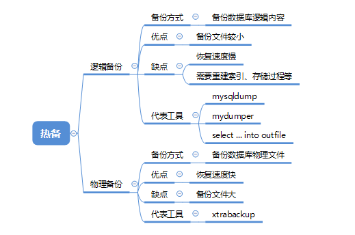

<!-- toc -->

* * * * *

# 概览


## 1.冷备
很简单：关数据，物理copy。基本不会用到这种方式。

## 2.热备



从以下维度选择备份方式：
* 备份速度
* 恢复速度
* 备份大小
* 对业务影响

表，包含表结构，约束（主键，唯一键，外键等），当然索引这东西实际上不需要备份，也无法备份。
视图
存储过程
存储函数
触发器
事件

以上对象在全库备份时一个都不能少，否则全库备份就失去意义。
默认情况下，mysqldump仅仅备份表，视图和触发器。

-E，指定导出事件（events）。
-R，指定导出存储程序（函数和过程）。

mysqlpump工具，默认导出所有的六类对象。

但是mysqlpump没有 --lock-all-tables 和 --lock-tables 参数。虽然有 --single-transaction 参数，但默认也off。

所以很明显，导出的备份不是数据一致性快照。

如果我们需要使用mysqlpump备份，并且需要数据一致性快照的话，那么我们必须在pump之前手工使用 FLUSH TABLES WITH READ LOCK 锁住数据库。

特别注意：
> FTWRL(flush tables with read lock)，全局禁止读写。为了获取一致性位点，都强依赖于FTWRL。这个锁杀伤力非常大，因为持有锁的这段时间，整个数据库实质上不能对外提供写服务的。此外，由于FTWRL需要关闭表，如有大查询，会导致FTWRL等待，进而导致DML堵塞的时间变长。即使是备库，也有SQL线程在复制来源于主库的更新，上全局锁时，会导致主备库延迟。从前面的分析来看，FTWRL这把锁持有的时间主要与非innodb表的数据量有关，如果非innodb表数据量很大，备份很慢，那么持有锁的时间就会很长。即使全部是innodb表，也会因为有mysql库系统表存在，导致会锁一定的时间。

### 2.1 mysqldump
```
mysqldump [OPTIONS] --single-transaction database [tables] # 备份某个数据库下的表
mysqldump [OPTIONS] --single-transaction --databases [OPTIONS] DB1 [DB2 DB3...] # 备份指定数据库
mysqldump [OPTIONS] --single-transaction --all-databases [OPTIONS] # 备份所有数据库
For more options, use mysqldump --help
```
需要注意single-transaction ： 在一个事务中导出，确保产生一致性的备份 ，当前只对innodb支持

#### 2.1.1 mysqldump参数说明
```
参数说明

--all-databases  , -A  导出全部数据库
eg:  mysqldump  -uroot -p123456 --all-databases


--all-tablespaces  , -Y 导出全部表空间
eg:  mysqldump  -uroot -p123456 --all-databases --all-tablespaces


--no-tablespaces  , -y 不导出任何表空间信息
eg:  mysqldump  -uroot -p123456 --all-databases --no-tablespaces


--add-drop-database 每个数据库创建之前添加drop数据库语句
eg:  mysqldump  -uroot -p123456 --all-databases --add-drop-database


--add-drop-table 每个数据表创建之前添加drop数据表语句。(默认为打开状态，使用--skip-add-drop-table取消选项)
eg:  mysqldump  -uroot -p123456 --all-databases  (默认添加drop语句)
eg:  mysqldump  -uroot -p123456 --all-databases –skip-add-drop-table  (取消drop语句)


--add-locks 在每个表导出之前增加LOCK TABLES并且之后UNLOCK  TABLE。(默认为打开状态，使用--skip-add-locks取消选项)
eg:  mysqldump  -uroot -p123456 --all-databases  (默认添加LOCK语句)
eg:  mysqldump  -uroot -p123456 --all-databases –skip-add-locks   (取消LOCK语句)


--allow-keywords 允许创建是关键词的列名字
eg:  mysqldump  -uroot -p123456 --all-databases --allow-keywords


--apply-slave-statements 在'CHANGE MASTER'前添加'STOP SLAVE'，并且在导出的最后添加'START SLAVE'。
eg:  mysqldump  -uroot -p123456 --all-databases --apply-slave-statements


--character-sets-dir 字符集文件的目录
eg:  mysqldump  -uroot -p123456 --all-databases  --character-sets-dir=/usr/local/mysql/share/mysql/charsets


--comments 附加注释信息。默认为打开，可以用--skip-comments取消
eg:  mysqldump  -uroot -p123456 --all-databases  (默认记录注释)
eg:  mysqldump  -uroot -p123456 --all-databases --skip-comments   (取消注释)


--compatible 导出的数据将和其它数据库或旧版本的MySQL 相兼容。值可以为ansi、mysql323、mysql40、postgresql、oracle、mssql、db2、maxdb、no_key_options、no_tables_options、no_field_options等，要使用几个值，用逗号将它们隔开。它并不保证能完全兼容，而是尽量兼容。
eg:  mysqldump  -uroot -p123456 --all-databases --compatible=ansi


--compact 导出更少的输出信息(用于调试)。去掉注释和头尾等结构。可以使用选项：--skip-add-drop-table  --skip-add-locks --skip-comments --skip-disable-keys
eg:  mysqldump  -uroot -p123456 --all-databases --compact


--complete-insert,  -c 使用完整的insert语句(包含列名称)。这么做能提高插入效率，但是可能会受到max_allowed_packet参数的影响而导致插入失败。
eg:  mysqldump  -uroot -p123456 --all-databases --complete-insert


--compress, -C 在客户端和服务器之间启用压缩传递所有信息
eg:  mysqldump  -uroot -p123456 --all-databases --compress


--create-options,  -a 在CREATE TABLE语句中包括所有MySQL特性选项。(默认为打开状态)
eg:  mysqldump  -uroot -p123456 --all-databases


--databases,  -B 导出几个数据库。参数后面所有名字参量都被看作数据库名。
eg:  mysqldump  -uroot -p123456 --databases test mysql


--debug 输出debug信息，用于调试。默认值为：d:t:o , /tmp/mysqldump.trace
eg:  mysqldump  -uroot -p123456 --all-databases --debug
eg:  mysqldump  -uroot -p123456 --all-databases --debug="d:t:o,/tmp/debug.trace"


--debug-check 检查内存和打开文件使用说明并退出。
eg:  mysqldump  -uroot -p123456 --all-databases --debug-check


--debug-info 输出调试信息并退出
eg:  mysqldump  -uroot -p123456 --all-databases --debug-info


--default-character-set 设置默认字符集，默认值为utf8
eg:  mysqldump  -uroot -p123456 --all-databases --default-character-set=latin1


--delayed-insert 采用延时插入方式（INSERT DELAYED）导出数据
eg:  mysqldump  -uroot -p123456 --all-databases --delayed-insert


--delete-master-logs master备份后删除日志. 这个参数将自动激活--master-data
eg:  mysqldump  -uroot -p123456 --all-databases --delete-master-logs


--disable-keys 对于每个表，用/*!40000 ALTER TABLE tbl_name DISABLE KEYS */;和/*!40000 ALTER TABLE tbl_name ENABLE KEYS */;语句引用INSERT语句。这样可以更快地导入dump出来的文件，因为它是在插入所有行后创建索引的。该选项只适合MyISAM表，默认为打开状态。
eg:  mysqldump  -uroot -p123456 --all-databases


--dump-slave 该选项将导致主的binlog位置和文件名追加到导出数据的文件中。设置为1时，将会以CHANGE MASTER命令输出到数据文件；设置为2时，在命令前增加说明信息。该选项将会打开--lock-all-tables，除非--single-transaction被指定。该选项会自动关闭--lock-tables选项。默认值为0。
eg:  mysqldump  -uroot -p123456 --all-databases --dump-slave=1
eg:  mysqldump  -uroot -p123456 --all-databases --dump-slave=2


--events, -E 导出事件。
eg:  mysqldump  -uroot -p123456 --all-databases --events


--extended-insert,  -e 使用具有多个VALUES列的INSERT语法。这样使导出文件更小，并加速导入时的速度。默认为打开状态，使用--skip-extended-insert取消选项。
eg:  mysqldump  -uroot -p123456 --all-databases
eg:  mysqldump  -uroot -p123456 --all-databases--skip-extended-insert   (取消选项)


--fields-terminated-by 导出文件中忽略给定字段。与--tab选项一起使用，不能用于--databases和--all-databases选项
eg:  mysqldump  -uroot -p123456 test test --tab=”/home/mysql” --fields-terminated-by=”#”


--fields-enclosed-by 输出文件中的各个字段用给定字符包裹。与--tab选项一起使用，不能用于--databases和--all-databases选项
eg:  mysqldump  -uroot -p123456 test test --tab=”/home/mysql” --fields-enclosed-by=”#”


--fields-optionally-enclosed-by 输出文件中的各个字段用给定字符选择性包裹。与--tab选项一起使用，不能用于--databases和--all-databases选项
eg:  mysqldump  -uroot -p123456 test test --tab=”/home/mysql”  --fields-enclosed-by=”#” --fields-optionally-enclosed-by  =”#”


--fields-escaped-by 输出文件中的各个字段忽略给定字符。与--tab选项一起使用，不能用于--databases和--all-databases选项
eg:  mysqldump  -uroot -p123456 mysql user --tab=”/home/mysql” --fields-escaped-by=”#”


--flush-logs 开始导出之前刷新日志。
注意：假如一次导出多个数据库(使用选项--databases或者--all-databases)，将会逐个数据库刷新日志。除使用--lock-all-tables或者--master-data外。在这种情况下，日志将会被刷新一次，相应的所以表同时被锁定。因此，如果打算同时导出和刷新日志应该使用--lock-all-tables 或者--master-data 和--flush-logs。
eg:  mysqldump  -uroot -p123456 --all-databases --flush-logs


--flush-p123456rivileges 在导出mysql数据库之后，发出一条FLUSH  PRIVILEGES 语句。为了正确恢复，该选项应该用于导出mysql数据库和依赖mysql数据库数据的任何时候。
eg:  mysqldump  -uroot -p123456 --all-databases --flush-p123456rivileges


--force 在导出过程中忽略出现的SQL错误。
eg:  mysqldump  -uroot -p123456 --all-databases --force


--help 显示帮助信息并退出。
eg:  mysqldump  --help


--hex-blob 使用十六进制格式导出二进制字符串字段。如果有二进制数据就必须使用该选项。影响到的字段类型有BINARY、VARBINARY、BLOB。
eg:  mysqldump  -uroot -p123456 --all-databases --hex-blob


--host, -h 需要导出的主机信息
eg:  mysqldump  -uroot -p123456 -S /tmp/mysql.sock --all-databases


--ignore-table 不导出指定表。指定忽略多个表时，需要重复多次，每次一个表。每个表必须同时指定数据库和表名。例如：--ignore-table=database.table1 --ignore-table=database.table2 ……
eg:  mysqldump  -uroot -p123456 -S /tmp/mysql.sock --all-databases --ignore-table=mysql.user


--include-master-host-p123456ort 在--dump-slave产生的'CHANGE  MASTER TO..'语句中增加'MASTER_HOST=<host>，MASTER_PORT=<port>'
eg:  mysqldump  -uroot -p123456 -S /tmp/mysql.sock --all-databases --include-master-host-p123456ort


--insert-ignore 在插入行时使用INSERT IGNORE语句
eg:  mysqldump  -uroot -p123456 -S /tmp/mysql.sock --all-databases --insert-ignore


--lines-terminated-by 输出文件的每行用给定字符串划分。与--tab选项一起使用，不能用于--databases和--all-databases选项。
eg:  mysqldump  -uroot -p123456 -S /tmp/mysql.sock test test --tab=”/tmp/mysql”  --lines-terminated-by=”##”


--lock-all-tables,  -x 提交请求锁定所有数据库中的所有表，以保证数据的一致性。这是一个全局读锁，并且自动关闭--single-transaction 和--lock-tables 选项。
eg:  mysqldump  -uroot -p123456 -S /tmp/mysql.sock --all-databases --lock-all-tables


--lock-tables,  -l 开始导出前，锁定所有表。用READ  LOCAL锁定表以允许MyISAM表并行插入。对于支持事务的表例如InnoDB和BDB，--single-transaction是一个更好的选择，因为它根本不需要锁定表。
注意当导出多个数据库时，--lock-tables分别为每个数据库锁定表。因此，该选项不能保证导出文件中的表在数据库之间的逻辑一致性。不同数据库表的导出状态可以完全不同。
eg:  mysqldump  -uroot -p123456 -S /tmp/mysql.sock --all-databases --lock-tables


--log-error 附加警告和错误信息到给定文件
eg:  mysqldump  -uroot -p123456 -S /tmp/mysql.sock --all-databases  --log-error=/tmp/mysqldump_error_log.err


--master-data
该选项将binlog的位置和文件名追加到输出文件中。如果为1，将会输出CHANGE MASTER 命令；如果为2，输出的CHANGE  MASTER命令前添加注释信息。该选项将打开--lock-all-tables 选项，除非--single-transaction也被指定（在这种情况下，全局读锁在开始导出时获得很短的时间；其他内容参考下面的--single-transaction选项）。该选项自动关闭--lock-tables选项。
eg:  mysqldump  -uroot -p123456 -S /tmp/mysql.sock --all-databases --master-data=1;
eg:  mysqldump  -uroot -p123456 -S /tmp/mysql.sock --all-databases --master-data=2;


--max_allowed_packet 服务器发送和接受的最大包长度。
eg:  mysqldump  -uroot -p123456 -S /tmp/mysql.sock --all-databases --max_allowed_packet=10240


--net_buffer_length TCP/IP和socket连接的缓存大小。
eg:  mysqldump  -uroot -p123456 -S /tmp/mysql.sock --all-databases --net_buffer_length=1024


--no-autocommit 使用autocommit/commit 语句包裹表。
eg:  mysqldump  -uroot -p123456 -S /tmp/mysql.sock --all-databases --no-autocommit


--no-create-db,  -n 只导出数据，而不添加CREATE DATABASE 语句。
eg:  mysqldump  -uroot -p123456 -S /tmp/mysql.sock --all-databases --no-create-db


--no-create-info,  -t 只导出数据，而不添加CREATE TABLE 语句。
eg:  mysqldump  -uroot -p123456 -S /tmp/mysql.sock --all-databases --no-create-info


--no-data, -d 不导出任何数据，只导出数据库表结构。
eg:  mysqldump  -uroot -p123456 -S /tmp/mysql.sock --all-databases --no-data


--no-set-names,  -N 等同于--skip-set-charset
eg:  mysqldump  -uroot -p123456 -S /tmp/mysql.sock --all-databases --no-set-names


--opt 等同于--add-drop-table,  --add-locks, --create-options, --quick, --extended-insert, --lock-tables,  --set-charset, --disable-keys 该选项默认开启,  可以用--skip-opt禁用.
eg:  mysqldump  -uroot -p123456 -S /tmp/mysql.sock --all-databases --opt


--order-by-p123456rimary 如果存在主键，或者第一个唯一键，对每个表的记录进行排序。在导出MyISAM表到InnoDB表时有效，但会使得导出工作花费很长时间。
eg:  mysqldump  -uroot -p123456 -S /tmp/mysql.sock --all-databases --order-by-p123456rimary


--p123456ipe(windows系统可用) 使用命名管道连接mysql
eg:  mysqldump  -uroot -p123456 -S /tmp/mysql.sock --all-databases --p123456ipe


--p123456ort, -p123456 连接数据库端口号


--p123456rotocol 使用的连接协议，包括：tcp, socket, pipe, memory.
eg:  mysqldump  -uroot -p123456 -S /tmp/mysql.sock --all-databases --p123456rotocol=tcp


--quick, -q 不缓冲查询，直接导出到标准输出。默认为打开状态，使用--skip-quick取消该选项。
eg:  mysqldump  -uroot -p123456 -S /tmp/mysql.sock --all-databases
eg:  mysqldump  -uroot -p123456 -S /tmp/mysql.sock --all-databases --skip-quick


--quote-names,-Q 使用（`）引起表和列名。默认为打开状态，使用--skip-quote-names取消该选项。
eg:  mysqldump  -uroot -p123456 -S /tmp/mysql.sock --all-databases
eg:  mysqldump  -uroot -p123456 -S /tmp/mysql.sock --all-databases --skip-quote-names


--replace 使用REPLACE INTO 取代INSERT INTO.
eg:  mysqldump  -uroot -p123456 -S /tmp/mysql.sock --all-databases --replace


--result-file,  -r 直接输出到指定文件中。该选项应该用在使用回车换行对（\\r\\n）换行的系统上（例如：DOS，Windows）。该选项确保只有一行被使用。
eg:  mysqldump  -uroot -p123456 -S /tmp/mysql.sock --all-databases --result-file=/tmp/mysqldump_result_file.txt


--routines, -R 导出存储过程以及自定义函数。
eg:  mysqldump  -uroot -p123456 -S /tmp/mysql.sock --all-databases --routines


--set-charset 添加'SET NAMES  default_character_set'到输出文件。默认为打开状态，使用--skip-set-charset关闭选项。
eg:  mysqldump  -uroot -p123456 -S /tmp/mysql.sock --all-databases
eg:  mysqldump  -uroot -p123456 -S /tmp/mysql.sock --all-databases --skip-set-charset


--single-transaction 该选项在导出数据之前提交一个BEGIN SQL语句，BEGIN 不会阻塞任何应用程序且能保证导出时数据库的一致性状态。它只适用于多版本存储引擎，仅InnoDB。本选项和--lock-tables 选项是互斥的，因为LOCK  TABLES 会使任何挂起的事务隐含提交。要想导出大表的话，应结合使用--quick 选项。
eg:  mysqldump  -uroot -p123456 -S /tmp/mysql.sock --all-databases --single-transaction


--dump-date 将导出时间添加到输出文件中。默认为打开状态，使用--skip-dump-date关闭选项。
eg:  mysqldump  -uroot -p123456 -S /tmp/mysql.sock --all-databases
eg:  mysqldump  -uroot -p123456 -S /tmp/mysql.sock --all-databases --skip-dump-date


--skip-opt 禁用–opt选项.
eg:  mysqldump  -uroot -p123456 -S /tmp/mysql.sock --all-databases --skip-opt


--socket,-S 指定连接mysql的socket文件位置，默认路径/tmp/mysql.sock
eg:  mysqldump  -uroot -p123456 -S /tmp/mysql.sock --all-databases --socket=/tmp/mysqld.sock


--tab,-T 为每个表在给定路径创建tab分割的文本文件。注意：仅仅用于mysqldump和mysqld服务器运行在相同机器上。
eg:  mysqldump  -uroot -p123456 -S /tmp/mysql.sock test test --tab="/home/mysql"


--tables 覆盖--databases (-B)参数，指定需要导出的表名。
eg:  mysqldump  -uroot -p123456 -S /tmp/mysql.sock --databases test --tables test


--triggers 导出触发器。该选项默认启用，用--skip-triggers禁用它。
eg:  mysqldump  -uroot -p123456 -S /tmp/mysql.sock --all-databases --triggers

--tz-utc 在导出顶部设置时区TIME_ZONE='+00:00' ，以保证在不同时区导出的TIMESTAMP 数据或者数据被移动其他时区时的正确性。
eg:  mysqldump  -uroot -p123456 -S /tmp/mysql.sock --all-databases --tz-utc


--user, -u 指定连接的用户名。


--verbose, --v 输出多种平台信息。


--version, -V 输出mysqldump版本信息并退出


--where, -w 只转储给定的WHERE条件选择的记录。请注意如果条件包含命令解释符专用空格或字符，一定要将条件引用起来。
eg:  mysqldump  -uroot -p123456 -S /tmp/mysql.sock --all-databases --where=” user=’root’”


--xml, -X 导出XML格式.
eg:  mysqldump  -uroot -p123456 -S /tmp/mysql.sock --all-databases --xml


--p123456lugin_dir 客户端插件的目录，用于兼容不同的插件版本。
eg:  mysqldump  -uroot -p123456 -S /tmp/mysql.sock --all-databases --p123456lugin_dir=”/usr/local/lib/plugin”


--default_auth 客户端插件默认使用权限。
```

#### 2.1.2 重要参数介绍
以上是根据 --help得到的参数
下面将重点列举几个生产环境中常用的参数

##### single-transaction
1. 当开始备份的时候，备份的是备份点（备份开始的时刻） 时的数据（即使在备份过程中，表中的数据发生了改变）
2. 实现方式：在开启事物前，先设置为 RR 隔离级别（ 事物隔离级别是会话级别，由 mysqldump 自己设置 ），因为RR级别 解决 了 不可重复读 和 幻读 问题，所以在备份的时刻开启一个事务后，读取的数据是能保证一致性的

```
mysql> show variables like '%socket%';
+-----------------------------------------+-----------------+
| Variable_name                           | Value           |
+-----------------------------------------+-----------------+
| performance_schema_max_socket_classes   | 10              |
| performance_schema_max_socket_instances | -1              |
| socket                                  | /tmp/mysql.sock |
+-----------------------------------------+-----------------+
3 rows in set (0.00 sec)

mysql> exit
Bye

[root@nazeebo ~]# mysqldump -uroot -p --single-transaction --databases employees -S /tmp/mysql.sock > employees_bak.sql
Enter password:
Warning: A partial dump from a server that has GTIDs will by default include the GTIDs of all transactions, even those that changed suppressed parts of the database. If you don't want to restore GTIDs, pass --set-gtid-purged=OFF. To make a complete dump, pass --all-databases --triggers --routines --events.
[root@nazeebo ~]# ll
total 164432
-rw-r--r-- 1 root root 168376235 Jul 17 11:41 employees_bak.sql

```

##### master-data
备份的时候dump出 CHANGE MASTER 信息（file  和 pos），可供 主从复制的时候使用， 默认值为1 。 当值设置为 2 的时候，也会dump出信息，但是会被 注释 掉
```
[root@nazeebo ~]# mysqldump -uroot -p --single-transaction --master-data=1 --databases test -S /tmp/mysql.sock > test_bak_1.sql
Enter password:
Warning: A partial dump from a server that has GTIDs will by default include the GTIDs of all transactions, even those that changed suppressed parts of the database. If you don't want to restore GTIDs, pass --set-gtid-purged=OFF. To make a complete dump, pass --all-databases --triggers --routines --events.
[root@nazeebo ~]# mysqldump -uroot -p --single-transaction --master-data=2 --databases test -S /tmp/mysql.sock > test_bak_2.sql
Enter password:
Warning: A partial dump from a server that has GTIDs will by default include the GTIDs of all transactions, even those that changed suppressed parts of the database. If you don't want to restore GTIDs, pass --set-gtid-purged=OFF. To make a complete dump, pass --all-databases --triggers --routines --events.
[root@nazeebo ~]#
[root@nazeebo ~]# diff test_bak_1.sql test_bak_2.sql
30c30
< CHANGE MASTER TO MASTER_LOG_FILE='bin.000006', MASTER_LOG_POS=21135;
---
> -- CHANGE MASTER TO MASTER_LOG_FILE='bin.000006', MASTER_LOG_POS=21135;
1024c1024
< -- Dump completed on 2018-07-17 11:44:52
---
> -- Dump completed on 2018-07-17 11:45:02
```
CHANGE MASTER 信息表示，这个mysqldump出来的文件，是在这个 MASTER_LOG_FILE 文件的 MASTER_LOG_POS 位置备份出来的，是一个 起始位置 信息

##### dump-slave
该选项将导致主的binlog位置和文件名追加到导出数据的文件中。
设置为1时，将会以CHANGE MASTER命令输出到数据文件；
设置为2时，在命令前增加说明信息。
该选项将会打开--lock-all-tables，除非--single-transaction被指定。该选项会自动关闭--lock-tables选项。默认值为0。
```
mysqldump  -uroot -p123456 --all-databases --dump-slave=1 -S /tmp/mysql.sock > full_bak.sql
mysqldump  -uroot -p123456 --all-databases --dump-slave=2 -S /tmp/mysql.sock > full_bak.sql
```

##### no-data
不导出任何数据，只导出数据库表结构。
```
[root@nazeebo ~]# mysqldump -uroot -p123456 --no-data --databases test -S /tmp/mysql.sock > test_bak_3.sql
```

##### no-create-info
与no-data相反，这个参数只导出数据不包含创建表的表结构

##### quick
不缓冲查询，直接导出到标准输出。默认为打开状态，使用--skip-quick取消该选项
```
 mysqldump  -uroot -p123456 -S /tmp/mysql.sock --all-databases
 mysqldump  -uroot -p123456 -S /tmp/mysql.sock --all-databases --skip-quick
```

##### default-character-set
设置默认字符集，默认值为utf8, ，要与备份出的表的字符集保持一致
```
mysqldump  -uroot -p123456 --all-databases --default-character-set=latin1
```

##### complete-insert
使用完整的insert语句(包含列名称)。这么做能提高插入效率，但是可能会受到max_allowed_packet参数的影响而导致插入失败。
```
mysqldump  -uroot -p123456 --all-databases --complete-insert -S /tmp/mysql.sock > test_bak.sql
```

##### all-databases
导出全部数据库
```
mysqldump  -uroot -p123456 --all-databases -S /tmp/mysql.sock > test_bak.sql
```

##### databases
导出几个数据库。参数后面所有名字参量都被看作数据库名。
```
mysqldump  -uroot -p123456 --databases test mysql -S /tmp/mysql.sock > somedb_bak.sql
```
#### 2.1.3 flush-logs
注意：假如一次导出多个数据库(使用选项--databases或者--all-databases)，将会逐个数据库刷新日志。除使用--lock-all-tables或者--master-data外。在这种情况下，日志将会被刷新一次，相应的所以表同时被锁定。因此，如果打算同时导出和刷新日志应该使用--lock-all-tables 或者--master-data 和--flush-logs。
```
mysqldump  -uroot -p123456 --all-databases --flush-logs
```
另外，这个参数要重点提一句：
从mysqldump备份文件恢复数据会丢失掉从备份点开始的更新数据，所以还需要结合mysqlbinlog二进制日志增量备份。确保my.cnf中包含下面的配置以启用二进制日志，或者`mysqld ---log-bin`：
mysqldump命令必须带上`--flush-logs` 以便生成新的二进制日志文件：这样生成的增量二进制日志文件比如为mysql-bin.00000X，那么恢复数据时如下：
```
--先进行全备恢复
mysql -uroot -p123456 < backup_full.sql

--再进行增量恢复
mysqlbinlog mysql-bin.00000X | mysql -uroot -p123456
```
此外，mysqlbinlog还可以指定--start-date、--stop-date、--start-position和--stop-position参数，用于精确恢复数据到某个时刻之前或者跳过中间某个出问题时间段恢复数据。

可以参考MySQL_FAQ一章中的《恢复被误删的表》

##### where
只转储给定的WHERE条件选择的记录。
请注意如果条件包含命令解释符专用空格或字符，一定要将条件引用起来。
```
mysqldump  -uroot -p123456 -S /tmp/mysql.sock --all-databases --where=” user='root'”
```

##### set-gtid-purged
以上的备份操作，如果数据库开启了gtid的选项，但备份过程中又不想带gtid的信息，那么可以使用
--set-gtid-purged=off参数来达到效果

#### 2.1.4 恢复操作
备份与恢复是匹配的，恢复操作更简单一些
直接利用`mysql  -uroot -p < 备份的.sql` 来进行恢复即可

##### 恢复全库
```
备份全库：
mysqldump -uroot -p123456  --single-transaction -S /tmp/mysql.sock > all_bak.sql

恢复全库：
mysql -uroot -p123456 -S /tmp/mysql.sock < all_bak.sql
```

##### 恢复单库
```
备份库employee：
mysqldump  --single-transaction -S /tmp/mysql.sock -uroot -p123456  employee > employee_bak.sql

恢复employee库：
mysql -uroot -p123456 employee -S /tmp/mysql.sock < employee_bak.sql

--注意：如果库employee以及被drop了，那么需要在恢复前，先去数据库中cretae database employee；
```

##### 恢复单表
```
备份表 employee.dept：
mysqldump  --single-transaction -S /tmp/mysql.sock -uroot -p123456  employee dept > employee_dept_bak.sql

恢复表employee.dept：
mysql -uroot -p123456 employee -S /tmp/mysql.sock < employee_dept_bak.sql

--注意：恢复单表的时候，不需要再写表的名字，只需要写库的名字即可
```

#### 2.1.5 使用mysqldump注意事项
备份包括六大件：
* 表，包含表结构，约束（主键，唯一键，外键等），当然索引这东西实际上不需要备份，也无法备份。
* 视图
* 存储过程
* 存储函数
* 触发器
* 事件

以上对象在全库备份时一个都不能少，否则全库备份就失去意义。
默认情况下，mysqldump仅仅 ***备份表，视图和触发器。***
如果需要备份事件和存储过程，需要使用下面两个参数
* -E，指定导出事件（events）
* -R，指定导出存储程序（函数和过程）

另外，在备份过程中，可能会出现性能的抖动，出现性能急剧下降的现象。原因是因为mysqldump是先从buffer里面找想要的内容，如果buffer中找不到，则需要去访问磁盘中的数据文件，然后把数据调回内存中，再形成备份文件。而在这个过程中，有可能会被热点数据从buffer中刷走，故影响了性能。
在MySQL5.7，新增了一个参数innodb_buffer_pool_dump_pct，用这个参数来控制每个innodb buffer中转储活跃使用的innodb buffer pages的比例，只有当数据在1秒内再次被访问时，才能放到热区域中，这样避免了热数据被冲走的情况

### 2.2 mysqlpump
在 MySQL5.7 版本推出了 mysqlpump工具 。
可以理解它是mysqldump的加强版，几大提升：
* 并行备份数据库和数据库中的对象的，加快备份过程。
* 更好的控制数据库和数据库对象（表，存储过程，用户帐户）的备份，默认导出所有的六类对象。
* 备份用户账号作为帐户管理语句（CREATE USER，GRANT），而不是直接插入到MySQL的系统数据库。
* 备份出来直接生成压缩后的备份文件。
* 备份进度指示（估计值）。
* 重新加载（还原）备份文件，先建表后插入数据最后建立索引，减少了索引维护开销，加快了还原速度。
* 备份可以排除或则指定数据库。

* * * * *

需要注意的是：
* 要确保使用mysqlpump的版本在5.7.11及以上（在5.7.11以前，mysqlpump和并行参数是有冲突的，在这个版本之后做了修复）
* mysqlpump没有 `--lock-all-tables` 和 `--lock-tables` 参数。虽然有 `--single-transaction` 参数，但默认也off。所以很明显，导出的备份不是数据一致性快照。如果我们需要使用mysqlpump备份，并且需要数据一致性快照的话，那么我们必须在pump之前手工使用 `FLUSH TABLES WITH READ LOCK` 锁住数据库。
* mysqlpump 是多线的，但是只能到 表级别 ，对于 一张表 来说，还是 单线程的
* mysqlpump 有默认的队列（default），队列下面可以有N个线程去备份数据库/数据库下的表
* mysqlpump 可以开多个队列（对应不同的库/表），然后每个队列设置不同的线程数，进行并发备份
* mysqlpump 会先插入数据，在建立索引 ；而mysqldump在建立表的时候就把索引加上了，所以mysqlpump在导入数据的时候也比mysqldump要快
* mysqlpump 目前 导入 的时候是 单线程 的

#### 2.2.1 mysqlpump重要参数
mysqlpump参数常甠参数同mysqldump类似，以下参数和并发相关的
```
--default-parallelism=4 #线程数，默认开 2 个线程进行并发备份
--parallel-schemas=name #哪些数据库进行并发备份
--compress-output #mysqlpump  支持压缩 功能，支持 LZ4 和 ZLIB 。ZLIB 压缩比例对较高，但是速度较慢
```

#### 2.2.2 mysqlpump示例
```
mysqlpump --single-transaction --databases employees -S /tmp/mysql.sock > employees_pump_1.sql
```

```
mysqlpump -S /tmp/mysql.sock --single-transaction --parallel-schemas=2:employees --parallel-schemas=4:dbt3 --databases employees dbt3 > backup.sql

 --parallel-schemas=2:employees 表示备份employees库使用2个线程
 --parallel-schemas=4:dbt3 表示备份dbt3库使用4个线程
 --databases employees dbt3 表示指定备份 employees 和 dbt3 这两个库
```

#### 2.2.3 mysqlpump恢复
恢复没有被压缩的库
```
mysql < backup.sql # mysql -u root -p -S /tmp/mysql.sock
```
恢复压缩的库，需要先将压缩的库解压`lz4_decompress backup.sql.lz4 backup.sql `，再进行恢复
```
mysql < backup.sql # mysql -u root -p -S /tmp/mysql.sock
```

### 2.3 mydumper
mydumper是一个针对MySQL的高性能多线程的备份工具，也属于逻辑备份，恢复的时候使用myloader工具进行恢复。

#### 2.3.1 mydumper特点：
1. 支持多线程导出数据，速度比mysqldump快。
2. 支持一致性备份，使用FTWRL(FLUSH TABLES WITH READ LOCK)会阻塞DML语句,保证备份数据的一致性。
3. 支持将导出文件压缩，节约空间。
4. 支持多线程恢复。
5. 支持以守护进程模式工作，定时快照和连续二进制日志
6. 支持按照指定大小将备份文件切割。
7. 数据与建表语句分离。

* * * * *

#### 2.3.2 mydumper的主要工作步骤：
1. 主线程 FLUSH TABLES WITH READ LOCK, 施加全局只读锁，以阻止DML语句写入，保证数据的一致性
2. 读取当前时间点的二进制日志文件名和日志写入的位置并记录在metadata文件中，以供即使点恢复使用
3. START TRANSACTION WITH CONSISTENT SNAPSHOT; 开启读一致事务
4. 启用N个（线程数可以指定，默认是4）dump线程导出表和表结构
5. 备份非事务类型的表
6. 主线程 UNLOCK TABLES，备份完成非事务类型的表之后，释放全局只读锁
7. dump InnoDB tables, 基于事物导出InnoDB表
8. 事物结束

* * * * *

#### 2.3.3 参数说明
mydumper 的常用参数
```
-B, --database 要导出的dbname
-T, --tables-list 需要导出的表名,导出多个表需要逗号分隔，t1[,t2,t3 ....]
-o, --outputdir 导出数据文件存放的目录，mydumper会自动创建
-s, --statement-size 生成插入语句的字节数, 默认1000000字节
-r, --rows Try to split tables into chunks of this many rows. This option turns off --chunk-filesize
-F, --chunk-filesize 切割表文件的大小，默认单位是 MB ，如果表大于
-c, --compress 压缩导出的文件
-e, --build-empty-files 即使是空表也为表创建文件
-x, --regex 使用正则表达式匹配 db.table
-i, --ignore-engines 忽略的存储引擎，多个值使用逗号分隔
-m, --no-schemas 只导出数据，不导出建库建表语句
-d, --no-data 仅仅导出建表结构，创建db的语句
-G, --triggers 导出触发器
-E, --events 导出events
-R, --routines 导出存储过程和函数
-k, --no-locks 不执行临时的只读锁，会导致备份不一致 。WARNING: This will cause inconsistent backups
--less-locking 最小化在innodb表上的锁表时间 --butai
-l, --long-query-guard 设置长时间执行的sql 的时间标准
-K, --kill-long-queries 将长时间执行的sql kill
-D, --daemon 以守护进程的方式执行
-I, --snapshot-interval 创建导出快照的时间间隔，默认是 60s ，该参数只有在守护进程执行的时候有用。
-L, --logfile 指定mydumper输出的日志文件，默认使用控制台输出。
--tz-utc SET TIME_ZONE='+00:00' at top of dump to allow dumping of TIMESTAMP data when a server has data in different time zones or data is being moved between servers with different time zones, defaults to on use --skip-tz-utc to disable.
--skip-tz-utc
--use-savepoints 使用savepoints 减少MDL 锁事件 需要 SUPER 权限
--success-on-1146 Not increment error count and Warning instead of Critical in case of table doesn
```
myloader使用参数
```
-d, --directory 备份文件的文件夹
-q, --queries-per-transaction 每次事物执行的查询数量，默认是1000
-o, --overwrite-tables 如果要恢复的表存在，则先drop掉该表，使用该参数，需要备份时候要备份表结构
-B, --database 需要还原的数据库
-e, --enable-binlog 启用还原数据的二进制日志
-h, --host The host to connect to
-u, --user Username with privileges to run the dump
-p, --password User password
-P, --port TCP/IP port to connect to
-S, --socket UNIX domain socket file to use for connection
-t, --threads 还原所使用的线程数，默认是4
-C, --compress-protocol 压缩协议
-V, --version 显示版本
-v, --verbose 输出模式, 0 = silent, 1 = errors, 2 = warnings, 3 = info, 默认为2
```
注意：mydumper没有—where参数，部分场景不适用

* * * * *

#### 2.3.4 mydumper使用示例
导出整个库
```
mydumper -u root -S /tmp/mysql.sock -B employee -o /bak/employee
```

导出platform的ddl语句不包含数据到指定的目录 /bak/employee
```
mydumper -u root -S /tmp/mysql.sock -B employee -m -o /bak/employee
```

以压缩的方式导出的文件
```
mydumper -u root -S /tmp/mysql.sock -B employee -c -o /bak/employee
```
使用正则表达式 ,--regex=order.*  导出所有order 开头的表
```
mydumper -u root -S /tmp/mysql.sock --regex='^(?!(mysql|test))' -o /bak/bktest20180717
```

mydumper 导出的文件分为:
```
metadata :包含导出时刻的binlog 位点信息 ，如果启用gtid ，则记录gtid信息。
db.table.sql        :数据文件，insert语句
db.table-schema.sql :包含建表语句
db-schema.sql       :包含建库语句
```

### 2.4 xtrabackup
内容较多，单独写一章
