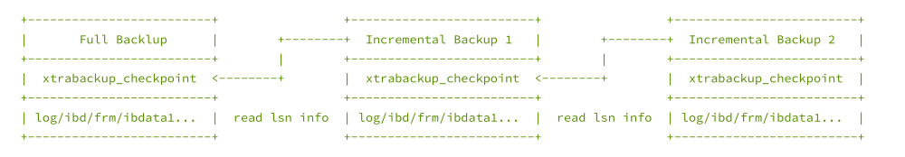
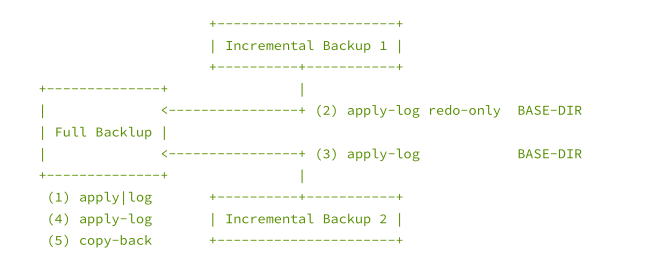

<!-- toc -->

* * * * *

# 一、Xtrabackup
* xtrabackup 只能备份innodb存储引擎表
* innobackupex 可以备份内其他存储引擎（含innodb）
	* innobackupex 在 xtrabackup 的基础上做了包装，以兼容其他存储引擎
	* 平时在 备份/恢复 操作过程中， 使用innobackupex
* 备份时，默认读取MySQL配置文件（读取datadir）

## 1. xtrabackup备份的原理
xtrabackup备份的是 备份结束点 的数据（ 而 mysqldump 是备份开始时的数据 ）

### 1.1 全量备份
网上找了一个备份的过程图:


1. innobackupex 在启动后，会先 fork 一个进程，启动 xtrabackup进程，然后就等待 xtrabackup 备份完 ibd 数据文件；
2. xtrabackup 在备份 InnoDB 相关数据时，是有2种线程的，1种是 redo 拷贝线程，负责拷贝 redo 文件，1种是 ibd 拷贝线程，负责拷贝 ibd 文件；redo 拷贝线程只有一个，在 ibd 拷贝线程之前启动，在 ibd 线程结束后结束。xtrabackup 进程开始执行后，先启动 redo 拷贝线程，从最新的 checkpoint 点开始顺序拷贝 redo 日志；然后再启动 ibd 数据拷贝线程，在 xtrabackup 拷贝 ibd 过程中，innobackupex 进程一直处于等待状态（等待文件被创建）。
3. xtrabackup 拷贝完成idb后，通知 innobackupex（通过创建文件），同时自己进入等待（redo 线程仍然继续拷贝）;
4. innobackupex 收到 xtrabackup 通知后，执行FLUSH TABLES WITH READ LOCK (FTWRL)，取得一致性位点，然后开始备份非 InnoDB 文件（包括 frm、MYD、MYI、CSV、opt、par等）。拷贝非 InnoDB 文件过程中，因为数据库处于全局只读状态，如果在业务的主库备份的话，要特别小心，非 InnoDB 表（主要是MyISAM）比较多的话整库只读时间就会比较长，这个影响一定要评估到。
5. 当 innobackupex 拷贝完所有非 InnoDB 表文件后，通知 xtrabackup（通过删文件） ，同时自己进入等待（等待另一个文件被创建）；
6. xtrabackup 收到 innobackupex 备份完非 InnoDB 通知后，就停止 redo 拷贝线程，然后通知 innobackupex redo log 拷贝完成（通过创建文件）；
7. innobackupex 收到 redo 备份完成通知后，就开始解锁，执行 UNLOCK TABLES；
8. 最后 innobackupex 和 xtrabackup 进程各自完成收尾工作，如资源的释放、写备份元数据信息等，innobackupex 等待 xtrabackup 子进程结束后退出。

在上面描述的文件拷贝，都是备份进程直接通过操作系统读取数据文件的，只在执行 SQL 命令时和数据库有交互，基本不影响数据库的运行，在备份非 InnoDB 时会有一段时间只读（如果没有MyISAM表的话，只读时间在几秒左右），在备份 InnoDB 数据文件时，对数据库完全没有影响，是真正的热备。

 InnoDB 和非 InnoDB 文件的备份都是通过拷贝文件来做的，但是实现的方式不同，前者是以page为粒度做的(xtrabackup)，后者是 cp 或者 tar 命令(innobackupex)，xtrabackup 在读取每个page时会校验 checksum 值，保证数据块是一致的，而 innobackupex 在 cp MyISAM 文件时已经做了flush（FTWRL），磁盘上的文件也是完整的，所以最终备份集里的数据文件都是写入完整的。

### 1.2 增量备份
* XB 是支持增量备份的，但是只能对 InnoDB 做增量，InnoDB 每个 page 有个 LSN 号，LSN 是全局递增的，page 被更改时会记录当前的 LSN 号，page中的 LSN 越大，说明当前page越新（最近被更新）。每次备份会记录当前备份到的LSN（xtrabackup_checkpoints 文件中），增量备份就是只拷贝LSN大于上次备份的page，比上次备份小的跳过，每个ibd文件最终备份出来的是增量 delta 文件。
* MyISAM 是没有增量的机制的，每次增量备份都是全部拷贝的。
* 增量备份过程和全量备份一样，只是在 ibd 文件拷贝上有不同。

### 1.3 恢复过程

如果看恢复备份集的日志，会发现和 mysqld 启动时非常相似，其实备份集的恢复就是类似 mysqld crash后，做一次 crash recover。
恢复的目的是把备份集中的数据恢复到一个一致性位点，所谓一致就是指原数据库某一时间点各引擎数据的状态，比如 MyISAM 中的数据对应的是 15:00 时间点的，InnoDB 中的数据对应的是 15:20 的，这种状态的数据就是不一致的。XB 备份集对应的一致点，就是备份时FTWRL的时间点，恢复出来的数据，就对应原数据库FTWRL时的状态。

因为备份时 FTWRL 后，数据库是处于只读的，非 InnoDB 数据是在持有全局读锁情况下拷贝的，所以非 InnoDB 数据本身就对应 FTWRL 时间点；InnoDB 的 ibd 文件拷贝是在 FTWRL 前做的，拷贝出来的不同 ibd 文件最后更新时间点是不一样的，这种状态的 ibd 文件是不能直接用的，但是 redo log 是从备份开始一直持续拷贝的，最后的 redo 日志点是在持有 FTWRL 后取得的，所以最终通过 redo 应用后的 ibd 数据时间点也是和 FTWRL 一致的。

所以恢复过程只涉及 InnoDB 文件的恢复，非 InnoDB 数据是不动的。备份恢复完成后，就可以把数据文件拷贝到对应的目录，然后通过mysqld来启动了。


### 1.4 xb在对于FTWRL上做的改进：
为了解决这个FTWRL的问题，Percona公司对Mysql的Server层做了改进，引入了BACKUP LOCK，具体而言，通过"LOCK TABLES FOR BACKUP"命令来备份非innodb表数据；通过"LOCK BINLOG FOR BACKUP"来获取一致性位点，尽量减少因为数据库备份带来的服务受损。这两个锁与FTWRL的区别：

* LOCK TABLES FOR BACKUP
    * 作用：备份数据
        * 1.禁止非innodb表更新
        * 2.禁止所有表的ddl
    * 优化点：
        * 1.不会被大查询堵塞(关闭表)
        * 2.不会堵塞innodb表的读取和更新，这点非常重要，对于业务表全部是innodb的情况，则备份过程中DML完全不受损
        * 3.UNLOCK TABLES
* LOCK BINLOG FOR BACKUP
    * 作用：获取一致性位点。
        * 1.禁止对位点更新的操作
    * 优化点：
        * 1.允许DDl和更新，直到写binlog为止。
        * 2.UNLOCK BINLOG

## 2. 下载及安装
下载页面 https://www.percona.com/downloads/XtraBackup/LATEST/
具体下载版本: https://www.percona.com/downloads/XtraBackup/Percona-XtraBackup-2.4.9/binary/tarball/percona-xtrabackup-2.4.9-Linux-x86_64.tar.gz
选择的是2.4.9的版本，10以上的版本带有libgcrypt的版本，搞不懂。
选择编译好的版本，解压，做个链接，即可使用
```
[root@nazeebo percona-xtrabackup-2.4.9-Linux-x86_64]# tree bin
bin
├── innobackupex -> xtrabackup
├── xbcloud
├── xbcloud_osenv
├── xbcrypt
├── xbstream
└── xtrabackup

0 directories, 6 files

[root@nazeebo softdb]# mv percona-xtrabackup-2.4.9-Linux-x86_64 /usr/local/xtrabackup
[root@nazeebo softdb]# ln -sf /usr/local/xtrabackup/bin/* /usr/bin/
```

### 2.1 参数选项：
```
1) innobackupex 参数选项

--defaults-file=[MY.CNF]    //指定配置文件：只能从给定的文件中读取默认选项。 且必须作为命令行上的第一个选项；必须是一个真实的文件，它不能是一个符号链接。

--databases=#    //指定备份的数据库和表，格式为：--database="db1[.tb1] db2[.tb2]" 多个库之间以空格隔开，如果此选项不被指定，将会备份所有的数据库。

--include=REGEXP    //用正则表达式的方式指定要备份的数据库和表，格式为 --include=‘^mydb[.]mytb’ ，对每个库中的每个表逐一匹配，因此会创建所有的库，不过是空的目录。--include 传递给 xtrabackup --tables。

--tables-file=FILE    //此选项的参数需要是一个文件名，此文件中每行包含一个要备份的表的完整名称，格式为databasename.tablename。该选项传递给 xtrabackup --tables-file，与--tables选项不同，只有要备份的表的库才会被创建。

注意：部分备份（--include、--tables-file、--database）需要开启 innodb_file_per_table 。

--compact    //创建紧凑型备份，忽略所有辅助索引页，只备份data page；通过--apply-log中重建索引--rebuild-indexs。

--compress    //此选项指示xtrabackup压缩备份的InnoDB数据文件，会生成 *.qp 文件。

--decompress    //解压缩qp文件，为了解压缩，必须安装 qpress 工具。 Percona XtraBackup不会自动删除压缩文件，为了清理备份目录，用户应手动删除 * .qp文件：find /data/backup -name "*.qp" | xargs rm。

--no-timestamp    //指定了这个选项备份将会直接存储在 BACKUP-DIR 目录，不再创建时间戳文件夹。

--apply-log    //应用 BACKUP-DIR 中的 xtrabackup_logfile 事务日志文件。一般情况下，在备份完成后，数据尚且不能用于恢复操作，因为备份的数据中可能会包含尚未提交的事务或已经提交但尚未同步至数据文件中的事务。因此，此时数据文件仍处于不一致状态。“准备”的主要作用正是通过回滚未提交的事务及同步已经提交的事务至数据文件使得数据文件处于一致性状态。

--use-memory=#    //此选项接受一个字符参数（1M/1MB,1G/1GB，默认100M），仅与--apply-log一起使用，该选项指定prepare时用于崩溃恢复（crash-recovery）的内存。

--copy-back    //拷贝先前备份所有文件到它们的原始路径。但原路径下不能有任何文件或目录，除非指定 --force-non-empty-directories 选项。

--force-non-empty-directories    //恢复时指定此选项，可使 --copy-back 和 --move-back 复制文件到非空目录，即原data目录下可以有其他文件，但是不能有与恢复文件中同名的文件，否则恢复失败。

--rsync    //此选项可优化本地文件（非InnoDB）的传输。rsync工具一次性拷贝所有非InnoDB文件，而不是为每个文件单独创建cp，在备份恢复很多数据库和表时非常高效。此选项不能和 --stream 一起使用。

--incremental    //这个选项告诉 xtrabackup 创建一个增量备份，而不是完全备份。它传递到 xtrabackup 子进程。当指定这个选项，可以设置 --incremental-lsn 或 --incremental-basedir。如果这2个选项都没有被指定，--incremental-basedir 传递给 xtrabackup 默认值，默认值为：基础备份目录的第一个时间戳备份目录。

--incremental-basedir=DIRECTORY    //该选项接受一个字符串参数，该参数指定作为增量备份的基本数据集的完整备份目录。它与 --incremental 一起使用。

--incremental-dir=DIRECTORY    //该选项接受一个字符串参数，该参数指定了增量备份将与完整备份相结合的目录，以便进行新的完整备份。它与 --incremental 选项一起使用。

--redo-only    //在“准备基本完整备份” 和 “合并所有的增量备份(除了最后一个增备)”时使用此选项。它直接传递给xtrabackup的 xtrabackup --apply-log-only 选项，使xtrabackup跳过"undo"阶段，只做"redo"操作。如果后面还有增量备份应用到这个全备,这是必要的。有关详细信息,请参阅xtrabackup文档。

--parallel=NUMBER-OF-THREADS    //此选项接受一个整数参数，指定xtrabackup子进程应用于同时备份文件的线程数。请注意，此选项仅适用于文件级别，也就是说，如果您有多个.ibd文件，则它们将被并行复制； 如果您的表一起存储在一个表空间文件中，它将不起作用。

2) xtrabackup 参数选项

--apply-log-only    //这个选项使在准备备份(prepare)时，只执行重做(redo)阶段，这对于增量备份非常重要。


```
## 3. 全量备份与恢复示例

### 3.1 全备过程
#### 3.1.1 创建备份的目录
```
mkdir -p /bakdir
```

#### 3.1.2 创建备份用户
```
mysql> CREATE USER 'bkadmin'@'%' IDENTIFIED BY '123456';
mysql> GRANT RELOAD, LOCK TABLES, REPLICATION CLIENT,process ON *.* TO 'bkadmin'@'%';
mysql> FLUSH PRIVILEGES;

```
注意，上面必须要有一个权限是 process
```
[root@nazeebo softdb]# innobackupex --defaults-file=/etc/my.cnf --user=bkadmin --password=123456 --host 127.0.0.1  /bakdir
180718 13:32:07 innobackupex: Starting the backup operation

IMPORTANT: Please check that the backup run completes successfully.
           At the end of a successful backup run innobackupex
           prints "completed OK!".

Can't locate Digest/MD5.pm in @INC (@INC contains: /usr/local/lib64/perl5 /usr/local/share/perl5 /usr/lib64/perl5/vendor_perl /usr/share/perl5/vendor_perl /usr/lib64/perl5 /usr/share/perl5 .) at - line 693.
BEGIN failed--compilation aborted at - line 693.
180718 13:32:07 Connecting to MySQL server host: 127.0.0.1, user: bkadmin, password: set, port: not set, socket: not set
Using server version 5.7.22-log
Error: failed to execute query SHOW ENGINE INNODB STATUS: Access denied; you need (at least one of) the PROCESS privilege(s) for this operation

[root@nazeebo softdb]# mysql -ubkadmin -p123456
mysql: [Warning] Using a password on the command line interface can be insecure.
Welcome to the MySQL monitor.  Commands end with ; or \g.
Your MySQL connection id is 59
Server version: 5.7.22-log MySQL Community Server (GPL)

Copyright (c) 2000, 2018, Oracle and/or its affiliates. All rights reserved.

Oracle is a registered trademark of Oracle Corporation and/or its
affiliates. Other names may be trademarks of their respective
owners.

Type 'help;' or '\h' for help. Type '\c' to clear the current input statement.

mysql> SHOW ENGINE INNODB STATUS;
ERROR 1227 (42000): Access denied; you need (at least one of) the PROCESS privilege(s) for this operation

```

#### 3.1.3 执行全备
```
[root@nazeebo ~]#  innobackupex --defaults-file=/etc/my.cnf --user=bkadmin --password=123456 --host 127.0.0.1  /bakdir
180718 13:56:20 innobackupex: Starting the backup operation

IMPORTANT: Please check that the backup run completes successfully.
           At the end of a successful backup run innobackupex
           prints "completed OK!".

Can't locate Digest/MD5.pm in @INC (@INC contains: /usr/local/lib64/perl5 /usr/local/share/perl5 /usr/lib64/perl5/vendor_perl /usr/share/perl5/vendor_perl /usr/lib64/perl5 /usr/share/perl5 .) at - line 693.
BEGIN failed--compilation aborted at - line 693.
180718 13:56:20 Connecting to MySQL server host: 127.0.0.1, user: bkadmin, password: set, port: not set, socket: not set
Using server version 5.7.22-log
innobackupex version 2.4.9 based on MySQL server 5.7.13 Linux (x86_64) (revision id: a467167cdd4)
xtrabackup: uses posix_fadvise().
xtrabackup: cd to /u01/mysql/mysql_data/
xtrabackup: open files limit requested 0, set to 65535
xtrabackup: using the following InnoDB configuration:
xtrabackup:   innodb_data_home_dir = .
xtrabackup:   innodb_data_file_path = ibdata1:12M:autoextend
xtrabackup:   innodb_log_group_home_dir = /u01/mysql/mysql_redolog/
xtrabackup:   innodb_log_files_in_group = 2
xtrabackup:   innodb_log_file_size = 1073741824
xtrabackup: using O_DIRECT
InnoDB: Number of pools: 1
180718 13:56:20 >> log scanned up to (291395853)
InnoDB: Opened 3 undo tablespaces
InnoDB: 0 undo tablespaces made active
xtrabackup: Generating a list of tablespaces
InnoDB: Allocated tablespace ID 33 for employees/titles, old maximum was 3
180718 13:56:20 [01] Copying ./ibdata1 to /bakdir/2018-07-18_13-56-20/ibdata1
180718 13:56:21 [01]        ...done
180718 13:56:21 [01] Copying /u01/mysql/mysql_undolog//undo001 to /bakdir/2018-07-18_13-56-20/undo001
180718 13:56:21 [01]        ...done
180718 13:56:21 >> log scanned up to (291395853)
180718 13:56:21 [01] Copying /u01/mysql/mysql_undolog//undo002 to /bakdir/2018-07-18_13-56-20/undo002
180718 13:56:21 [01]        ...done
180718 13:56:21 [01] Copying /u01/mysql/mysql_undolog//undo003 to /bakdir/2018-07-18_13-56-20/undo003
180718 13:56:21 [01]        ...done
180718 13:56:21 [01] Copying ./employees/titles.ibd to /bakdir/2018-07-18_13-56-20/employees/titles.ibd
180718 13:56:22 >> log scanned up to (291395853)
180718 13:56:22 [01]        ...done
180718 13:56:22 [01] Copying ./employees/salaries.ibd to /bakdir/2018-07-18_13-56-20/employees/salaries.ibd
180718 13:56:23 >> log scanned up to (291395853)
180718 13:56:24 >> log scanned up to (291395853)
180718 13:56:25 >> log scanned up to (291395853)
180718 13:56:25 [01]        ...done
180718 13:56:25 [01] Copying ./employees/dept_emp.ibd to /bakdir/2018-07-18_13-56-20/employees/dept_emp.ibd
...
...
省略部分输出
...
...
180718 13:56:28 [01] Copying ./performance_schema/events_waits_summary_global_by_event_name.frm to /bakdir/2018-07-18_13-56-20/performance_schema/events_waits_summary_global_by_event_name.frm
180718 13:56:28 [01]        ...done
180718 13:56:28 Finished backing up non-InnoDB tables and files
180718 13:56:28 [00] Writing /bakdir/2018-07-18_13-56-20/xtrabackup_binlog_info
180718 13:56:28 [00]        ...done
180718 13:56:28 Executing FLUSH NO_WRITE_TO_BINLOG ENGINE LOGS...
xtrabackup: The latest check point (for incremental): '291395844'
xtrabackup: Stopping log copying thread.
.180718 13:56:28 >> log scanned up to (291395853)

180718 13:56:28 Executing UNLOCK TABLES
180718 13:56:28 All tables unlocked
180718 13:56:28 [00] Copying ib_buffer_pool to /bakdir/2018-07-18_13-56-20/ib_buffer_pool
180718 13:56:28 [00]        ...done
180718 13:56:28 Backup created in directory '/bakdir/2018-07-18_13-56-20/'
MySQL binlog position: filename 'bin.000006', position '23108', GTID of the last change '873d6f4e-6ed2-11e8-b02d-00163e0463a7:1-444'
180718 13:56:28 [00] Writing /bakdir/2018-07-18_13-56-20/backup-my.cnf
180718 13:56:28 [00]        ...done
180718 13:56:28 [00] Writing /bakdir/2018-07-18_13-56-20/xtrabackup_info
180718 13:56:28 [00]        ...done
xtrabackup: Transaction log of lsn (291395844) to (291395853) was copied.
180718 13:56:29 completed OK!

```

#### 3.1.4 查看备份出来的目录
```
[root@nazeebo 2018-07-18_13-56-20]# ll
total 33940
-rw-r----- 1 root root      449 Jul 18 13:56 backup-my.cnf --备份的my.cnf
drwxr-x--- 2 root root     4096 Jul 18 13:56 employees
-rw-r----- 1 root root    99624 Jul 18 13:56 ib_buffer_pool
-rw-r----- 1 root root 12582912 Jul 18 13:56 ibdata1
drwxr-x--- 2 root root     4096 Jul 18 13:56 mysql
drwxr-x--- 2 root root     4096 Jul 18 13:56 performance_schema
drwxr-x--- 2 root root    12288 Jul 18 13:56 sys
drwxr-x--- 2 root root     4096 Jul 18 13:56 test
-rw-r----- 1 root root  7340032 Jul 18 13:56 undo001
-rw-r----- 1 root root  7340032 Jul 18 13:56 undo002
-rw-r----- 1 root root  7340032 Jul 18 13:56 undo003
-rw-r----- 1 root root       60 Jul 18 13:56 xtrabackup_binlog_info
-rw-r----- 1 root root      117 Jul 18 13:56 xtrabackup_checkpoints
-rw-r----- 1 root root      579 Jul 18 13:56 xtrabackup_info
-rw-r----- 1 root root     2560 Jul 18 13:56 xtrabackup_logfile

```

xtrabackup除了备份指定的库，还要备份共享表空间，undo表空间等等。
并且生成对应的4个文件
1. xtrabackup_binlog_info – 包含了binlog的文件名和position
2. xtrabackup_checkpoints – 包含了备份过程中的checkpoint、LSN信息
3. xtrabackup_info – 包含了备份过程中的整体信息
4. xtrabackup_logfile – 持续备份的日志文件（redo）

```
[root@nazeebo 2018-07-18_13-56-20]# cat xtrabackup_binlog_info
bin.000006	23108	873d6f4e-6ed2-11e8-b02d-00163e0463a7:1-444

[root@nazeebo 2018-07-18_13-56-20]# cat xtrabackup_checkpoints
backup_type = full-backuped
from_lsn = 0
to_lsn = 291395844
last_lsn = 291395853
compact = 0
recover_binlog_info = 0

[root@nazeebo 2018-07-18_13-56-20]# cat xtrabackup_info
uuid = 504fb2eb-8a4f-11e8-ae89-00163e0463a7
name =
tool_name = innobackupex
tool_command = --defaults-file=/etc/my.cnf --user=bkadmin --password=... --host 127.0.0.1 /bakdir
tool_version = 2.4.9
ibbackup_version = 2.4.9
server_version = 5.7.22-log
start_time = 2018-07-18 13:56:20
end_time = 2018-07-18 13:56:28
lock_time = 0
binlog_pos = filename 'bin.000006', position '23108', GTID of the last change '873d6f4e-6ed2-11e8-b02d-00163e0463a7:1-444'
innodb_from_lsn = 0
innodb_to_lsn = 291395844
partial = N
incremental = N
format = file
compact = N
compressed = N
encrypted = N

```
### 3.2 恢复过程
#### 3.2.1 删除一个库作测试
```
mysql> show databases;
+--------------------+
| Database           |
+--------------------+
| information_schema |
| employees          |
| mysql              |
| performance_schema |
| sys                |
| test               |
+--------------------+
6 rows in set (0.00 sec)

mysql> drop database employees;
Query OK, 8 rows affected (0.67 sec)

mysql> show databases;
+--------------------+
| Database           |
+--------------------+
| information_schema |
| mysql              |
| performance_schema |
| sys                |
| test               |
+--------------------+
5 rows in set (0.00 sec)
```

#### 3.2.2 恢复
恢复步骤分为三步：
1. apply-log
2. copy-back
3. 修改权限
4. 启动实例

##### 3.2.2.1 apply-log
```
[root@nazeebo bakdir]# innobackupex --defaults-file=/etc/my.cnf --apply-log /bakdir/2018-07-18_13-56-20/
180718 23:34:03 innobackupex: Starting the apply-log operation

IMPORTANT: Please check that the apply-log run completes successfully.
           At the end of a successful apply-log run innobackupex
           prints "completed OK!".

innobackupex version 2.4.9 based on MySQL server 5.7.13 Linux (x86_64) (revision id: a467167cdd4)
xtrabackup: cd to /bakdir/2018-07-18_13-56-20/
xtrabackup: This target seems to be not prepared yet.
InnoDB: Number of pools: 1
xtrabackup: xtrabackup_logfile detected: size=8388608, start_lsn=(291395844)
xtrabackup: using the following InnoDB configuration for recovery:
xtrabackup:   innodb_data_home_dir = .
xtrabackup:   innodb_data_file_path = ibdata1:12M:autoextend
xtrabackup:   innodb_log_group_home_dir = .
xtrabackup:   innodb_log_files_in_group = 1
xtrabackup:   innodb_log_file_size = 8388608
xtrabackup: using the following InnoDB configuration for recovery:
xtrabackup:   innodb_data_home_dir = .
xtrabackup:   innodb_data_file_path = ibdata1:12M:autoextend
xtrabackup:   innodb_log_group_home_dir = .
xtrabackup:   innodb_log_files_in_group = 1
xtrabackup:   innodb_log_file_size = 8388608
xtrabackup: Starting InnoDB instance for recovery.
xtrabackup: Using 104857600 bytes for buffer pool (set by --use-memory parameter)
InnoDB: PUNCH HOLE support available
InnoDB: Mutexes and rw_locks use GCC atomic builtins
InnoDB: Uses event mutexes
InnoDB: GCC builtin __atomic_thread_fence() is used for memory barrier
InnoDB: Compressed tables use zlib 1.2.7
InnoDB: Number of pools: 1
InnoDB: Using CPU crc32 instructions
InnoDB: Initializing buffer pool, total size = 100M, instances = 1, chunk size = 100M
InnoDB: Completed initialization of buffer pool
InnoDB: page_cleaner coordinator priority: -20
InnoDB: Opened 3 undo tablespaces
InnoDB: 3 undo tablespaces made active
InnoDB: Highest supported file format is Barracuda.
InnoDB: Log scan progressed past the checkpoint lsn 291395844
InnoDB: Doing recovery: scanned up to log sequence number 291395853 (0%)
InnoDB: Doing recovery: scanned up to log sequence number 291395853 (0%)
InnoDB: Database was not shutdown normally!
InnoDB: Starting crash recovery.
InnoDB: xtrabackup: Last MySQL binlog file position 21135, file name bin.000006
InnoDB: Creating shared tablespace for temporary tables
InnoDB: Setting file './ibtmp1' size to 12 MB. Physically writing the file full; Please wait ...
InnoDB: File './ibtmp1' size is now 12 MB.
InnoDB: 96 redo rollback segment(s) found. 1 redo rollback segment(s) are active.
InnoDB: 32 non-redo rollback segment(s) are active.
InnoDB: 5.7.13 started; log sequence number 291395853
InnoDB: xtrabackup: Last MySQL binlog file position 21135, file name bin.000006

xtrabackup: starting shutdown with innodb_fast_shutdown = 1
InnoDB: FTS optimize thread exiting.
InnoDB: Starting shutdown...
InnoDB: Shutdown completed; log sequence number 291395872
InnoDB: Number of pools: 1
xtrabackup: using the following InnoDB configuration for recovery:
xtrabackup:   innodb_data_home_dir = .
xtrabackup:   innodb_data_file_path = ibdata1:12M:autoextend
xtrabackup:   innodb_log_group_home_dir = .
xtrabackup:   innodb_log_files_in_group = 2
xtrabackup:   innodb_log_file_size = 1073741824
InnoDB: PUNCH HOLE support available
InnoDB: Mutexes and rw_locks use GCC atomic builtins
InnoDB: Uses event mutexes
InnoDB: GCC builtin __atomic_thread_fence() is used for memory barrier
InnoDB: Compressed tables use zlib 1.2.7
InnoDB: Number of pools: 1
InnoDB: Using CPU crc32 instructions
InnoDB: Initializing buffer pool, total size = 100M, instances = 1, chunk size = 100M
InnoDB: Completed initialization of buffer pool
InnoDB: page_cleaner coordinator priority: -20
InnoDB: Setting log file ./ib_logfile101 size to 1024 MB
InnoDB: Progress in MB:
 100 200 300 400 500 600 700 800 900 1000
InnoDB: Setting log file ./ib_logfile1 size to 1024 MB
InnoDB: Progress in MB:
 100 200 300 400 500 600 700 800 900 1000
InnoDB: Renaming log file ./ib_logfile101 to ./ib_logfile0
InnoDB: New log files created, LSN=291395872
InnoDB: Opened 3 undo tablespaces
InnoDB: 3 undo tablespaces made active
InnoDB: Highest supported file format is Barracuda.
InnoDB: Log scan progressed past the checkpoint lsn 291396108
InnoDB: Doing recovery: scanned up to log sequence number 291396117 (0%)
InnoDB: Doing recovery: scanned up to log sequence number 291396117 (0%)
InnoDB: Database was not shutdown normally!
InnoDB: Starting crash recovery.
InnoDB: xtrabackup: Last MySQL binlog file position 21135, file name bin.000006
InnoDB: Removed temporary tablespace data file: "ibtmp1"
InnoDB: Creating shared tablespace for temporary tables
InnoDB: Setting file './ibtmp1' size to 12 MB. Physically writing the file full; Please wait ...
InnoDB: File './ibtmp1' size is now 12 MB.
InnoDB: 96 redo rollback segment(s) found. 1 redo rollback segment(s) are active.
InnoDB: 32 non-redo rollback segment(s) are active.
InnoDB: page_cleaner: 1000ms intended loop took 38564ms. The settings might not be optimal. (flushed=0 and evicted=0, during the time.)
InnoDB: 5.7.13 started; log sequence number 291396117
xtrabackup: starting shutdown with innodb_fast_shutdown = 1
InnoDB: FTS optimize thread exiting.
InnoDB: Starting shutdown...
InnoDB: Shutdown completed; log sequence number 291396136
180718 23:34:45 completed OK!

```
##### 3.2.2.2 copy-back
```
[root@nazeebo bakdir]# innobackupex --defaults-file=/etc/my.cnf --copy-back 2018-07-18_13-56-20
180718 23:37:57 innobackupex: Starting the copy-back operation

IMPORTANT: Please check that the copy-back run completes successfully.
           At the end of a successful copy-back run innobackupex
           prints "completed OK!".

innobackupex version 2.4.9 based on MySQL server 5.7.13 Linux (x86_64) (revision id: a467167cdd4)
180718 23:37:57 [01] Copying undo001 to /u01/mysql/mysql_undolog/undo001
180718 23:37:57 [01]        ...done
180718 23:37:57 [01] Copying undo002 to /u01/mysql/mysql_undolog/undo002
180718 23:37:57 [01]        ...done
180718 23:37:57 [01] Copying undo003 to /u01/mysql/mysql_undolog/undo003
180718 23:37:57 [01]        ...done
180718 23:37:57 [01] Copying ib_logfile0 to /u01/mysql/mysql_redolog/ib_logfile0
180718 23:38:15 [01]        ...done
...
省略一些copy的输出
...
180718 23:38:41 [01] Copying ./xtrabackup_info to /u01/mysql/mysql_data/xtrabackup_info
180718 23:38:41 [01]        ...done
180718 23:38:41 [01] Copying ./ib_buffer_pool to /u01/mysql/mysql_data/ib_buffer_pool
180718 23:38:41 [01]        ...done
180718 23:38:41 completed OK!

```
需要注意的是：在copy-back的时候要保证在my.cnf里面对应的数据文件、undo、redo的目录为空，否则会报错，如下：
```
--datafile的报错
[root@nazeebo bakdir]# innobackupex --defaults-file=/etc/my.cnf --copy-back 2018-07-18_13-56-20/
180718 23:36:03 innobackupex: Starting the copy-back operation

IMPORTANT: Please check that the copy-back run completes successfully.
           At the end of a successful copy-back run innobackupex
           prints "completed OK!".

innobackupex version 2.4.9 based on MySQL server 5.7.13 Linux (x86_64) (revision id: a467167cdd4)
Original data directory /u01/mysql/mysql_data/ is not empty!

--undo的报错
innobackupex version 2.4.9 based on MySQL server 5.7.13 Linux (x86_64) (revision id: a467167cdd4)
innobackupex: Can't create/write to file '/u01/mysql/mysql_undolog/undo001' (Errcode: 17 - File exists)
[01] error: cannot open the destination stream for undo001
[01] Error: copy_file() failed.

--redo的报错
innobackupex: Can't create/write to file '/u01/mysql/mysql_redolog/ib_logfile0' (Errcode: 17 - File exists)
[01] error: cannot open the destination stream for ib_logfile0
[01] Error: copy_file() failed.

```
##### 3.2.2.3 修改目录的权限
```
chown -R mysql.mysql /u01/mysql/mysql_*
```

##### 3.2.2.4 启动mysql服务
```
service mysql start
service mysql status
```

##### 3.2.2.5 验证

> 注意：
> --apply-log 与 --copy-back 步骤可以调换，可以先拷贝到 datadir 后，再做 redo 日志重放（apply-log）

## 4. 增量备份与恢复示例
增量备份可以是链式的，每次增量备份都要基于上一次的备份的LSN信息


也可以每一次增量备份都是基于上一次全量备份

```
--先做一个全备，得到一个全备的目录，比如第一次全备后的目录叫做/bakdir/full/年月日
 innobackupex --defaults-file=/etc/my.cnf --user=bkadmin --password=123456 --host 127.0.0.1  /bakdir/full

 --再做增量备份
  innobackupex --defaults-file=/etc/my.cnf --user=bkadmin --password=123456 --host 127.0.0.1 --incremental /bakdir/inc --incremental-basedir=/bakdir/full/年月日
```
1. --incremental – 指定进行增量备份
2. --incremental-basedir – 指定之前 完整备份/上一次增量备份的文件夹
### 4.1 增量备份
#### 4.1.1 先做一个全备
```
[root@nazeebo bakdir]#  innobackupex --defaults-file=/etc/my.cnf --user=bkadmin --password=123456 --host 127.0.0.1  /bakdir/full
180719 00:24:18 innobackupex: Starting the backup operation

IMPORTANT: Please check that the backup run completes successfully.
           At the end of a successful backup run innobackupex
           prints "completed OK!".

Can't locate Digest/MD5.pm in @INC (@INC contains: /usr/local/lib64/perl5 /usr/local/share/perl5 /usr/lib64/perl5/vendor_perl /usr/share/perl5/vendor_perl /usr/lib64/perl5 /usr/share/perl5 .) at - line 693.
BEGIN failed--compilation aborted at - line 693.
180719 00:24:18 Connecting to MySQL server host: 127.0.0.1, user: bkadmin, password: set, port: not set, socket: not set
Using server version 5.7.22-log
innobackupex version 2.4.9 based on MySQL server 5.7.13 Linux (x86_64) (revision id: a467167cdd4)
xtrabackup: uses posix_fadvise().
xtrabackup: cd to /u01/mysql/mysql_data/
xtrabackup: open files limit requested 0, set to 65535
xtrabackup: using the following InnoDB configuration:
xtrabackup:   innodb_data_home_dir = .
xtrabackup:   innodb_data_file_path = ibdata1:12M:autoextend
xtrabackup:   innodb_log_group_home_dir = /u01/mysql/mysql_redolog/
xtrabackup:   innodb_log_files_in_group = 2
xtrabackup:   innodb_log_file_size = 1073741824
xtrabackup: using O_DIRECT
InnoDB: Number of pools: 1
180719 00:24:18 >> log scanned up to (291396136)
InnoDB: Opened 3 undo tablespaces
InnoDB: 0 undo tablespaces made active
xtrabackup: Generating a list of tablespaces
InnoDB: Allocated tablespace ID 33 for employees/titles, old maximum was 3
180719 00:24:18 [01] Copying ./ibdata1 to /bakdir/full/2018-07-19_00-24-18/ibdata1
180719 00:24:18 [01]        ...done
180719 00:24:19 [01] Copying /u01/mysql/mysql_undolog//undo001 to /bakdir/full/2018-07-19_00-24-18/undo001
180719 00:24:19 [01]        ...done
180719 00:24:19 [01] Copying /u01/mysql/mysql_undolog//undo002 to /bakdir/full/2018-07-19_00-24-18/undo002
180719 00:24:19 [01]        ...done
180719 00:24:19 >> log scanned up to (291396136)
180719 00:24:19 [01] Copying /u01/mysql/mysql_undolog//undo003 to /bakdir/full/2018-07-19_00-24-18/undo003
180719 00:24:19 [01]        ...done
...
省略一些copy的过程
...
180719 00:24:25 [01] Copying ./performance_schema/events_waits_summary_global_by_event_name.frm to /bakdir/full/2018-07-19_00-24-18/performance_schema/events_waits_summary_global_by_event_name.frm
180719 00:24:25 >> log scanned up to (291396136)
180719 00:24:25 [01]        ...done
180719 00:24:25 Finished backing up non-InnoDB tables and files
180719 00:24:25 [00] Writing /bakdir/full/2018-07-19_00-24-18/xtrabackup_binlog_info
180719 00:24:25 [00]        ...done
180719 00:24:25 Executing FLUSH NO_WRITE_TO_BINLOG ENGINE LOGS...
xtrabackup: The latest check point (for incremental): '291396136'
xtrabackup: Stopping log copying thread.
.180719 00:24:25 >> log scanned up to (291396136)

180719 00:24:25 Executing UNLOCK TABLES
180719 00:24:25 All tables unlocked
180719 00:24:25 [00] Copying ib_buffer_pool to /bakdir/full/2018-07-19_00-24-18/ib_buffer_pool
180719 00:24:25 [00]        ...done
180719 00:24:25 Backup created in directory '/bakdir/full/2018-07-19_00-24-18/'
MySQL binlog position: filename 'bin.000006', position '23442', GTID of the last change '873d6f4e-6ed2-11e8-b02d-00163e0463a7:1-446'
180719 00:24:25 [00] Writing /bakdir/full/2018-07-19_00-24-18/backup-my.cnf
180719 00:24:25 [00]        ...done
180719 00:24:25 [00] Writing /bakdir/full/2018-07-19_00-24-18/xtrabackup_info
180719 00:24:25 [00]        ...done
xtrabackup: Transaction log of lsn (291396136) to (291396136) was copied.
180719 00:24:25 completed OK!
[root@nazeebo bakdir]# cd full/
[root@nazeebo full]# ls
2018-07-19_00-24-18

```

#### 4.1.2 新增加一个库一个表，然后做一个增量备份
```
mysql> create database test_lowa;
Query OK, 1 row affected (0.01 sec)

mysql> show databases;
+--------------------+
| Database           |
+--------------------+
| information_schema |
| employees          |
| mysql              |
| performance_schema |
| sys                |
| test               |
| test_lowa          |
+--------------------+
7 rows in set (0.00 sec)

mysql> use test_lowa;
Database changed
mysql> create table t1 (id bigint);
Query OK, 0 rows affected (0.02 sec)

mysql> show tables;
+---------------------+
| Tables_in_test_lowa |
+---------------------+
| t1                  |
+---------------------+
1 row in set (0.00 sec)

```
做第一次增量备份
```
[root@nazeebo full]#  innobackupex --defaults-file=/etc/my.cnf --user=bkadmin --password=123456 --host=127.0.0.1 --incremental /bakdir/inc --incremental-basedir=/bakdir/full/2018-07-19_00-24-18/
180719 00:28:42 innobackupex: Starting the backup operation

IMPORTANT: Please check that the backup run completes successfully.
           At the end of a successful backup run innobackupex
           prints "completed OK!".

Can't locate Digest/MD5.pm in @INC (@INC contains: /usr/local/lib64/perl5 /usr/local/share/perl5 /usr/lib64/perl5/vendor_perl /usr/share/perl5/vendor_perl /usr/lib64/perl5 /usr/share/perl5 .) at - line 693.
BEGIN failed--compilation aborted at - line 693.
180719 00:28:42 Connecting to MySQL server host: 127.0.0.1, user: bkadmin, password: set, port: not set, socket: not set
Using server version 5.7.22-log
innobackupex version 2.4.9 based on MySQL server 5.7.13 Linux (x86_64) (revision id: a467167cdd4)
incremental backup from 291396136 is enabled.
xtrabackup: uses posix_fadvise().
xtrabackup: cd to /u01/mysql/mysql_data/
xtrabackup: open files limit requested 0, set to 65535
xtrabackup: using the following InnoDB configuration:
xtrabackup:   innodb_data_home_dir = .
xtrabackup:   innodb_data_file_path = ibdata1:12M:autoextend
xtrabackup:   innodb_log_group_home_dir = /u01/mysql/mysql_redolog/
xtrabackup:   innodb_log_files_in_group = 2
xtrabackup:   innodb_log_file_size = 1073741824
xtrabackup: using O_DIRECT
InnoDB: Number of pools: 1
180719 00:28:42 >> log scanned up to (291396136)
InnoDB: Opened 3 undo tablespaces
InnoDB: 0 undo tablespaces made active
xtrabackup: Generating a list of tablespaces
InnoDB: Allocated tablespace ID 33 for employees/titles, old maximum was 3
180719 00:28:42 [01] Copying ./ibdata1 to /bakdir/inc/2018-07-19_00-28-42/ibdata1.delta
180719 00:28:42 [01]        ...done
180719 00:28:42 [01] Copying /u01/mysql/mysql_undolog//undo001 to /bakdir/inc/2018-07-19_00-28-42/undo001.delta
180719 00:28:42 [01]        ...done
180719 00:28:42 [01] Copying /u01/mysql/mysql_undolog//undo002 to /bakdir/inc/2018-07-19_00-28-42/undo002.delta
180719 00:28:42 [01]        ...done
180719 00:28:42 [01] Copying /u01/mysql/mysql_undolog//undo003 to /bakdir/inc/2018-07-19_00-28-42/undo003.delta
180719 00:28:42 [01]        ...done
180719 00:28:42 [01] Copying ./employees/titles.ibd to /bakdir/inc/2018-07-19_00-28-42/employees/titles.ibd.delta
180719 00:28:42 [01]        ...done
...
省略一些copy的步骤
...
180719 00:28:44 [01]        ...done
180719 00:28:44 [01] Copying ./performance_schema/events_waits_summary_global_by_event_name.frm to /bakdir/inc/2018-07-19_00-28-42/performance_schema/events_waits_summary_global_by_event_name.frm
180719 00:28:44 [01]        ...done
180719 00:28:44 Finished backing up non-InnoDB tables and files
180719 00:28:44 [00] Writing /bakdir/inc/2018-07-19_00-28-42/xtrabackup_binlog_info
180719 00:28:44 [00]        ...done
180719 00:28:44 Executing FLUSH NO_WRITE_TO_BINLOG ENGINE LOGS...
xtrabackup: The latest check point (for incremental): '291396136'
xtrabackup: Stopping log copying thread.
.180719 00:28:44 >> log scanned up to (291396136)

180719 00:28:44 Executing UNLOCK TABLES
180719 00:28:44 All tables unlocked
180719 00:28:44 [00] Copying ib_buffer_pool to /bakdir/inc/2018-07-19_00-28-42/ib_buffer_pool
180719 00:28:44 [00]        ...done
180719 00:28:44 Backup created in directory '/bakdir/inc/2018-07-19_00-28-42/'
MySQL binlog position: filename 'bin.000006', position '23792', GTID of the last change '873d6f4e-6ed2-11e8-b02d-00163e0463a7:1-448'
180719 00:28:44 [00] Writing /bakdir/inc/2018-07-19_00-28-42/backup-my.cnf
180719 00:28:44 [00]        ...done
180719 00:28:44 [00] Writing /bakdir/inc/2018-07-19_00-28-42/xtrabackup_info
180719 00:28:44 [00]        ...done
xtrabackup: Transaction log of lsn (291396136) to (291396136) was copied.
180719 00:28:44 completed OK!
[root@nazeebo full]# cd ../inc/
[root@nazeebo inc]# ls
2018-07-19_00-28-42
```

#### 4.1.3 再增加一张表，做第二次增量备份
```
mysql> show databases;
+--------------------+
| Database           |
+--------------------+
| information_schema |
| employees          |
| mysql              |
| performance_schema |
| sys                |
| test               |
| test_lowa          |
+--------------------+
7 rows in set (0.00 sec)

mysql> use test_lowa
Reading table information for completion of table and column names
You can turn off this feature to get a quicker startup with -A

Database changed
mysql> create table t2(id bigint);
Query OK, 0 rows affected (0.03 sec)

mysql> show tables;
+---------------------+
| Tables_in_test_lowa |
+---------------------+
| t1                  |
| t2                  |
+---------------------+
2 rows in set (0.00 sec)

```
做第二次增量备份
```
[root@nazeebo inc]#  innobackupex --defaults-file=/etc/my.cnf --user=bkadmin --password=123456 --host=127.0.0.1 --incremental /bakdir/inc --incremental-basedir=/bakdir/inc/2018-07-19_00-28-42/
180719 00:32:56 innobackupex: Starting the backup operation

IMPORTANT: Please check that the backup run completes successfully.
           At the end of a successful backup run innobackupex
           prints "completed OK!".

Can't locate Digest/MD5.pm in @INC (@INC contains: /usr/local/lib64/perl5 /usr/local/share/perl5 /usr/lib64/perl5/vendor_perl /usr/share/perl5/vendor_perl /usr/lib64/perl5 /usr/share/perl5 .) at - line 693.
BEGIN failed--compilation aborted at - line 693.
180719 00:32:56 Connecting to MySQL server host: 127.0.0.1, user: bkadmin, password: set, port: not set, socket: not set
Using server version 5.7.22-log
innobackupex version 2.4.9 based on MySQL server 5.7.13 Linux (x86_64) (revision id: a467167cdd4)
incremental backup from 291396136 is enabled.
xtrabackup: uses posix_fadvise().
xtrabackup: cd to /u01/mysql/mysql_data/
xtrabackup: open files limit requested 0, set to 65535
xtrabackup: using the following InnoDB configuration:
xtrabackup:   innodb_data_home_dir = .
xtrabackup:   innodb_data_file_path = ibdata1:12M:autoextend
xtrabackup:   innodb_log_group_home_dir = /u01/mysql/mysql_redolog/
xtrabackup:   innodb_log_files_in_group = 2
xtrabackup:   innodb_log_file_size = 1073741824
xtrabackup: using O_DIRECT
InnoDB: Number of pools: 1
180719 00:32:56 >> log scanned up to (291396136)
InnoDB: Opened 3 undo tablespaces
InnoDB: 0 undo tablespaces made active
xtrabackup: Generating a list of tablespaces
InnoDB: Allocated tablespace ID 33 for employees/titles, old maximum was 3
180719 00:32:56 [01] Copying ./ibdata1 to /bakdir/inc/2018-07-19_00-32-56/ibdata1.delta
180719 00:32:56 [01]        ...done
180719 00:32:56 [01] Copying /u01/mysql/mysql_undolog//undo001 to /bakdir/inc/2018-07-19_00-32-56/undo001.delta
180719 00:32:56 [01]        ...done
180719 00:32:56 [01] Copying /u01/mysql/mysql_undolog//undo002 to /bakdir/inc/2018-07-19_00-32-56/undo002.delta
180719 00:32:56 [01]        ...done
180719 00:32:56 [01] Copying /u01/mysql/mysql_undolog//undo003 to /bakdir/inc/2018-07-19_00-32-56/undo003.delta
180719 00:32:56 [01]        ...done
180719 00:32:56 [01] Copying ./employees/titles.ibd to /bakdir/inc/2018-07-19_00-32-56/employees/titles.ibd.delta
180719 00:32:56 [01]        ...done
...
省略一些copy的过程
...
180719 00:32:58 [01] Copying ./performance_schema/events_waits_summary_global_by_event_name.frm to /bakdir/inc/2018-07-19_00-32-56/performance_schema/events_waits_summary_global_by_event_name.frm
180719 00:32:58 [01]        ...done
180719 00:32:58 Finished backing up non-InnoDB tables and files
180719 00:32:58 [00] Writing /bakdir/inc/2018-07-19_00-32-56/xtrabackup_binlog_info
180719 00:32:58 [00]        ...done
180719 00:32:58 Executing FLUSH NO_WRITE_TO_BINLOG ENGINE LOGS...
xtrabackup: The latest check point (for incremental): '291396136'
xtrabackup: Stopping log copying thread.
.180719 00:32:58 >> log scanned up to (291396136)

180719 00:32:58 Executing UNLOCK TABLES
180719 00:32:58 All tables unlocked
180719 00:32:58 [00] Copying ib_buffer_pool to /bakdir/inc/2018-07-19_00-32-56/ib_buffer_pool
180719 00:32:58 [00]        ...done
180719 00:32:58 Backup created in directory '/bakdir/inc/2018-07-19_00-32-56/'
MySQL binlog position: filename 'bin.000006', position '23967', GTID of the last change '873d6f4e-6ed2-11e8-b02d-00163e0463a7:1-449'
180719 00:32:58 [00] Writing /bakdir/inc/2018-07-19_00-32-56/backup-my.cnf
180719 00:32:58 [00]        ...done
180719 00:32:58 [00] Writing /bakdir/inc/2018-07-19_00-32-56/xtrabackup_info
180719 00:32:58 [00]        ...done
xtrabackup: Transaction log of lsn (291396136) to (291396136) was copied.
180719 00:32:58 completed OK!
[root@nazeebo inc]#
```

### 4.2 再恢复之前可以先看下相关的备份信息
```
--全备
[root@nazeebo 2018-07-19_00-24-18]# more xtrabackup_checkpoints
backup_type = full-backuped  --备份类型为全备
from_lsn = 0
to_lsn = 291396136
last_lsn = 291396136
compact = 0
recover_binlog_info = 0

--第一次增量备份
[root@nazeebo 2018-07-19_00-28-42]# more xtrabackup_checkpoints
backup_type = incremental --备份类型为增量备份
from_lsn = 291396136 --从全备的结束开始
to_lsn = 291491125
last_lsn = 291491125
compact = 0
recover_binlog_info = 0

--第二次增量备份
[root@nazeebo 2018-07-19_00-32-56]# more xtrabackup_checkpoints
backup_type = incremental --备份类型为增量备份
from_lsn = 291491125 --从第一次增量备份的结束开始
to_lsn = 292396157
last_lsn = 292396157
compact = 0
recover_binlog_info = 0

```

### 4.3 恢复的过程及注意事项
增量恢复的过程：


如果有多个增量备份，增量恢复的步骤相对较多
1.  innobackupex --apply-log --redo-only BASE-DIR
	* BASE-DIR 指完整的全部备份目录
2.  innobackupex --apply-log --redo-only BASE-DIR --incremental-dir=INCREMENTAL-DIR-1
	* INCREMENTAL-DIR-1 指第一次增量备份的目录
3.  innobackupex --apply-log BASE-DIR --incremental-dir=INCREMENTAL-DIR-2
	* INCREMENTAL-DIR-2 第二档增量备份的目录
	* 如果此时是 最后一个增量备份 ，就不要使用--redo-only选项
4.  innobackupex --apply-log BASE-DIR （可选）
	* 原文：Once you merge the base with all the increments, you can prepare it to roll back the uncommitted transactions
		* 官方建议做一档，来回滚掉没有提交的事物
		* 即使不做这个一步，数据库在启动的时候也会回滚掉未提交的事物（ 启动会变慢 ）
5.  innobackupex --copy-back BASE-DIR
	* 再通过 全量的copy-back 进行还原
	* 增量备份还原就是，把 增量目录 下的数据， 整合 到 全备份目录 下，然后在进行 全量数据的还原

> 在应用 最后一次 apply-log之前，都需要增加 --redo-only 参数
> 这里的 BASE-DIR 和 --incremental-dir 保持绝对路径 ，不然可能会提示 找不到xtrabackup_logfile
> ( 主要是 --incremental-dir 这个参数需要绝对路径，因为 innobackupex 会先 cd  到 BASE-DIR 目录中去

### 4.4 恢复示例
#### 4.4.1 先搞个破坏，删掉装有新建2个表的数据库test_lowa
```
mysql> show databases;
+--------------------+
| Database           |
+--------------------+
| information_schema |
| employees          |
| mysql              |
| performance_schema |
| sys                |
| test               |
| test_lowa          |
+--------------------+
7 rows in set (0.00 sec)

mysql> drop database test_lowa;
Query OK, 2 rows affected (0.06 sec)

mysql> show databases;
+--------------------+
| Database           |
+--------------------+
| information_schema |
| employees          |
| mysql              |
| performance_schema |
| sys                |
| test               |
+--------------------+
6 rows in set (0.00 sec)
```

#### 4.4.2 先完整应用全备
```
[root@nazeebo mysql_data]# innobackupex --defaults-file=/etc/my.cnf --apply-log --redo-only /bakdir/full/2018-07-19_00-24-18/
```

#### 4.4.3 应用第一次增量备份
***使用绝对路径!***
```
[root@nazeebo mysql_data]# innobackupex --defaults-file=/etc/my.cnf --apply-log --redo-only /bakdir/full/2018-07-19_00-24-18  --incremental-dir=/bakdir/inc/2018-07-19_00-28-42/
```

#### 4.4.4 应用第二次增量备份
***使用绝对路径!***
***不要使用 --redo-only 选项***
```
[root@nazeebo mysql_data]# innobackupex --defaults-file=/etc/my.cnf --apply-log  /bakdir/full/2018-07-19_00-24-18  --incremental-dir=/bakdir/inc/2018-07-19_00-32-56/
```

#### 4.4.5 建议再做一次apply-log来回滚事务
```
innobackupex --defaults-file=/etc/my.cnf --apply-log  /bakdir/full/2018-07-19_00-24-18
```
至此，之前 全量备份 的目录中的数据 是 两次增量备份整合的数据

#### 4.4.6 清空相关数据目录里面的文件
```
[root@nazeebo mysql]# tree
.
├── log
│   ├── mysql_error.log
│   └── mysql_slow_query.log
├── mysql_data
├── mysql_redolog
└── mysql_undolog

4 directories, 2 files

```
#### 4.4.7 还原数据库copy-file
```
innobackupex --defaults-file=/etc/my.cnf --copy-back /bakdir/full/2018-07-19_00-24-18/
```

#### 4.4.8 修改权限，重启服务，验证
```
mysql> show databases;
+--------------------+
| Database           |
+--------------------+
| information_schema |
| employees          |
| mysql              |
| performance_schema |
| sys                |
| test               |
| test_lowa          |
+--------------------+
7 rows in set (0.00 sec)

mysql> use test_lowa
Reading table information for completion of table and column names
You can turn off this feature to get a quicker startup with -A

Database changed
mysql> show tables;
+---------------------+
| Tables_in_test_lowa |
+---------------------+
| t1                  |
| t2                  |
+---------------------+
2 rows in set (0.00 sec)
```

##  5. xtrabackup备份的压缩
 innobackupex 可以通过 stream 的方式（流的方式），然后通过 管道 进行压缩，或者直接使用 --compress 进行自动压缩
```
innobackupex --compress --compress-threads=8 --stream=xbstream --parallel=4 ./ > backup.xbstream

--parallel 表示有多少个线程拷贝表空间文件
--compress-threads 表示有多少个线程进行压缩
```
压缩的东西还有点多，后面有时间再慢慢补上。
