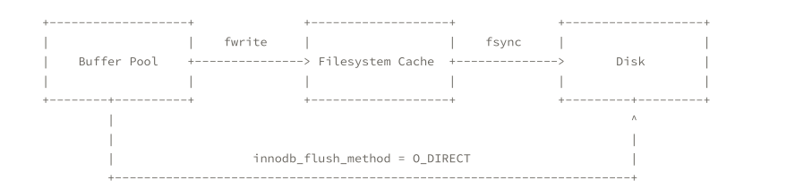
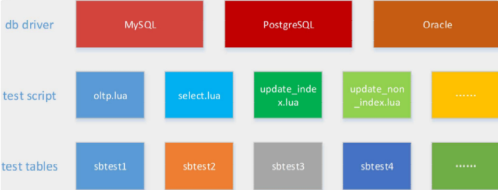

<!-- toc --> 

* * * * *

# 一、一些基本的概念

## 1.基准测试：
数据库的基准测试是对数据库的性能指标进行定量的、可复现的、可对比的测试。
基准测试可以理解为针对系统的一种压力测试。但基准测试不关心业务逻辑，更加简单、直接、易于测试，数据可以由工具生成，不要求真实；而压力测试一般考虑业务逻辑(如购物车业务)，要求真实的数据。
总结一下，为什么要有基准测试：
1. 验证假设
2. 重现异常
3. 测试系统
4. 预测扩展性瓶颈
5. 规划未来的业务增长，评估所需资源
6. 测试应用适应可变环境的能力
7. 测试不同的硬件、软件和操作系统配置
8. 证明设备是否配置正确

## 2.基准测试的作用
对于多数Web应用，整个系统的瓶颈在于数据库；原因很简单：Web应用中的其他因素，例如网络带宽、负载均衡节点、应用服务器（包括CPU、内存、硬盘灯、连接数等）、缓存，都很容易通过水平的扩展（俗称加机器）来实现性能的提高。而对于MySQL，由于数据一致性的要求，无法通过增加机器来分散向数据库写数据带来的压力；虽然可以通过前置缓存（Redis等）、读写分离、分库分表来减轻压力，但是与系统其它组件的水平扩展相比，受到了太多的限制。

而对数据库的基准测试的作用，就是分析在当前的配置下（包括硬件配置、OS、数据库设置等），数据库的性能表现，从而找出MySQL的性能阈值，并根据实际系统的要求调整配置。

## 3.常见数据库的基准测试指标包括：

* 1.处理能力
	* 数据吞吐量(Throughput)，指单位时间内可以成功传输的数据数量。对于大量顺序读写的应用，如VOD(Video On Demand)，则更关注吞吐量指标。 
	* 每秒事务数(TPS) ：这是一个系统的处理能力的，最直接指标，一般的基准测试，都会重点测试这个指标。个业务场景中的事物标准是不一样的。 --用于衡量吞吐量 
	* QPS 每秒处理的查询数 --用于衡量吞吐量
	* TPM 每分钟事务数
	* IOPS，每秒磁盘进行的I/O操作次数。随机读写频繁的应用，如OLTP，IOPS是关键衡量指标。
* 2.响应时间或延迟
	* 任务所需的整体时间
	* 常用测试指标：
		* 平均响应时间
		* 最小响应时间
		* 最大响应时间
		* 时间百分比
		* 其中时间百分比参考意义较大，如前95%的请求的最大响应时间
* 3.并发量：同时处理的查询请求的数量。
	* 为了测试应用在不同并发下的性能
* 4.可扩展性
	* 给系统增加一倍的工作，在理想情况下获得两倍的结果(吞吐量)

## 4.基准测试的分类
对MySQL的基准测试，有如下两种思路：

1. 针对整个系统的基准测试：通过http请求进行测试，如通过浏览器、APP或postman等测试工具。该方案的优点是能够更好的针对整个系统，测试结果更加准确；缺点是设计复杂实现困难。

2. 只针对MySQL的基准测试：优点和缺点与针对整个系统的测试恰好相反。

在针对MySQL进行基准测试时，一般使用专门的工具进行，例如mysqlslap、sysbench等。其中，sysbench比mysqlslap更通用、更强大，且更适合Innodb（因为模拟了许多Innodb的IO特性），后面也将介绍使用sysbench进行基准测试的方法。


## 5.MySQL的相关tps/qps计算方法
### 5.1 MySQL的QPS计算 
show global status where Variable_name in('com_select','com_insert','com_delete','com_update'); 
等待10秒 
show global status where Variable_name in('com_select','com_insert','com_delete','com_update'); 
计算差值 

### 5.2 MySQL的TPS计算 
show global status where Variable_name in('com_insert','com_delete','com_update'); 
等待10秒 
show global status where Variable_name in('com_insert','com_delete','com_update'); 
计算差值 

## 6.磁盘的IOPS计算
IOPS 是指单位时间内系统能处理的I/O请求数量，一般以每秒处理的I/O请求数量为单位，I/O请求通常为读或写数据操作请求。

### 6.1 传统机械硬盘的IOPS值计算
磁盘完成一个I/O请求所花费的时间，它由`寻道时间、旋转延迟和数据传输时间`三部分构成。 
* 寻道时间Tseek
	* 是指将读写磁头移动至正确的磁道上所需要的时间。寻道时间越短，I/O操作越快，目前磁盘的平均寻道时间一般在3－15ms。 
* 旋转延迟Trotation
	* 是指盘片旋转将请求数据所在扇区移至读写磁头下方所需要的时间。旋转延迟取决于磁盘转速，通常使用磁盘旋转一周所需时间的1/2表示。比如，7200 rpm的磁盘平均旋转延迟大约为60*1000/7200/2 = 4.17ms，而转速为15000 rpm的磁盘其平均旋转延迟约为2ms。 
* 数据传输时间Ttransfer
	* 是指完成传输所请求的数据所需要的时间，它取决于数据传输率，其值等于数据大小除以数据传输率。
	* 目前IDE/ATA能达到133MB/s，SATA II可达到300MB/s的接口数据传输率，数据传输时间通常远小于前两部分时间。 

因此，理论上可以计算出磁盘的平均最大IOPS，即IOPS = 1000 ms/ (Tseek + Troatation)，忽略数据传输时间。假设磁盘平均物理寻道时间为3ms, 磁盘转速为7200,10K,15K rpm，则磁盘IOPS理论最大值分别为， 
IOPS = 1000 / (3 + 60000/7200/2)  = 140 
IOPS = 1000 / (3 + 60000/10000/2) = 167 
IOPS = 1000 / (3 + 60000/15000/2) = 200 

### 6.2 iostat 命令
```
[root@nazeebo ~]# iostat -xm 2  --x表示显示扩展统计信息，m表示以兆为单位显示，2表示每隔2秒显示
Linux 3.10.0-693.2.2.el7.x86_64 (nazeebo) 	07/24/2018 	_x86_64_	(2 CPU)

avg-cpu:  %user   %nice %system %iowait  %steal   %idle
           0.08    0.00    0.07    0.01    0.00   99.84

Device:         rrqm/s   wrqm/s     r/s     w/s    rMB/s    wMB/s avgrq-sz avgqu-sz   await r_await w_await  svctm  %util
vda               0.00     0.07    0.03    0.26     0.00     0.01    70.07     0.02   58.27   41.96   60.14   0.87   0.03

avg-cpu:  %user   %nice %system %iowait  %steal   %idle
           0.00    0.00    0.25    0.00    0.00   99.75

Device:         rrqm/s   wrqm/s     r/s     w/s    rMB/s    wMB/s avgrq-sz avgqu-sz   await r_await w_await  svctm  %util
vda               0.00     0.00    0.00    0.00     0.00     0.00     0.00     0.00    0.00    0.00    0.00   0.00   0.00

avg-cpu:  %user   %nice %system %iowait  %steal   %idle
           0.25    0.00    0.00    0.00    0.00   99.75

Device:         rrqm/s   wrqm/s     r/s     w/s    rMB/s    wMB/s avgrq-sz avgqu-sz   await r_await w_await  svctm  %util
vda               0.00     0.00    0.00    0.00     0.00     0.00     0.00     0.00    0.00    0.00    0.00   0.00   0.00

```

#### 6.2.1 CPU属性说明:
* %user CPU处在用户模式下的时间百分比
* %nice CPU处在带NICE值的用户模式下的时间百分比
* %sys CPU处在系统模式下的时间百分比
* %iowait CPU等待IO完成时间的百分比
* %steal 管理程序维护另一个虚拟处理器时，虚拟CPU的无意的等待时间的百分比
* %idle 闲置cpu的百分比

提示：
* 如果%iowait的值过高，表示硬盘存在I/O瓶颈;
* 如果%idle值高，表示CPU较空闲，如果%idle值高但系统响应慢时，有可能是CPU等待分配内存，此时应加大内存容量。
* 如果%idle值如果 持续 很低，那么系统的CPU处理能力相对较低，表明系统中最需要解决的资源是CPU。

#### 6.2.2 Device属性说明:
* rrqm/s 每秒进行 merge 的读操作数目
* wrqm/s 每秒进行 merge 的写操作数目
* r/s 每秒完成的读 I/O 设备次数
* w/s 每秒完成的写 I/O 设备次数
* rsec/s 每秒读扇区数
* wsec/s 每秒写扇区数
* rkB/s 每秒读K字节数
* wkB/s 每秒写K字节数
* avgrq-sz 平均每次设备I/O操作的数据大小 (扇区)
* avgqu-sz 平均I/O队列长度
* await 平均每次设备I/O操作的等待时间 (毫秒)
* svctm 平均每次设备I/O操作的服务时间 (毫秒)
* %util 一秒中有百分之多少的时间用于 I/O 操作，即被io消耗的cpu百分比


* * * * *

* rrqm/s 和 wrqm/s
	* Merge 将若干个连续地址的IO请求进行合并。来提高IO的效率
	* rrqm/s 是每秒读（read）请求合并的次数
	* wrqm/s 是每秒写（write）请求合并的次数
* r/s和w/s
	* 在 合并之后（after merge） IO请求的次数
	* r/s 合并之后每秒读IO的次数
	* w/s 合并之后每秒写IO的次数
	* r/s + w/s = IOPS
* rsec/s（rKB/s、rMB/s）和 wsec/s（wKB/s、wMB/s）
	* sec 是 Sector（扇区） ，为 512Byte
	* KB 和 MB 是通过扇区的 512Byte 进行的换算
* avgrq-sz
	* 一块磁盘可能存储数据的同时还存储日志，所以请求的IO大小是不一样的
	* 该参数就是平均的请求数，注意，该值需要 * 512Byte 才是最终的结果，因为该值是以扇区为单位的
* avgqu-sz
	* 请求的IO队列的平均长度 （比较重要）
	* HDD可能在4左右，SSD可以达到30左右
* await、r_await、w_await
	* IO请求平均等待的时间，单位是ms
	* r_await 和 w_await 分别对应 读IO请求的等待 和 写IO请求的等待
* svctm
	* 服务于IO请求的平均时间
	* man文档中提示不要相信该值，以后会被移除
* %util
	* 磁盘是否空闲；不能简单的等同于IO的使用率；该值可以解释为磁盘是否繁忙
	* 如果该值100% 不能简单的等同于磁盘的负载满了，达到了瓶颈
	* 需要综合 avgqu-sz 、 await 等其他指标进行综合判断磁盘是否达到瓶颈


提示：
* 如果 %util 接近 100%，说明产生的I/O请求太多，I/O系统已经满负荷，该磁盘可能存在瓶颈。
* 如果 svctm 比较接近 await，说明 I/O 几乎没有等待时间；
* 如果 await 远大于 svctm，说明I/O队列太长，io响应太慢，则需要进行必要优化。
* 如果avgqu-sz比较大，也表示有当量io在等待。

### 6.3 iotop
```
iotop -u mysql   # -u 表示监控哪个user的进程
```
上述命令只能看到MySQL的线程ID（Thread ID）
需要结合 performance_schema.threads表 中的信息，结合 iotop -u mysql 的输出，才可以知道某个线程的io使用情况

#### 6.3.1 thread id 、pid的关系查询（类似于Oracle的pid于sid的关系）
```
mysql>  use performance_schema;
Reading table information for completion of table and column names
You can turn off this feature to get a quicker startup with -A

Database changed
mysql> desc threads;
+---------------------+---------------------+------+-----+---------+-------+
| Field               | Type                | Null | Key | Default | Extra |
+---------------------+---------------------+------+-----+---------+-------+
| THREAD_ID           | bigint(20) unsigned | NO   |     | NULL    |       | -- MySQL内部线程ID
| NAME                | varchar(128)        | NO   |     | NULL    |       |
| TYPE                | varchar(10)         | NO   |     | NULL    |       |
| PROCESSLIST_ID      | bigint(20) unsigned | YES  |     | NULL    |       |
| PROCESSLIST_USER    | varchar(32)         | YES  |     | NULL    |       |
| PROCESSLIST_HOST    | varchar(60)         | YES  |     | NULL    |       |
| PROCESSLIST_DB      | varchar(64)         | YES  |     | NULL    |       |
| PROCESSLIST_COMMAND | varchar(16)         | YES  |     | NULL    |       |
| PROCESSLIST_TIME    | bigint(20)          | YES  |     | NULL    |       |
| PROCESSLIST_STATE   | varchar(64)         | YES  |     | NULL    |       |
| PROCESSLIST_INFO    | longtext            | YES  |     | NULL    |       |
| PARENT_THREAD_ID    | bigint(20) unsigned | YES  |     | NULL    |       |
| ROLE                | varchar(64)         | YES  |     | NULL    |       |
| INSTRUMENTED        | enum('YES','NO')    | NO   |     | NULL    |       |
| HISTORY             | enum('YES','NO')    | NO   |     | NULL    |       |
| CONNECTION_TYPE     | varchar(16)         | YES  |     | NULL    |       |
| THREAD_OS_ID        | bigint(20) unsigned | YES  |     | NULL    |       | -- 操作系统的线程ID
+---------------------+---------------------+------+-----+---------+-------+
17 rows in set (0.00 sec)

--thread_id，thread_os_id，processid
mysql> select name,type,thread_id,thread_os_id,processlist_id from threads;
+----------------------------------------+------------+-----------+--------------+----------------+
| name                                   | type       | thread_id | thread_os_id | processlist_id |
+----------------------------------------+------------+-----------+--------------+----------------+
| thread/sql/main                        | BACKGROUND |         1 |         8947 |           NULL |
| thread/sql/thread_timer_notifier       | BACKGROUND |         2 |         8948 |           NULL |
| thread/innodb/io_ibuf_thread           | BACKGROUND |         3 |         8951 |           NULL |
| thread/innodb/io_log_thread            | BACKGROUND |         4 |         8952 |           NULL |
| thread/innodb/io_read_thread           | BACKGROUND |         5 |         8953 |           NULL |
| thread/innodb/io_read_thread           | BACKGROUND |         6 |         8954 |           NULL |
| thread/innodb/io_read_thread           | BACKGROUND |         7 |         8955 |           NULL |
| thread/innodb/io_read_thread           | BACKGROUND |         8 |         8956 |           NULL |
| thread/innodb/io_write_thread          | BACKGROUND |         9 |         8957 |           NULL |
| thread/innodb/io_write_thread          | BACKGROUND |        10 |         8958 |           NULL |
| thread/innodb/io_write_thread          | BACKGROUND |        11 |         8959 |           NULL |
| thread/innodb/io_write_thread          | BACKGROUND |        12 |         8960 |           NULL |
| thread/innodb/page_cleaner_thread      | BACKGROUND |        13 |         8961 |           NULL |
| thread/innodb/srv_lock_timeout_thread  | BACKGROUND |        15 |         8968 |           NULL |
| thread/innodb/srv_error_monitor_thread | BACKGROUND |        16 |         8969 |           NULL |
| thread/innodb/srv_monitor_thread       | BACKGROUND |        17 |         8970 |           NULL |
| thread/innodb/srv_master_thread        | BACKGROUND |        18 |         8971 |           NULL |
| thread/innodb/srv_purge_thread         | BACKGROUND |        19 |         8972 |           NULL |
| thread/innodb/srv_worker_thread        | BACKGROUND |        20 |         8973 |           NULL |
| thread/innodb/srv_worker_thread        | BACKGROUND |        21 |         8974 |           NULL |
| thread/innodb/srv_worker_thread        | BACKGROUND |        22 |         8975 |           NULL |
| thread/innodb/buf_dump_thread          | BACKGROUND |        23 |         8976 |           NULL |
| thread/innodb/dict_stats_thread        | BACKGROUND |        24 |         8977 |           NULL |
| thread/semisync/Ack_receiver           | BACKGROUND |        25 |         8980 |           NULL |
| thread/sql/signal_handler              | BACKGROUND |        26 |         8987 |           NULL |
| thread/sql/compress_gtid_table         | FOREGROUND |        27 |         8988 |              1 |
| thread/sql/one_connection              | FOREGROUND |       142 |         9019 |            116 |  -- FOREGROUND前台线程
+----------------------------------------+------------+-----------+--------------+----------------+
27 rows in set (0.00 sec)

--processid
mysql> show processlist;
+-----+------+-----------+--------------------+---------+------+----------+------------------+
| Id  | User | Host      | db                 | Command | Time | State    | Info             |
+-----+------+-----------+--------------------+---------+------+----------+------------------+
| 116 | root | localhost | performance_schema | Query   |    0 | starting | show processlist |
+-----+------+-----------+--------------------+---------+------+----------+------------------+
1 row in set (0.00 sec)

mysql> select connection_id();
+-----------------+
| connection_id() |
+-----------------+
|             116 |
+-----------------+
1 row in set (0.00 sec)
```

通过 threads表 中的信息，结合 iotop -u mysql 的输出，就可以知道某个线程的io使用情况

#### 6.3.2 innodb_flush_method参数
```
mysql> show variables like '%innodb_flush_method%';
+---------------------+----------+
| Variable_name       | Value    |
+---------------------+----------+
| innodb_flush_method | O_DIRECT |
+---------------------+----------+
1 row in set (0.00 sec)
```
* fwrite / fsync
    * fwrite 是把数据写入文件系统层（Filesystem）（可能有cache），并不能保证写入Disk
    * fsync 可以保证把数据写入到Disk（数据落盘）

只通过 fwrite 写入数据特别快（因为有缓存），但随后调用 fsync 就会很慢，这个速度取决于磁盘的 IOPS
如果不手工执行 fysnc ，当Filesystem的 cache 小于 10% 时，操作系统才会将数据刷入磁盘。所以可能存在数据丢失的风险，比如掉电

O_DIRECT 的设置参数是告诉系统 直接将数据写入磁盘 ，跳过文件系统的缓存。等同于使用 裸设备 的效果

## 7.提升IOPS性能的手段
* 通过 RAID 技术
	* 功耗较高
	* IOPS在2000左右
* 通过购买共享存储设备
	* 价格非常昂贵
	* 但是比较稳定
	* 底层还是通过RAID实现
* 直接使用SSD
	* 性能较好的SSD可以达到 万级别的IOPS
	* 建议可以用SSD + RAID5，RAID1+0太奢侈


* * * * *

SSD的IOPS值计算
SSD避免了传统磁盘在寻道和旋转上的时间花费，存储单元寻址开销大大降低，因此IOPS可以非常高，能够达到数万甚至数十万。实际测量中，IOPS数值会受到很多因素的影响，包括I/O负载特征(读写比例，顺序和随机，工作线程数，队列深度，数据记录大小)、系统配置、操作系统、磁盘驱动等等。 
因此对比测量磁盘IOPS时，必须在同样的测试基准下进行，即便如何也会产生一定的随机不确定性。通常情况下，IOPS可细分为如下几个指标： 
* Toatal IOPS，混合读写和顺序随机I/O负载情况下的磁盘IOPS，这个与实际I/O情况最为相符，大多数应用关注此指标。 
* Random Read IOPS，100%随机读负载情况下的IOPS。 
* Random Write IOPS，100%随机写负载情况下的IOPS。 
* Sequential Read IOPS，100%顺序负载读情况下的IOPS。 
* Sequential Write IOPS，100%顺序写负载情况下的IOPS。 

IOPS的测试benchmark工具主要有Iometer, IoZone, FIO等，可以综合用于测试磁盘在不同情形下的IOPS。对于应用系统，需要首先确定数据的负载特征，然后选择合理的IOPS指标进行测量和对比分析，据此选择合适的存储介质和软件系统。下面的磁盘IOPS数据来自http://en.wikipedia.org/wiki/IOPS [1]，供基本参考。

# 二、sysbench
## 1.基本介绍
简单高效的基准测试工具
* Oracle官方也使用该工具对MySQL进行测试
* 根据互联网应用特点进行测试
* 可以根据某个具体操作进行测试
* 最新版本1.1
* https://github.com/akopytov/sysbench
* 还支持Oracle、PostgreSQL的测试

主要包括以下几种方式的测试：
1. cpu性能
2. 磁盘io性能
3. 调度程序性能
4. 内存分配及传输速度
5. POSIX线程性能
6. 数据库性能(OLTP基准测试)

## 2.sysbench测试框架


常用测试脚本：
* oltp.lua – 读写混合测试
* select.lua – 读的测试
* update_index.lua – 更新索引页测试
* update_non_index.lua – 更新非索引页测试
* insert.lua – 插入测试
* delete.lua – 删除测试

## 3.sysbench的安装
### 3.1 下载sysbench
```
git clone  https://github.com/akopytov/sysbench.git
```
### 3.2 进入目录，生成相关的配置文件
```
cd sysbench
./autogen.sh 
```
在这儿有个小插曲，执行autogen.sh的时候报错
```
[root@nazeebo sysbench]# ./autogen.sh 
autoreconf: Entering directory `.'
autoreconf: configure.ac: not using Gettext
autoreconf: running: aclocal -I m4 --output=aclocal.m4t
Can't exec "aclocal": No such file or directory at /usr/share/autoconf/Autom4te/FileUtils.pm line 326.
autoreconf: failed to run aclocal: No such file or directory
```

autogen.sh脚本依赖于autoreconf来调用autoconf，automake，aclocal和其它相关工具
所以上述的报错只需要 安装相应的rpm包既可
```
[root@nazeebo sysbench]# 
[root@nazeebo sysbench]# ./autogen.sh 
autoreconf: Entering directory `.'
autoreconf: configure.ac: not using Gettext
autoreconf: running: aclocal -I m4
autoreconf: configure.ac: tracing
autoreconf: configure.ac: not using Libtool
autoreconf: running: /usr/bin/autoconf
configure.ac:61: error: possibly undefined macro: AC_PROG_LIBTOOL
      If this token and others are legitimate, please use m4_pattern_allow.
      See the Autoconf documentation.
autoreconf: /usr/bin/autoconf failed with exit status: 1

[root@nazeebo sysbench]# yum install libtool libsysfs-devel
```

安装了automake，libtool libsysfs-devel后可以正常的执行了
```

[root@nazeebo sysbench]# ./autogen.sh 
autoreconf: Entering directory `.'
autoreconf: configure.ac: not using Gettext
autoreconf: running: aclocal -I m4
autoreconf: configure.ac: tracing
autoreconf: running: libtoolize --copy
libtoolize: putting auxiliary files in AC_CONFIG_AUX_DIR, `config'.
libtoolize: copying file `config/ltmain.sh'
libtoolize: putting macros in AC_CONFIG_MACRO_DIR, `m4'.
libtoolize: copying file `m4/libtool.m4'
libtoolize: copying file `m4/ltoptions.m4'
libtoolize: copying file `m4/ltsugar.m4'
libtoolize: copying file `m4/ltversion.m4'
libtoolize: copying file `m4/lt~obsolete.m4'
autoreconf: running: /usr/bin/autoconf
autoreconf: running: /usr/bin/autoheader
autoreconf: running: automake --add-missing --copy --no-force
configure.ac:59: installing 'config/ar-lib'
configure.ac:45: installing 'config/compile'
configure.ac:27: installing 'config/config.guess'
configure.ac:27: installing 'config/config.sub'
configure.ac:32: installing 'config/install-sh'
configure.ac:32: installing 'config/missing'
src/Makefile.am: installing 'config/depcomp'
parallel-tests: installing 'config/test-driver'
autoreconf: Leaving directory `.'
```
### 3.3 关联mysql的头文件和库
```
[root@nazeebo sysbench]# ./configure --with-mysql-includes=/usr/local/mysql/include/ --with-mysql-libs=/usr/local/mysql/lib/ 
...
===============================================================================
sysbench version   : 1.1.0-7c366c6
CC                 : gcc -std=gnu99
CFLAGS             : -O3 -funroll-loops -ggdb3  -march=core2 -Wall -Wextra -Wpointer-arith -Wbad-function-cast -Wstrict-prototypes -Wnested-externs -Wno-format-zero-length -Wundef -Wstrict-prototypes -Wmissing-prototypes -Wmissing-declarations -Wredundant-decls -Wcast-align   -pthread
CPPFLAGS           : -D_GNU_SOURCE   -I$(top_srcdir)/src -I$(abs_top_builddir)/third_party/luajit/inc -I$(abs_top_builddir)/third_party/concurrency_kit/include
LDFLAGS            : -L/usr/local/lib 
LIBS               : -lm 

prefix             : /usr/local
bindir             : ${prefix}/bin
libexecdir         : ${prefix}/libexec
mandir             : ${prefix}/share/man
datadir            : ${prefix}/share

MySQL support      : yes
PostgreSQL support : no

LuaJIT             : bundled
LUAJIT_CFLAGS      : -I$(abs_top_builddir)/third_party/luajit/inc
LUAJIT_LIBS        : $(abs_top_builddir)/third_party/luajit/lib/libluajit-5.1.a -ldl
LUAJIT_LDFLAGS     : -rdynamic

Concurrency Kit    : bundled
CK_CFLAGS          : -I$(abs_top_builddir)/third_party/concurrency_kit/include
CK_LIBS            : $(abs_top_builddir)/third_party/concurrency_kit/lib/libck.a
configure flags    : 
===============================================================================
```
### 3.4 常规性的make && make install
```
[root@nazeebo sysbench]#  make  #make -j 2 ，其中2表示用几个cpu核心进行编译
[root@nazeebo sysbench]#  make install
```
### 3.5 配置环境变量，查看版本
```
[root@nazeebo sysbench]#  echo "export LD_LIBRARY_PATH=/usr/local/mysql/lib/:$LD_LIBRARY_PATH" >> ~/.bashrc 
[root@nazeebo sysbench]# source ~/.bashrc 
[root@nazeebo sysbench]# sysbench --version
sysbench 1.1.0-7c366c6
```

## 4.sysbench的使用

### 4.1 sysbench选项说明
```
--oltp-test-mode=STRING                    测试类型：simple(简单select测试),complex(事务测试),nontrx(非事务测试),sp(存储过程) ；默认complex
  --oltp-reconnect-mode=STRING             连接类型：session(每个线程到测试结束不重新连接),transaction(执行每个事务重新连接),query(每一个查询重新连接),random(随机)；默认 [session]
  --oltp-sp-name=STRING                    指定执行测试的存储过程名
  --oltp-read-only=[on|off]                仅执行select测试，默认关闭
  --oltp-avoid-deadlocks=[on|off]          更新过程中忽略死锁，默认[off]
  --oltp-skip-trx=[on|off]                 语句以bigin/commit开始结尾，默认[off]
  --oltp-range-size=N                      范围查询的范围大小，默认 [100]，例如begin 100 and 200
  --oltp-point-selects=N                   单个事务中select查询的数量，默认 [10]
  --oltp-use-in-statement=N                每个查询中主键查找(in 10个值)的数量，默认 [0]
  --oltp-simple-ranges=N                   单个事务中执行范围查询的数量(SELECT c  FROM sbtest WHERE id BETWEEN  N AND  M)，默认[1]
  --oltp-sum-ranges=N                      单个事务中执行范围sum查询的数量，默认 [1]
  --oltp-order-ranges=N                    单个事务中执行范围order by查询的数量，默认[1]
  --oltp-distinct-ranges=N                 单个事务中执行范围distinct查询的数量，默认[1]
  --oltp-index-updates=N                   单个事务中执行索引更新的操作的数量，默认[1]
  --oltp-non-index-updates=N               单个事务中执行非索引更新操作的数量，默认[1]
  --oltp-nontrx-mode=STRING                指定单独非事务测试类型进行测试，默认select {select, update_key, update_nokey, insert, delete} [select]
  --oltp-auto-inc=[on|off]                 id列默认自增，默认[on]
  --oltp-connect-delay=N                   指定每一次重新连接延时的时长，默认1秒 [10000]
  --oltp-user-delay-min=N                  minimum time in microseconds to sleep after each request [0]
  --oltp-user-delay-max=N                  maximum time in microseconds to sleep after each request [0]
  --oltp-table-name=STRING                 指定测试的表名，默认[sbtest]
  --oltp-table-size=N                      指定表的记录大小，默认[10000]
  --oltp-dist-type=STRING                  随机数分布状态。uniform(均匀分布)、gauss(高斯分布)、special(特殊分布)，默认 [special]
  --oltp-dist-iter=N                       number of iterations used for numbers generation [12]
  --oltp-dist-pct=N                        启用百分比特殊分布，默认 [1]
  --oltp-dist-res=N                        special 百分比[75]
  --oltp-point-select-mysql-handler=[on|off] Use MySQL HANDLER for point select [off]
  --oltp-point-select-all-cols=[on|off]    select查询测试时select所有列，默认[off]
  --oltp-secondary=[on|off]                索引不是主键索引而是二级索引，默认[off]
  --oltp-num-partitions=N                  指定表分区的数量，默认 [0]
  --oltp-num-tables=N                      指定测试表的数量，默认[1]
General database options:
  --db-driver=STRING  指定测试数据库类型，默认mysql
  --db-ps-mode=STRING prepared statements usage mode {auto, disable} [auto]

mysql options:
  --mysql-host=[LIST,...]       MySQL server host [localhost]
  --mysql-port=N                MySQL server port [3306]
  --mysql-socket=STRING         MySQL socket
  --mysql-user=STRING           MySQL user [sbtest]
  --mysql-password=STRING       MySQL password []
  --mysql-db=STRING             MySQL database name [sbtest]
  --mysql-table-engine=STRING   storage engine to use for the test table {myisam,innodb,bdb,heap,ndbcluster,federated} [innodb]
  --mysql-engine-trx=STRING     whether storage engine used is transactional or not {yes,no,auto} [auto]
  --mysql-ssl=[on|off]          use SSL connections, if available in the client library [off]
  --myisam-max-rows=N           max-rows parameter for MyISAM tables [1000000]
  --mysql-create-options=STRING additional options passed to CREATE TABLE []
```
oltp测试主要会有以下相关参数的测试,,其它相关参数默认即可，有需求也可以自定义：
```
--mysql-engine-trx=STRING     指定不同的存储引擎测试。
--oltp-test-mode=STRING       测试类型：simple(简单select测试),complex(事务测试),nontrx(非事务测试),sp(存储过程) ；默认complex
--oltp-sp-name=STRING         指定存储过程进行语句测试
--oltp-table-size=N           指定表的记录大小，默认[10000]
--oltp-num-tables=N           指定测试表的数量，默认[1]
```
### 4.2 cpu性能测试
cpu测试主要是进行素数的加法运算，在下面的例子中，指定了最大的素数为 50000，可以根据机器cpu的性能来适当调整数值。
```
[root@nazeebo bin]# sysbench --test=cpu --cpu-max-prime=50000 run
WARNING: the --test option is deprecated. You can pass a script name or path on the command line without any options.
sysbench 1.0.9 (using system LuaJIT 2.0.4)

Running the test with following options:
Number of threads: 1
Initializing random number generator from current time


Prime numbers limit: 50000

Initializing worker threads...

Threads started!

CPU speed:
    events per second:    98.53

General statistics:
    total time:                          10.0047s
    total number of events:              986

Latency (ms):
         min:                                  9.92
         avg:                                 10.14
         max:                                 11.98
         95th percentile:                     10.46
         sum:                              10000.88

Threads fairness:
    events (avg/stddev):           986.0000/0.00
    execution time (avg/stddev):   10.0009/0.00

[root@nazeebo bin]# cd /test/
[root@nazeebo test]# sysbench --test=cpu --cpu-max-prime=50000 run
WARNING: the --test option is deprecated. You can pass a script name or path on the command line without any options.
sysbench 1.0.9 (using system LuaJIT 2.0.4)

Running the test with following options:
Number of threads: 1
Initializing random number generator from current time


Prime numbers limit: 50000

Initializing worker threads...

Threads started!

CPU speed:
    events per second:    98.72

General statistics:
    total time:                          10.0058s
    total number of events:              988

Latency (ms):
         min:                                  9.93
         avg:                                 10.12
         max:                                 12.01
         95th percentile:                     10.46
         sum:                              10001.83

Threads fairness:
    events (avg/stddev):           988.0000/0.00
    execution time (avg/stddev):   10.0018/0.00

```

### 4.3 线程测试
```
[root@nazeebo test]# sysbench --test=threads --num-threads=64 --thread-yields=100 --thread-locks=2 run
WARNING: the --test option is deprecated. You can pass a script name or path on the command line without any options.
WARNING: --num-threads is deprecated, use --threads instead
sysbench 1.0.9 (using system LuaJIT 2.0.4)

Running the test with following options:
Number of threads: 64
Initializing random number generator from current time


Initializing worker threads...

Threads started!


General statistics:
    total time:                          10.0051s
    total number of events:              74954

Latency (ms):
         min:                                  0.04
         avg:                                  8.54
         max:                                252.31
         95th percentile:                     39.65
         sum:                             640079.38

Threads fairness:
    events (avg/stddev):           1171.1562/78.04
    execution time (avg/stddev):   10.0012/0.00

[root@nazeebo test]# sysbench --test=threads --num-threads=64 --thread-yields=100 --thread-locks=2 run
WARNING: the --test option is deprecated. You can pass a script name or path on the command line without any options.
WARNING: --num-threads is deprecated, use --threads instead
sysbench 1.0.9 (using system LuaJIT 2.0.4)

Running the test with following options:
Number of threads: 64
Initializing random number generator from current time


Initializing worker threads...

Threads started!


General statistics:
    total time:                          10.0048s
    total number of events:              73762

Latency (ms):
         min:                                  0.04
         avg:                                  8.68
         max:                                236.43
         95th percentile:                     41.10
         sum:                             640055.68

Threads fairness:
    events (avg/stddev):           1152.5312/92.49
    execution time (avg/stddev):   10.0009/0.00
```

### 4.4 磁盘IO性能测试
#### 4.4.1 准备测试文件
```
[root@nazeebo test]# sysbench --test=fileio --file-num=4 --file-block-size=8K --file-total-size=2G --file-test-mode=rndrw --file-extra-flags=direct --max-requests=0 --max-time=100 --num-threads=2 prepare 
WARNING: the --test option is deprecated. You can pass a script name or path on the command line without any options.
WARNING: --num-threads is deprecated, use --threads instead
WARNING: --max-time is deprecated, use --time instead
sysbench 1.0.9 (using system LuaJIT 2.0.4)

4 files, 524288Kb each, 2048Mb total
Creating files for the test...
Extra file open flags: 3
Creating file test_file.0

Creating file test_file.1
Creating file test_file.2
Creating file test_file.3
2147483648 bytes written in 217.06 seconds (9.44 MiB/sec).
[root@nazeebo test]# 
[root@nazeebo test]# ll
total 2097168
-rw------- 1 root root 536870912 Jul 24 16:04 test_file.0
-rw------- 1 root root 536870912 Jul 24 16:05 test_file.1
-rw------- 1 root root 536870912 Jul 24 16:06 test_file.2
-rw------- 1 root root 536870912 Jul 24 16:07 test_file.3

```
#### 4.4.2 开始测试
```
[root@nazeebo test]# sysbench --test=fileio --file-num=4 --file-block-size=8K --file-total-size=2G --file-test-mode=rndrw --file-extra-flags=direct --max-requests=0 --max-time=30 --num-threads=4 --report-interval=3 run
WARNING: the --test option is deprecated. You can pass a script name or path on the command line without any options.
WARNING: --num-threads is deprecated, use --threads instead
WARNING: --max-time is deprecated, use --time instead
sysbench 1.0.9 (using system LuaJIT 2.0.4)

Running the test with following options:
Number of threads: 4
Report intermediate results every 3 second(s)
Initializing random number generator from current time


Extra file open flags: 3
4 files, 512MiB each
2GiB total file size
Block size 8KiB
Number of IO requests: 0
Read/Write ratio for combined random IO test: 1.50
Periodic FSYNC enabled, calling fsync() each 100 requests.
Calling fsync() at the end of test, Enabled.
Using synchronous I/O mode
Doing random r/w test
Initializing worker threads...

Threads started!

[ 3s ] reads: 9.69 MiB/s writes: 6.46 MiB/s fsyncs: 82.61/s latency (ms,95%): 2.184
[ 6s ] reads: 9.69 MiB/s writes: 6.46 MiB/s fsyncs: 82.67/s latency (ms,95%): 1.960
[ 9s ] reads: 9.67 MiB/s writes: 6.45 MiB/s fsyncs: 81.34/s latency (ms,95%): 2.032
[ 12s ] reads: 9.69 MiB/s writes: 6.46 MiB/s fsyncs: 82.67/s latency (ms,95%): 1.996
[ 15s ] reads: 9.69 MiB/s writes: 6.46 MiB/s fsyncs: 82.67/s latency (ms,95%): 2.032
[ 18s ] reads: 9.69 MiB/s writes: 6.46 MiB/s fsyncs: 82.66/s latency (ms,95%): 1.891
[ 21s ] reads: 9.46 MiB/s writes: 6.31 MiB/s fsyncs: 81.33/s latency (ms,95%): 2.861
[ 24s ] reads: 9.47 MiB/s writes: 6.32 MiB/s fsyncs: 81.34/s latency (ms,95%): 2.264
[ 27s ] reads: 9.68 MiB/s writes: 6.45 MiB/s fsyncs: 82.66/s latency (ms,95%): 2.389
[ 30s ] reads: 9.69 MiB/s writes: 6.46 MiB/s fsyncs: 82.67/s latency (ms,95%): 2.264

File operations:
    reads/s:                      1234.25
    writes/s:                     822.80
    fsyncs/s:                     82.26

Throughput:
    read, MiB/s:                  9.64
    written, MiB/s:               6.43

General statistics:
    total time:                          30.0020s
    total number of events:              64187

Latency (ms):
         min:                                  0.02
         avg:                                  1.87
         max:                                 93.20
         95th percentile:                      2.18
         sum:                             119914.00

Threads fairness:
    events (avg/stddev):           16046.7500/174.99
    execution time (avg/stddev):   29.9785/0.00

```

上述测试随机读写的速度分别在9.64MB/s，6.43MB/s
（9.64MB/s * 1024 / 8KB =1233.92）换算后得到的值就是IOPS，约等于上面的1234.25。
（6.43MB/s * 1024 / 8KB =823.04）换算后得到的值就是IOPS，约等于上面的822.80。

#### 4.4.3 cleanup测试文件
```
[root@nazeebo test]#  sysbench --test=fileio --file-num=4 --file-block-size=8K --file-total-size=2G --file-test-mode=rndrw --file-extra-flags=direct --max-requests=0 --max-time=100 --num-threads=2 cleanup
WARNING: the --test option is deprecated. You can pass a script name or path on the command line without any options.
WARNING: --num-threads is deprecated, use --threads instead
WARNING: --max-time is deprecated, use --time instead
sysbench 1.0.9 (using system LuaJIT 2.0.4)

Removing test files...
[root@nazeebo test]# ls
[root@nazeebo test]# 
```

### 4.5 内存测试
指定本次测试整个过程是在内存中传输20G 的数据量，每个 block 大小为 8K。
```
[root@nazeebo test]# sysbench --test=memory --memory-block-size=8k --memory-total-size=20G run
WARNING: the --test option is deprecated. You can pass a script name or path on the command line without any options.
sysbench 1.0.9 (using system LuaJIT 2.0.4)

Running the test with following options:
Number of threads: 1
Initializing random number generator from current time


Running memory speed test with the following options:
  block size: 8KiB
  total size: 20480MiB
  operation: write
  scope: global

Initializing worker threads...

Threads started!

Total operations: 2621440 (1040027.08 per second)

20480.00 MiB transferred (8125.21 MiB/sec)


General statistics:
    total time:                          2.5185s
    total number of events:              2621440

Latency (ms):
         min:                                  0.00
         avg:                                  0.00
         max:                                  0.12
         95th percentile:                      0.00
         sum:                               1867.25

Threads fairness:
    events (avg/stddev):           2621440.0000/0.00
    execution time (avg/stddev):   1.8673/0.00

```

### 4.6 OLTP测试
#### 4.6.1 准备数据
执行模式为complex，使用了10个表，每个表有10万条数据，客户端的并发线程数为10，执行时间为120秒，每10秒生成一次报告。
```
[root@nazeebo sysbench]#  sysbench /usr/share/sysbench/tests/include/oltp_legacy/oltp.lua --db-driver=mysql --mysql-host=nazeebo --mysql-port=3306 --mysql-user=root --mysql-password=123456 --oltp-test-mode=complex --oltp-tables-count=10 --oltp-table-size=100000 --threads=10 --time=120 --report-interval=10 prepare
sysbench 1.0.9 (using system LuaJIT 2.0.4)

Creating table 'sbtest1'...
Inserting 100000 records into 'sbtest1'
Creating secondary indexes on 'sbtest1'...
Creating table 'sbtest2'...
Inserting 100000 records into 'sbtest2'
Creating secondary indexes on 'sbtest2'...
Creating table 'sbtest3'...
Inserting 100000 records into 'sbtest3'
Creating secondary indexes on 'sbtest3'...
Creating table 'sbtest4'...
Inserting 100000 records into 'sbtest4'
Creating secondary indexes on 'sbtest4'...
Creating table 'sbtest5'...
Inserting 100000 records into 'sbtest5'
Creating secondary indexes on 'sbtest5'...
Creating table 'sbtest6'...
Inserting 100000 records into 'sbtest6'
Creating secondary indexes on 'sbtest6'...
Creating table 'sbtest7'...
Inserting 100000 records into 'sbtest7'
Creating secondary indexes on 'sbtest7'...
Creating table 'sbtest8'...
Inserting 100000 records into 'sbtest8'
Creating secondary indexes on 'sbtest8'...
Creating table 'sbtest9'...
Inserting 100000 records into 'sbtest9'
Creating secondary indexes on 'sbtest9'...
Creating table 'sbtest10'...
Inserting 100000 records into 'sbtest10'
Creating secondary indexes on 'sbtest10'...
[root@nazeebo sysbench]# 
```

#### 4.6.2 开始测试
```
[root@nazeebo test]#  sysbench /usr/share/sysbench/tests/include/oltp_legacy/oltp.lua --db-driver=mysql --mysql-host=nazeebo --mysql-port=3306 --mysql-user=root --mysql-password=123456 --oltp-test-mode=complex --oltp-tables-count=10 --oltp-table-size=100000 --threads=10 --time=120 --report-interval=10 run >> /test/mysbtest.log
```
打开log查看：
```
Initializing random number generator from current time


Initializing worker threads...

Threads started!

[ 10s ] thds: 10 tps: 408.79 qps: 8194.76 (r/w/o: 5737.04/1639.15/818.58) lat (ms,95%): 37.56 err/s: 0.00 reconn/s: 0.00
[ 20s ] thds: 10 tps: 501.80 qps: 10033.31 (r/w/o: 7023.91/2005.80/1003.60) lat (ms,95%): 31.94 err/s: 0.00 reconn/s: 0.00
[ 30s ] thds: 10 tps: 512.10 qps: 10240.38 (r/w/o: 7168.98/2047.20/1024.20) lat (ms,95%): 31.37 err/s: 0.00 reconn/s: 0.00
[ 40s ] thds: 10 tps: 506.10 qps: 10123.40 (r/w/o: 7086.07/2025.12/1012.21) lat (ms,95%): 31.94 err/s: 0.00 reconn/s: 0.00
[ 50s ] thds: 10 tps: 518.51 qps: 10365.70 (r/w/o: 7255.67/2073.22/1036.81) lat (ms,95%): 30.81 err/s: 0.00 reconn/s: 0.00
[ 60s ] thds: 10 tps: 512.90 qps: 10260.06 (r/w/o: 7182.17/2051.89/1026.00) lat (ms,95%): 30.81 err/s: 0.00 reconn/s: 0.00
[ 70s ] thds: 10 tps: 494.97 qps: 9899.78 (r/w/o: 6930.16/1979.68/989.94) lat (ms,95%): 30.81 err/s: 0.00 reconn/s: 0.00
[ 80s ] thds: 10 tps: 466.83 qps: 9339.69 (r/w/o: 6536.52/1869.52/933.66) lat (ms,95%): 30.26 err/s: 0.00 reconn/s: 0.00
[ 90s ] thds: 10 tps: 520.30 qps: 10404.67 (r/w/o: 7284.85/2079.21/1040.61) lat (ms,95%): 30.26 err/s: 0.00 reconn/s: 0.00
[ 100s ] thds: 10 tps: 518.90 qps: 10380.23 (r/w/o: 7265.22/2077.21/1037.80) lat (ms,95%): 30.26 err/s: 0.00 reconn/s: 0.00
[ 110s ] thds: 10 tps: 510.68 qps: 10211.31 (r/w/o: 7148.02/2041.92/1021.36) lat (ms,95%): 31.37 err/s: 0.00 reconn/s: 0.00
[ 120s ] thds: 10 tps: 515.91 qps: 10319.65 (r/w/o: 7223.07/2064.85/1031.72) lat (ms,95%): 30.81 err/s: 0.00 reconn/s: 0.00
SQL statistics:
    queries performed:
        read:                            838432
        write:                           239552
        other:                           119776
        total:                           1197760
    transactions:                        59888  (499.03 per sec.)
    queries:                             1197760 (9980.60 per sec.)
    ignored errors:                      0      (0.00 per sec.)
    reconnects:                          0      (0.00 per sec.)

General statistics:
    total time:                          120.0071s
    total number of events:              59888

Latency (ms):
         min:                                  6.18
         avg:                                 20.03
         max:                                943.21
         95th percentile:                     31.37
         sum:                            1199820.15

Threads fairness:
    events (avg/stddev):           5988.8000/37.32
    execution time (avg/stddev):   119.9820/0.00
```
结果统计信息就在最后几句中。
#### 4.6.3 清除测试数据
```
[root@nazeebo test]# sysbench /usr/share/sysbench/tests/include/oltp_legacy/oltp.lua --db-driver=mysql --mysql-host=nazeebo --mysql-port=3306 --mysql-user=root --mysql-password=123456 cleanup
sysbench 1.0.9 (using system LuaJIT 2.0.4)

Dropping table 'sbtest1'...
```
