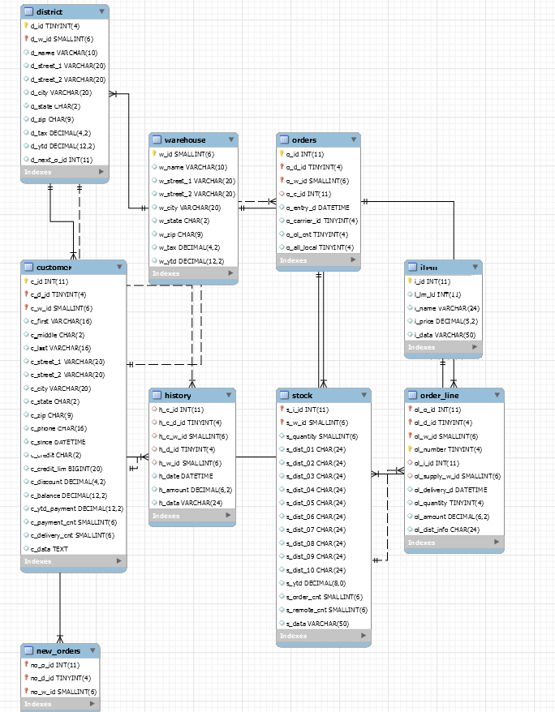
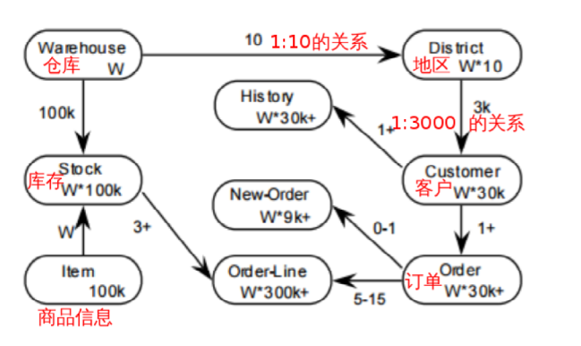

<!-- toc --> 
* * * * *

# 一、性能测试
## 1.TPC-C
* 专门针对联机交易处理系统（OLTP系统）的 规范
* 该系统需要处理的交易事务主要为以下几种：（偏向于电商类）
	* 新订单（New‐Order） ：客户输入一笔新的订货交易；
	* 支付操作（Payment） ：更新客户帐户余额以反映其支付状况；
	* 发货（Delivery） ：发货（模拟批处理交易）；
	* 订单状态查询（Order‐Status） ：查询客户最辢交易的状态；
	* 库存状态查询（Stock‐Level） ：查询仓库库存状况，以便能够及时补货
* 衡量单位： tpmC – transaction per minute
	* 测试出来的TPS比较低，所以乘以60，数据比较好看
	* 模拟线上业务，比较贴近实际
## 2.tpcc-mysql
 由Percona公司开发的tpcc测试工具，仅针对于MySQL数据库进行测试，和sysbench不同，TPCC测试中，数据库的总容量是在慢慢变大的（ 所以到后面，性能会慢慢下降 ）。
 下面是tpcc-mysql的ER图，以及各数据表之间的关系比例




### 2.1 tpcc-mysql的安装
#### 2.1.1 git clone
```
[root@nazeebo test]# git clone https://github.com/Percona-Lab/tpcc-mysql.git
Cloning into 'tpcc-mysql'...
remote: Counting objects: 392, done.
remote: Total 392 (delta 0), reused 0 (delta 0), pack-reused 392
Receiving objects: 100% (392/392), 202.81 KiB | 125.00 KiB/s, done.
Resolving deltas: 100% (216/216), done.
[root@nazeebo test]# ll
drwxr-xr-x 6 root root 4096 Jul 24 17:16 tpcc-mysql
[root@nazeebo test]# cd tpcc-mysql/
[root@nazeebo tpcc-mysql]# ll
total 44
-rw-r--r-- 1 root root 1621 Jul 24 17:16 add_fkey_idx.sql --step2:创建索引
-rw-r--r-- 1 root root  317 Jul 24 17:16 count.sql
-rw-r--r-- 1 root root 3105 Jul 24 17:16 create_table.sql  --step1:创建表
-rw-r--r-- 1 root root  194 Jul 24 17:16 Dockerfile
-rw-r--r-- 1 root root  763 Jul 24 17:16 drop_cons.sql
-rw-r--r-- 1 root root 1079 Jul 24 17:16 load_multi_schema.sh
-rw-r--r-- 1 root root  573 Jul 24 17:16 load.sh
-rw-r--r-- 1 root root 2302 Jul 24 17:16 README.md
drwxr-xr-x 2 root root 4096 Jul 24 17:16 schema2
drwxr-xr-x 5 root root 4096 Jul 24 17:16 scripts
drwxr-xr-x 2 root root 4096 Jul 24 17:16 src

```
#### 2.1.2 编译，生成tpcc_load和tpcc_start工具
```
[root@nazeebo tpcc-mysql]# cd src/
[root@nazeebo src]# ls
delivery.c  load.c  Makefile  ordstat.c     payment.c  rthist.h         sb_percentile.h  sequence.h  spt_proc.c  support.c  trans_if.h
driver.c    main.c  neword.c  parse_port.h  rthist.c   sb_percentile.c  sequence.c       slev.c      spt_proc.h  tpc.h
[root@nazeebo src]# make 
cc -w -O3 -g -I. `mysql_config --include`  -c load.c
cc -w -O3 -g -I. `mysql_config --include`  -c support.c
cc load.o support.o `mysql_config --libs_r` -lrt -o ../tpcc_load
cc -w -O3 -g -I. `mysql_config --include`  -c main.c
cc -w -O3 -g -I. `mysql_config --include`  -c spt_proc.c
cc -w -O3 -g -I. `mysql_config --include`  -c driver.c
cc -w -O3 -g -I. `mysql_config --include`  -c sequence.c
cc -w -O3 -g -I. `mysql_config --include`  -c rthist.c
cc -w -O3 -g -I. `mysql_config --include`  -c sb_percentile.c
cc -w -O3 -g -I. `mysql_config --include`  -c neword.c
cc -w -O3 -g -I. `mysql_config --include`  -c payment.c
cc -w -O3 -g -I. `mysql_config --include`  -c ordstat.c
cc -w -O3 -g -I. `mysql_config --include`  -c delivery.c
cc -w -O3 -g -I. `mysql_config --include`  -c slev.c
cc main.o spt_proc.o driver.o support.o sequence.o rthist.o sb_percentile.o neword.o payment.o ordstat.o delivery.o slev.o `mysql_config --libs_r` -lrt -o ../tpcc_start
[root@nazeebo src]# cd ..
[root@nazeebo tpcc-mysql]# ll
total 312
-rw-r--r-- 1 root root   1621 Jul 24 17:16 add_fkey_idx.sql
-rw-r--r-- 1 root root    317 Jul 24 17:16 count.sql
-rw-r--r-- 1 root root   3105 Jul 24 17:16 create_table.sql
-rw-r--r-- 1 root root    194 Jul 24 17:16 Dockerfile
-rw-r--r-- 1 root root    763 Jul 24 17:16 drop_cons.sql
-rw-r--r-- 1 root root   1079 Jul 24 17:16 load_multi_schema.sh
-rw-r--r-- 1 root root    573 Jul 24 17:16 load.sh
-rw-r--r-- 1 root root   2302 Jul 24 17:16 README.md
drwxr-xr-x 2 root root   4096 Jul 24 17:16 schema2
drwxr-xr-x 5 root root   4096 Jul 24 17:16 scripts
drwxr-xr-x 2 root root   4096 Jul 24 17:19 src
-rwxr-xr-x 1 root root  81112 Jul 24 17:19 tpcc_load
-rwxr-xr-x 1 root root 188640 Jul 24 17:19 tpcc_start

```
#### 2.1.3 创建表，生成数据
```
1.先提前创建好库tpcc1，然后使用脚本create_table.sql创建表
root@nazeebo tpcc-mysql]#  mysql -u root -p123456 -S /tmp/mysql.sock tpcc < create_table.sql
mysql: [Warning] Using a password on the command line interface can be insecure.
[root@nazeebo tpcc-mysql]#  mysql -u root -p123456 -S /tmp/mysql.sock tpcc -e "show tables"
mysql: [Warning] Using a password on the command line interface can be insecure.
+-----------------+
| Tables_in_tpcc1 |
+-----------------+
| customer        |
| district        |
| history         |
| item            |
| new_orders      |
| order_line      |
| orders          |
| stock           |
| warehouse       |
+-----------------+

2.创建表后，用tpcc_load生成数据
[root@nazeebo tpcc-mysql]# ./tpcc_load --help
*************************************
*** TPCC-mysql Data Loader        ***
*************************************
./tpcc_load: invalid option -- '-'
Usage: tpcc_load -h server_host -P port -d database_name -u mysql_user -p mysql_password -w warehouses -l part -m min_wh -n max_wh
* [part]: 1=ITEMS 2=WAREHOUSE 3=CUSTOMER 4=ORDERS
[root@nazeebo tpcc-mysql]# 

在这儿创建2个仓库的数据
[root@nazeebo tpcc-mysql]# ./tpcc_load -h nazeebo -P 3306 -d tpcc -u root -p 123456 -w 2
*************************************
*** TPCC-mysql Data Loader        ***
*************************************
option h with value 'nazeebo'
option P with value '3306'
option d with value 'tpcc'
option u with value 'root'
option p with value '123456'
option w with value '2'
<Parameters>
     [server]: nazeebo
     [port]: 3306
     [DBname]: tpcc
       [user]: root
       [pass]: 123456
  [warehouse]: 2
TPCC Data Load Started...
Loading Item 
.................................................. 5000
.................................................. 10000
.................................................. 15000
.................................................. 20000
.................................................. 25000
.................................................. 30000
.................................................. 35000
.................................................. 40000
.................................................. 45000
.................................................. 50000
.................................................. 55000
.................................................. 60000
.................................................. 65000
.................................................. 70000
.................................................. 75000
.................................................. 80000
.................................................. 85000
.................................................. 90000
.................................................. 95000
.................................................. 100000
Item Done. 
...
省略大部分输出
...

...DATA LOADING COMPLETED SUCCESSFULLY.

3.创建完成后创建索引
[root@nazeebo tpcc-mysql]# mysql -u root -p -S /tmp/mysql.sock tpcc < add_fkey_idx.sql
```

#### 2.1.4 检查生成的数据
```
mysql> use tpcc
Reading table information for completion of table and column names
You can turn off this feature to get a quicker startup with -A

Database changed
mysql> select * from warehouse;
+------+-----------+----------------+----------------------+--------------------+---------+-----------+-------+-----------+
| w_id | w_name    | w_street_1     | w_street_2           | w_city             | w_state | w_zip     | w_tax | w_ytd     |
+------+-----------+----------------+----------------------+--------------------+---------+-----------+-------+-----------+
|    1 | SGjfdBiF6 | f0gUgEmWUpQOx  | W9TDbXY1lFhMRNcVIFVy | BCTgeG62BHWJkj     | IG      | 955868834 |  0.18 | 300000.00 |
|    2 | wtBvxidw  | SWSdQDVap2wJah | aqHCF6QCyZ5          | FipF8JfjktCKgEHzoy | Nm      | 397751947 |  0.17 | 300000.00 |
+------+-----------+----------------+----------------------+--------------------+---------+-----------+-------+-----------+
2 rows in set (0.00 sec)

mysql> select count(1) from district;
+----------+
| count(1) |
+----------+
|       20 |  -- 因为是1:10的关系，有2个仓库，就有20个地区
+----------+
1 row in set (0.00 sec)

mysql>  select count(1) from customer;
+----------+
| count(1) |
+----------+
|    60000 |  -- 因为是1:30000，所以有2个仓库，就有60000个用户
+----------+
1 row in set (0.01 sec)

```
以上就是将测试的数据生成好了，接下来就可以进行测试了。

> 注意：
> 测试之前，建议先 备份tpcc的数据库 ，然后开始测试，因为tpcc测试时，数据量会越来越多；当你修改部分参数以及优化后，想要做对比测试时，就不能在原来的基础上进行测试（因为数据量变大了），需要用备份的tpcc库进行还原后，再做测试。最简单的是直接停机，拷贝走datadir目录。

### 2.2 tpcc-mysql 测试
#### 2.2.1 预热
```
[root@nazeebo tpcc-mysql]# mysql -uroot -p123456 -S /tmp/mysql.sock tpcc < count.sql
mysql: [Warning] Using a password on the command line interface can be insecure.
count(w_id)
2
count(d_w_id)
20
count(c_w_id)
60000
count(h_c_id)
60000
count(no_w_id)
18000
count(o_w_id)
60000
count(ol_w_id)
599639
count(i_id)
100000
count(s_w_id)
200000
[root@nazeebo tpcc-mysql]# 
```

#### 2.2.2 开始测试
```
[root@nazeebo tpcc-mysql]# ./tpcc_start -h nazeebo -P 3306 -d tpcc -u root -p 123456 -w 2 -c 16 -r 10 -l 60
***************************************
*** ###easy### TPC-C Load Generator ***
***************************************
option h with value 'nazeebo'
option P with value '3306'
option d with value 'tpcc'
option u with value 'root'
option p with value '123456'
option w with value '2'
option c with value '16'
option r with value '10'
option l with value '60'
<Parameters>
     [server]: nazeebo
     [port]: 3306
     [DBname]: tpcc
       [user]: root
       [pass]: 123456
  [warehouse]: 2
 [connection]: 16
     [rampup]: 10 (sec.)
    [measure]: 60 (sec.)

RAMP-UP TIME.(10 sec.)

MEASURING START. --下面这每隔10秒打印的数据，就是tpcc的5个动作，订单、支付、发货、订单查询、库存查询

  10, trx: 1482, 95%: 47.294, 99%: 73.085, max_rt: 170.466, 1476|247.195, 148|41.253, 148|393.725, 149|71.717
  20, trx: 1533, 95%: 43.427, 99%: 61.898, max_rt: 105.618, 1536|197.600, 153|11.631, 153|204.132, 153|66.841
  30, trx: 1520, 95%: 46.998, 99%: 65.954, max_rt: 81.930, 1520|167.517, 153|9.448, 153|207.713, 152|58.870
  40, trx: 1587, 95%: 41.297, 99%: 53.775, max_rt: 79.465, 1585|159.549, 158|9.081, 159|187.199, 159|64.726
  50, trx: 1502, 95%: 41.707, 99%: 54.504, max_rt: 87.930, 1503|175.694, 150|6.721, 149|170.767, 151|62.315
  60, trx: 1586, 95%: 43.077, 99%: 54.798, max_rt: 85.671, 1588|168.550, 159|15.743, 159|192.450, 158|67.230

STOPPING THREADS................

<Raw Results>
  [0] sc:0 lt:9210  rt:0  fl:0 avg_rt: 27.6 (5)
  [1] sc:0 lt:9208  rt:0  fl:0 avg_rt: 75.7 (5)
  [2] sc:900 lt:21  rt:0  fl:0 avg_rt: 1.6 (5)
  [3] sc:0 lt:921  rt:0  fl:0 avg_rt: 149.0 (80)
  [4] sc:184 lt:738  rt:0  fl:0 avg_rt: 32.2 (20)
 in 60 sec.

<Raw Results2(sum ver.)>
  [0] sc:0  lt:9210  rt:0  fl:0 
  [1] sc:0  lt:9208  rt:0  fl:0 
  [2] sc:900  lt:21  rt:0  fl:0 
  [3] sc:0  lt:921  rt:0  fl:0 
  [4] sc:184  lt:738  rt:0  fl:0 

<Constraint Check> (all must be [OK])
 [transaction percentage]
        Payment: 43.47% (>=43.0%) [OK]
   Order-Status: 4.35% (>= 4.0%) [OK]
       Delivery: 4.35% (>= 4.0%) [OK]
    Stock-Level: 4.35% (>= 4.0%) [OK]
 [response time (at least 90% passed)]
      New-Order: 0.00%  [NG] *
        Payment: 0.00%  [NG] *
   Order-Status: 97.72%  [OK]
       Delivery: 0.00%  [NG] *
    Stock-Level: 19.96%  [NG] *

<TpmC>
                 9210.000 TpmC

```
tps = 9210/60≈154

## 3.mysqlslap
mysqlslap 是官方提供的性能测试工具