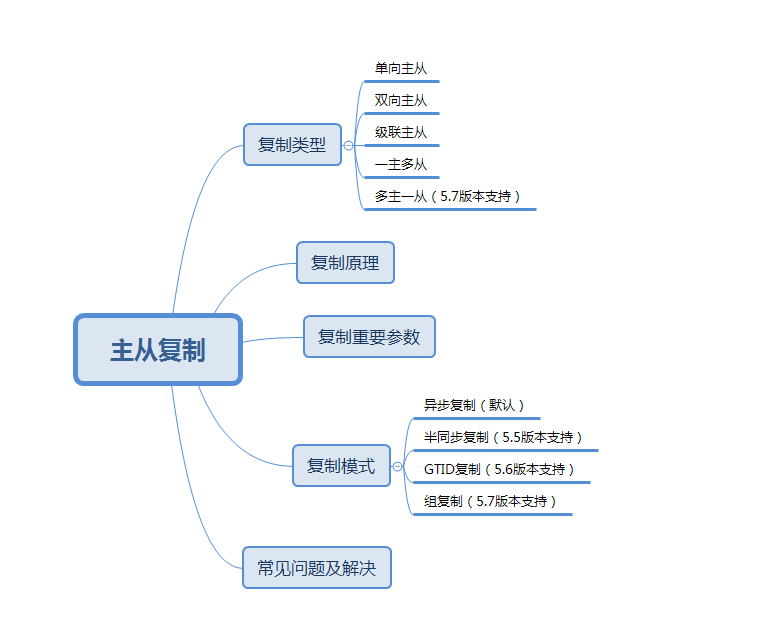
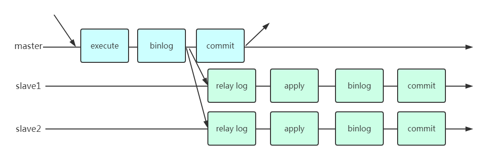
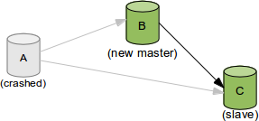
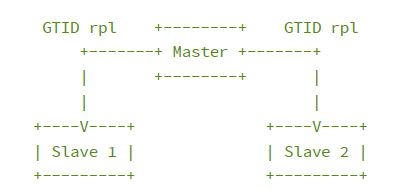
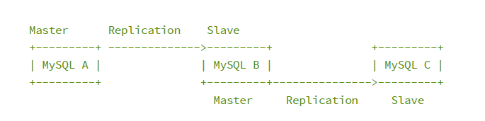
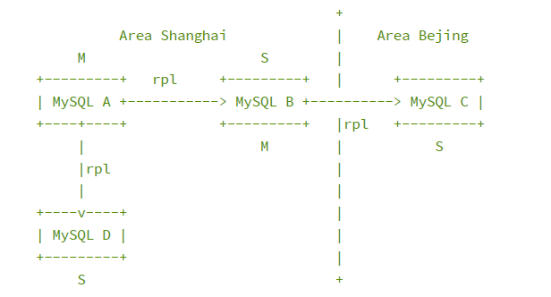
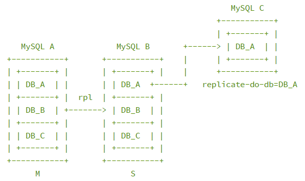

<!-- toc --> 

* * * * *

# 一、概述


> MySQL天生支持replication，这个是它最大的优势。后面很多高可用的玩法都是基于最基本的主从复制的原理来的。因此，掌握主从复制非常重要！

## 1.主从复制用途
* 实时灾备，用于故障切换
* 读写分离，提供查询服务
* 备份，避免影响业务

## 2.主从部署的必要条件
* 主库开启binlog日志（设置log-bin参数）
* 主从server-id不同
* 从库服务器能连同主库


## 3.复制原理
主从复制原理如图：

复制过程：
1. 从库有两个线程，一个I/O线程，一个SQL线程
2. 从库的I/O线程去请求主库的binlog
3. 主库把数据的更改记录到自己的binlog
4. 主库会生成一个log dump线程，用来给从库的I/O线程传binlog
5. 从库得到主库发送的binlog并写入到自己的relay log中
6. 从库的SQL线程会读取relay log，并解析成具体的操作执行，重做应用中继日志中的SQL语句，达到主从的数据一致


## 4.主从复制存在的问题
* 主库宕机之后，数据可能会丢失
* 从库只有一个sql Thread，主库是可以并发的，当写压力大时，复制很可能延时

## 5.复制类型
* 单向主从
* 双向主从
* 级联主从
* 一主多从
* 多主一从

## 6.复制重要参数


### log_bin
log_bin = on
* 搭建主从复制，必须开启二进制日志
* 需要注意的是，--log-bin选项设置的是log_bin_basename，而非log_bin

发散一个：
```
-- 查询bin-log是否开启
SHOW VARIABLES LIKE '%log_bin%';

-- 显示第一个bin-log的信息
SHOW BINLOG EVENTS;  

-- 获取bin-log列表
SHOW BINARY LOGS;

-- 查询某个bin-log信息
SHOW BINLOG EVENTS IN 'bin-log.000001';

-- 查看mysql服务器下面bin-log二进制文件方法: 
mysqlbinlog  /u01/mysql/log/BIN-log.000009 
```

再来个实际的例子，瞬间明了：
```
mysql> show variables like '%log_bin%';
+---------------------------------+---------------------------------+
| Variable_name                   | Value                           |
+---------------------------------+---------------------------------+
| log_bin                         | ON                              |
| log_bin_basename                | /u01/mysql/mysql_data/bin       |
| log_bin_index                   | /u01/mysql/mysql_data/bin.index |
| log_bin_trust_function_creators | OFF                             |
| log_bin_use_v1_row_events       | OFF                             |
| sql_log_bin                     | ON                              |
+---------------------------------+---------------------------------+
6 rows in set (0.00 sec)
```
### server-id
* 要保证主从的server-id不一致

### server-uuid
* uuid存放在数据目录的auto.cnf文件下
```
[root@nazeebodan mysql_data]# pwd
/u01/mysql/mysql_data
[root@nazeebodan mysql_data]# cat auto.cnf 
[auto]
server-uuid=fbde5555-a76a-11e8-b670-00163e0463a7
```
### binlog_format
binlog_format = row
* 二进制的日志记录格式。
* 其可取值包括：STATEMENT、ROW和MIXED，分别代表的是基于语句的日志记录格式、基于行的日志记录格式和混合型日志记录格式。
* 如果使用unhealthy格式，则MySQL服务器将根据具体情况在基于语句的和基于行的日志记录格式之间自动切换。默认格式为STATEMENT。
* 运行时，如果要更改此参数或者会话值，客户端必须拥有SUPER权限。

#### rbr的优缺点：
RBR的优点：
* 任何情况都可以被复制，这对复制来说是最安全可靠的
* 和其他大多数数据库系统的复制技术一样
* 多数情况下，从服务器上的表如果有主键的话，复制就会快了很多
* 复制以下几种语句时的行锁更少：
    * INSERT ... SELECT
    * 包含 AUTO_INCREMENT 字段的 INSERT
    * 没有附带条件或者并没有修改很多记录的 UPDATE 或 DELETE 语句
* 执行 INSERT，UPDATE，DELETE 语句时锁更少
* 从服务器上采用多线程来执行复制成为可能

RBR的缺点：
* binlog 大了很多
* 复杂的回滚时 binlog 中会包含大量的数据
* 主服务器上执行 UPDATE 语句时，所有发生变化的记录都会写到 binlog 中，而 SBR 只会写一次，这会导致频繁发生 binlog 的并发写问题
* UDF 产生的大 BLOB 值会导致复制变慢
* 无法从 binlog 中看到都复制了写什么语句
* 当在非事务表上执行一段堆积的SQL语句时，最好采用 SBR 模式，否则很容易导致主从服务器的数据不一致情况发生

### read only
* 设置从库只读，避免在从库上进行写操作
* 但是对super admin的账号没有限制
* 在5.7新增加了一个参数super_read_only，开启该参数，连super admin 的账号也没有写的权限

### sync_binlog
sync_binlog = 1
* 默认值为0
* 像操作系统刷其他文件的机制一样，MySQL不会同步到磁盘中去而是依赖操作系统来刷新binary log
    * N>0 ： 每向二进制日志文件写入N条SQL或N个事务后，会使用fdatasync()函数将它的写二进制日志binary log同步到磁盘中去
    * N=0 ： 不主动刷新二进制日志文件的数据到磁盘上，而是由操作系统决定；
* 如果启用了autocommit，那么每一个语句statement就会有一次写操作；否则每个事务对应一个写操作。

#### 一般与innodb_flush_log_at_trx_commit同时设置
推荐配置组合：
* N=1,1  — 适合数据安全性要求非常高，而且磁盘IO写能力足够支持业务，比如充值消费系统；
* N=1,0  — 适合数据安全性要求高，磁盘IO写能力支持业务不富余，允许备库落后或无复制；
* N=2,0或2,m(0<m<100)  — 适合数据安全性有要求，允许丢失一点事务日志，复制架构的延迟也能接受；
* N=0,0  — 磁盘IO写能力有限，无复制或允许复制延迟稍微长点能接受，例如：日志性登记业务；
### gtid_mode
gtid_mode = on
GTID是MySQL 5.6的新特性，其全称是Global Transaction Identifier，可简化MySQL的主从切换以及Failover。GTID用于在binlog中唯一标识一个事务。当事务提交时，MySQL Server在写binlog的时候，会先写一个特殊的Binlog Event，类型为GTID_Event，指定下一个事务的GTID，然后再写事务的Binlog。主从同步时GTID_Event和事务的Binlog都会传递到从库，从库在执行的时候也是用同样的GTID写binlog，这样主从同步以后，就可通过GTID确定从库同步到的位置了。也就是说，无论是级联情况，还是一主多从情况，都可以通过GTID自动找点儿，而无需像之前那样通过File_name和File_position找点儿了。
* * * * *
GTID(Global Transaction ID)是对于一个已提交事务的编号，并且是一个全局唯一的编号。
GTID实际上是由UUID+TID组成的。其中UUID是一个MySQL实例的唯一标识。TID代表了该实例上已经提交的事务数量，并且随着事务提交单调递增。下面是一个GTID的具体形式：
`3E11FA47-71CA-11E1-9E33-C80AA9429562:23`

* 配置方式为gtid_mode=ON/OFF
* gtid_mode的类型为枚举类型，枚举值可以为ON和OFF，所以应该通过ON或者OFF来控制gtid_mode，不要把它配置成0或者1，否则结果可能不符合预期
* 开启gtid_mode时，log-bin和log-slave-updates也必须开启，否则MySQL Server拒绝启动
* 除此以外，enforce-gtid-consistency也必须开启，否则MySQL Server也拒绝启动。enforce-gtid-consistency是因为开启grid_mode以后，许多MySQL的SQL和GTID是不兼容的，比如开启ROW 格式时，CREATE TABLE ... SELECT，在binlog中会形成2个不同的事务，GTID无法唯一。另外在事务中更新MyISAM表也是不允许的。

### enforce_gtid_consistency
enforce_gtid_consistency = 1
* 与gtid一起使用
* 开始该参数，保证数据的一致性

### log_slave_updates
log_slave_updates
* 与gtid一起使用
* 将master服务器上获取数据变更的信息记录到从服务器的二进制文件中

### master_info_repository
master_info_repository = TABLE
* 从服务器是将主服务器的日志信息写入文件，还是写入表
* 如果该值为FILE（默认值），则从服务器日志文件有—master-info-file选项指定
* 如果该值为TABLE，则服务器会把日志记录到mysql.slave_master_inro表中
* 此参数是在MySQL 5.6.2里引入的

### relay_log_info_repository
relay_log_info_repository = TABLE
* 从服务器是将中继日志信息写入文件，还是写入表
* 如果该值为FILE（默认值），那么从服务器会把日志记录到—relay-log-info-file选项所指定的文件里
* 如果该值为TABLE，那么服务器会把日志记录到mysql.slave_relay_log_info_file表里
* 此参数的在MySQL 5.6.2里引入的

### relay_log
relay_log = relay.log
* 中继日志文件的名字

### relay_log_recovery
relay_log_recovery = 1
* 默认是禁用的
* 此参数在从服务器崩溃之后非常有用
* 在启动时启用它，可以使从服务器删除所有的还未处理的中继日志，并再次从主服务器获取它们

### binlog_gtid_simple_recovery
binlog_gtid_simple_recovery = 1
* 影响GTID的一个参数:
    * 5.7.6以下中默认simplified_binlog_gtid_recovery=false
    * 5.7.6以上中默认binlog_gtid_simple_recovery=true
    
### slave_skip_errors
slave_skip_errors = ddl_exist_errors
* 用于指定一个错误列表
* 在列表里的错误出现时，从服务器会忽略它们，而不是将复制过程挂起。（不过，与利用这个选项来忽略错误的做法相比，还是找出问题的根源并彻底解决更好。）
* 如果此参数的值为all，则会忽略所有的错误。
* 否则，此参数的值应该是以逗号分隔的一个或者多个出错编号。

### relay log
* 从库的IO线程从读库读取而来的binlog内容

### binlog-do-db
* 选择性的复制某个、某些数据库

### binlog-ignore-db
* 选择性的不复制某个、某些数据库

### replicate_do_table
* 只复制指定的表，在从库上使用

### replicate_ignore_table
* 不复制指定的表，在从库上使用

### replicate_do_db
* 只复制指定的数据库，在从库上使用

### replicate_ignore_db
* 不复制指定的数据库，在从库上使用

### replicate-wild-do-table
* 使用通配符复制指定的表，如复制scott下面的emp开头的表 =scott.emp%

### replicate-wild-ignore-table
* 使用通配符不复制指定的表

### slave_parallel_type
* 5.7.2引入
* 两个值，一个是database，一个是logical_clock
* 基于组提交的并行复制

### slave_parallel_workers
* 设置多个线程并发执行relay log中主库提交的事务，最大值为1024

### slave_net_timeout
* 该参数是设置在多少秒没有收到主库传来的binlog之后，从库认为是网络超时，这时从库的IO线程会重新连接主库。
* 5.7.7开始默认是60秒

## 7.复制模式

### 7.1 异步复制

在主节点执行和提交事务，然后把变化量异步的发送到从节点，行复制的重新执行主节点的SQL语句，这是一个 shared-nothing 的系统，默认情况下所有 server 成员都有一个完整的数据副本。
#### 配置方法


### 7.2 半同步复制

半同步复制，它在协议中添加了一个同步步骤。 这意味着主节点在提交时需要等待从节点确认它已经接收到事务。只有这样，主节点才能继续提交操作。
#### 配置方法

### 7.3 GTID复制
#### 简介：
   GTID是MySQL 5.6的新特性，其全称是Global Transaction Identifier，可简化MySQL的主从切换以及Failover。GTID用于在binlog中唯一标识一个事务。当事务提交时，MySQL Server在写binlog的时候，会先写一个特殊的Binlog Event，类型为GTID_Event，指定下一个事务的GTID，然后再写事务的Binlog。主从同步时GTID_Event和事务的Binlog都会传递到从库，从库在执行的时候也是用同样的GTID写binlog，这样主从同步以后，就可通过GTID确定从库同步到的位置了。也就是说，无论是级联情况，还是一主多从情况，都可以通过GTID自动找点儿，而无需像之前那样通过File_name和File_position找点儿了。

GTID(Global Transaction ID)是对于一个已提交事务的编号，并且是一个全局唯一的编号。
GTID实际上是由UUID+TID组成的。其中UUID是一个MySQL实例的唯一标识。TID代表了该实例上已经提交的事务数量，并且随着事务提交单调递增。下面是一个GTID的具体形式：
`3E11FA47-71CA-11E1-9E33-C80AA9429562:23`
在服务器上查询uuid：
```
mysql> show global variables like 'server_uuid';
+---------------+--------------------------------------+
| Variable_name | Value                                |
+---------------+--------------------------------------+
| server_uuid   | fbde5555-a76a-11e8-b670-00163e0463a7 |
+---------------+--------------------------------------+
1 row in set (0.00 sec)
```
在服务器上uuid的自动生成位置：
```
[root@nazeebodan mysql_data]# pwd
/u01/mysql/mysql_data
[root@nazeebodan mysql_data]# cat auto.cnf 
[auto]
server-uuid=fbde5555-a76a-11e8-b670-00163e0463a7
```
更多详细的可以参考官方文档：http://dev.mysql.com/doc/refman/5.6/en/replication-gtids-concepts.html
#### GTID的意义

* 假设现在没有GTID
    * 当Master宕机后，一个Slave 被提升为New Master ，如果需要继续维持复制关系，就需要把另外两个Slave的CHANGE MASTER 指向New Master ；
    * 那问题来了，原来Slave是指向Master 的Filename_M + Position_M 的位置，现在要指向New Master 上新的Filename_N + Position_N 的位置，这两个位置是比较难对应起来的;
    * 此时两个Slave要继续复制（CHANGE MASTER）会比较麻烦。
* 使用GTID
    * 和上面一样的场景，两个Slave需要重新指向New Master ，由于使用了GTID ，目前Slave-A 获取到的日志对应的GTID=G_A ， Slave-B 获取到的日志对应的GTID=G_B ;
    * 此时New Master 上是存在G_A 和 G_B （通过选举出来的，获取的日志应该是最多的），那两个Slave就可以直接使用G_A和G_B 这两个GTID，通过指向New Master 接着继续复制；
* * * * *

#### GTID的作用
那么GTID功能的目的是什么呢？具体归纳主要有以下两点：
* 根据GTID可以知道事务最初是在哪个实例上提交的
* GTID的存在方便了Replication的Failover


这里详细解释下第二点。可以看下在MySQL 5.6的GTID出现以前replication failover的操作过程。假设我们有一个如下图的环境

此时，Server A的服务器宕机，需要将业务切换到`Server B`上。同时，我们又需要将`Server C`的复制源改成`Server B`。复制源修改的命令语法很简单即`CHANGE MASTER TO MASTER_HOST='xxx', MASTER_LOG_FILE='xxx', MASTER_LOG_POS=nnnn`。而难点在于，由于同一个事务在每台机器上所在的binlog名字和位置都不一样，那么怎么找到`Server C`当前同步停止点，对应`Server B`的`master_log_file`和`master_log_pos`是什么的时候就成为了难题。这也就是为什么M-S复制集群需要使用`MMM`,`MHA`这样的额外管理工具的一个重要原因。
这个问题在5.6的GTID出现后，就显得非常的简单。由于同一事务的GTID在所有节点上的值一致，那么根据`Server C`当前停止点的GTID就能唯一定位到`Server B`上的GTID。甚至由于`MASTER_AUTO_POSITION`功能的出现，我们都不需要知道GTID的具体值，直接使用`CHANGE MASTER TO MASTER_HOST='xxx', MASTER_AUTO_POSITION`命令就可以直接完成failover的工作。

#### 搭建步骤
可以参考官方给出的搭建步骤：http://dev.mysql.com/doc/refman/5.6/en/replication-gtids-howto.html
基于GTID的复制：


#### GTID的配置：
```
[mysqld]
log_bin = bin.log
gtid_mode = ON
log_slave_updates = 1
enforce_gtid_consistency = 1
```
1. MySQL 5.6 必须开启参数log_slave_updates （5.6版本的限制）
2. MySQL 5.6 升级到gtid模式需要停机重启
3. MySQL 5.7 版本开始可以不开启log_slave_updates
4. MySQL 5.7.6 版本开始可以在线升级成gtid模式

GTID的限制：
* 不支持非事务引擎（从库报错，stopslave; start slave; 忽略）
* 不支持create table … select 语句复制（主库直接报错）
* 不允许在一个SQL同时更新一个事务引擎和非事务引擎的表
* 在一个复制组中，必须要求统一开启CTID或是关闭GTID
* 开启GTID需要重启（5.7中可能不需要）
* 开启GTID后，就不在使用原来的传统的复制方式
* 对于createtemporary table 和drop temporary table语句不支持
* 不支持sql_slave_skip_counter
### 7.4 级联复制
#### 介绍

MySQL B 从MySQL A 上复制， MySQL C 从MySQL B 上复制，此时MySQL B 上就要开启log_slave_updates
如果MySQL B 上不启用log_slave_updates ，则不会产生binlog ，没有binlog 则无法提供复制；
log_bin 参数是当有直接对数据库进行操作的时候，产生binlog， 对复制产生的操作不会产生binlog （仅有relay-log）
#### 级联复制的场景
1.跨机房的复制

在跨机房搭建复制时，如果MySQL A 挂了， MySQL B 提升为New Master ，此时MySQL C 是不需要去做CHANGE MASTER 操作的。
缺点是复制的延迟会更大（跨机房的延迟本来就很难避免）。

2.库的拆分

当MySQL A 压力很大的时候，需要把DB_A 拆分出去，就可以使用级联复制，让DB_A 形成单独的库。
### 7.5 组复制

#### 简介：
基于传统异步复制和半同步复制的缺陷——数据的一致性问题无法保证，MySQL官方在5.7.17版本正式推出组复制（MySQL Group Replication，简称MGR）。
由若干个节点共同组成一个复制组，一个事务的提交，必须经过组内大多数节点（N / 2 + 1）决议并通过，才能得以提交。如上图所示，由3个节点组成一个复制组，Consensus层为一致性协议层，在事务提交过程中，发生组间通讯，由2个节点决议(certify)通过这个事务，事务才能够最终得以提交并响应。

引入组复制，主要是为了解决传统异步复制和半同步复制可能产生数据不一致的问题。组复制依靠分布式一致性协议(Paxos协议的变体)，实现了分布式下数据的最终一致性，提供了真正的数据高可用方案(是否真正高可用还有待商榷)。其提供的多写方案，给我们实现多活方案带来了希望。

#### MGR的解决方案现在具备的特性：
* 数据一致性保障：确保集群中大部分节点收到日志
* 多节点写入支持：多写模式下支持集群中的所有节点都可以写入
* Fault Tolerance: 确保系统发生故障（包括脑裂）依然可用，双写对系统无影响

#### 组复制实现了基于复制协议PAXOS的多主更新
1. 复制组由多个 server成员构成，并且组中的每个 server 成员可以独立地执行事务。但所有读写（RW）事务只有在冲突检测成功后才会提交。只读（RO）事务不需要在冲突检测，可以立即提交。
2. 对于任何 RW 事务，提交操作并不是由始发 server 单向决定的，而是由组来决定是否提交。准确地说，在始发 server 上，当事务准备好提交时，该 server 会广播写入值（已改变的行）和对应的写入集（已更新的行的唯一标识符）。然后会为该事务建立一个全局的顺序。最终，这意味着所有 server 成员以相同的顺序接收同一组事务。因此，所有 server 成员以相同的顺序应用相同的更改，以确保组内一致。
3. 组复制能够根据在一组 server 中复制系统的状态来创建具有冗余的容错系统。因此，只要它不是全部或多数 server 发生故障，即使有一些 server 故障，系统仍然可用，最多只是性能和可伸缩性降低，但它仍然可用。server 故障是孤立并且独立的。它们由组成员服务来监控，组成员服务依赖于分布式故障检测系统，其能够在任何 server 自愿地或由于意外停止而离开组时发出信号。
4. 它们是由一个分布式恢复程序来确保当有 server 加入组时，它们会自动更新组信息到最新。并且多主更新确保了即使在单个服务器故障的情况下也不会阻止更新，不必进行 server故障转移。因此，MySQL 组复制保证数据库服务持续可用。
5. 值得注意的一点是，尽管数据库服务可用，但当有一个 server 崩溃时，连接到它的客户端必须定向或故障转移到不同的 server。这不是组复制要解决的问题。连接器，负载均衡器，路由器或其他形式的中间件更适合处理这个问题。

#### MGR的解决方案目前的不足
* 仅支持InnoDB表，并且每张表一定要有一个主键，用于做write set的冲突检测；
* 必须打开GTID特性，二进制日志格式必须设置为ROW，用于选主与write set
* COMMIT可能会导致失败，类似于快照事务隔离级别的失败场景
* 目前一个MGR集群最多支持9个节点
* 不支持外键于save point特性，无法做全局间的约束检测与部分部分回滚
* 二进制日志不支持binlog event checksum