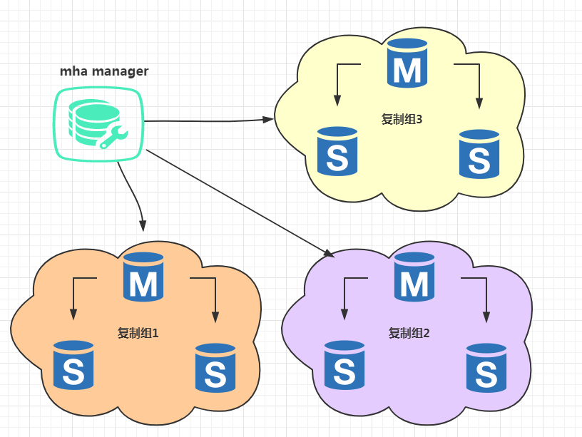
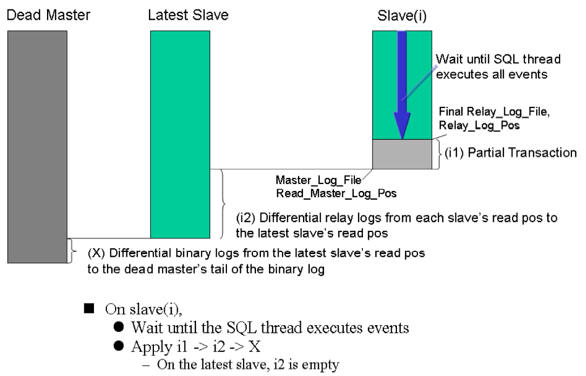
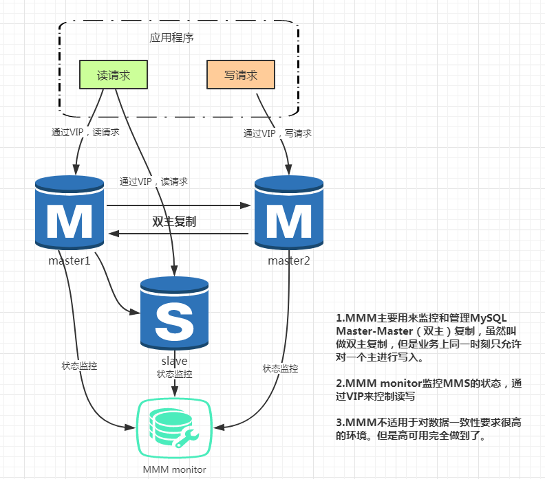
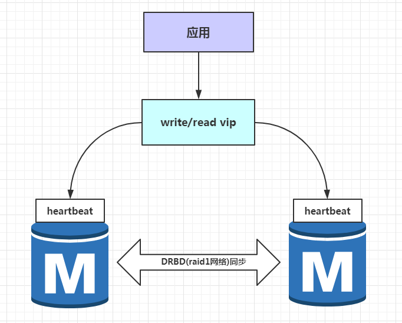
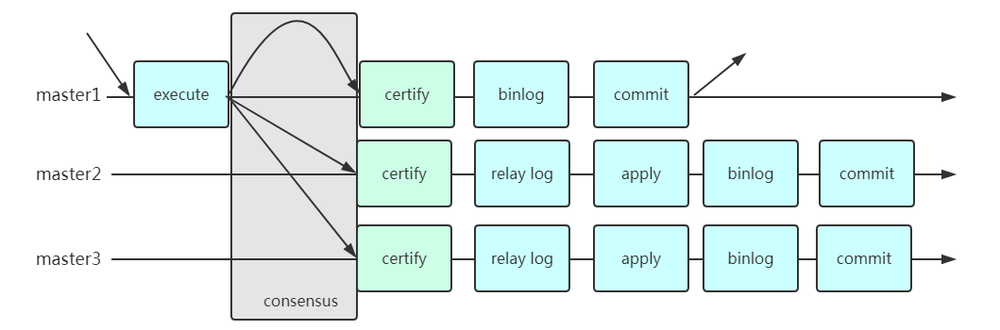
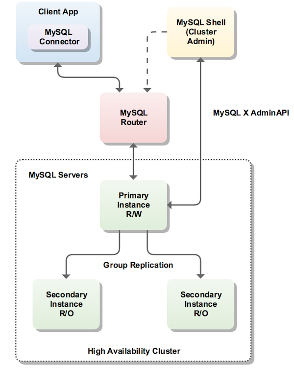
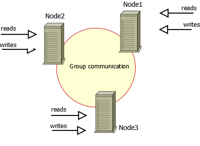
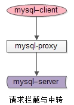

<!-- toc --> 

按照自己的理解，将MySQL的HA分为三类：基于原生复制的高可用，脱离原生复制的集群分布式，以及中间件。
本篇将简单介绍相应的产品或组件。

## 一、高可用
基于原生的高可用，包括：
* mha
* consul/zookeeper
* mmm
* keepalive
* drbd

### 1.mha介绍

MHA是一套MySQL高可用管理软件，除了检测Master宕机后，提升候选Slave为New Master之外（漂虚拟IP），还会自动让其他Slave与New Master 建立复制关系。
MHA Manager可以单独部署在一台独立的机器上，并管理多个master-slave集群。

#### 各组件作用：
* MHA Manager：MHA的管理节点，负责检测MySQL的状态，以及管理MySQL的复制关系；
* Master：MySQL对外提供的服务（ 通过 VIP ）的主节点；
* Slave(M)：MySQL候选主节点，本质上为一个Slave节点，只是在Master宕机后，会被提升为New Master ；
* Slave N：MySQL从机节点，对外可以提供只读服务；

#### 工作原理
* 1.当Master宕机后，MHA Manager会让Slave(M) 提升为New Master ，然后修改Slave N 的复制关系（ CHANGE MASTER ），指向New Master ；
    * MHA Manager检测Master是否宕机， 不会简单的只检查自身与Master之间的直连状态;
    *  MHA Manager会透过其他Slave节点去检测Master，进行二次探测，最大限度的避免脑裂的发生；
        * 比如说，检测到Master宕机了，MHA Manager会透过Slave(M) 检测是否为宕机；
        * 如果检测后仍为宕机状态，会继续透过Slave1...SlaveN 进行探测，只有在透过所有节点检测到Master宕机了，才真的认为Master宕机了；
        * 以上操作步骤的前提是，MHA Manager到所有MySQL节点的SSH免密码登录要打通；
* 2.最后将提供对外服务的VIP漂移到New Master 上，继续对外提供服务；
* 3.一个MHA Manager可以管理多个MySQL的Master-Slave集群（通过不同的app.conf）

#### MHA Failover过程

* 1.从宕机崩溃的Master节点保存二进制日志事件（binlog events）；
    * 此种情况为MySQL挂了，但是服务器没挂，还是可以通过SSH连接过去；
    * 如果服务器彻底宕机了，该步骤略过；
* 2.识别含有最新的更新的Slave节点；
* 3.应用差异的中继日志（relay-log）到其他的Slave；
* 4.应用从Master保存的二进制日志事件（binlog events）；
    * 如果之前Master彻底宕机了，就没有保存的binlog，该步骤略过；
* 5.提升一个 Slave 为新的 Master（New）；
* 6.使其他的Slave 连接新的 Master（New） 进行复制；

从上面的步骤看， MHA无法完全保证数据不会丢；
* MySQL 5.7 之前数据不丢的前提是Master服务器还可以被MHA Manager进行SSH连接，通过应用保存的binlog 的方式来保证。
* MySQL 5.7 之后通过无损复制， 仅仅是减少了丢数据的可能性，假如此时的状态为切成异步的状态，那就和之前一样了（可以设置超时的时间很大）；
* 当Master恢复的时候，最后一部分数据是否需要Flashback，MHA也是不负责这个事情，需要人工介入。

* * * * *

### 2.zookeeper/consul
#### zk介绍
Zookeeper/cosul使用分布式算法保证集群数据的一致性，使用zookeeper/consul可以有效的保证proxy的高可用性，可以较好的避免网络分区现象的产生。

#### consul介绍

consul是HashiCorp公司（曾经开发过vgrant） 推出的一款开源工具， 基于go语言开发， 轻量级， 用于实现分布式系统的服务发现与配置。 与其他类似产品相比， 提供更“一站式”的解决方案。 consul内置有KV存储， 服务注册/发现， 健康检查， HTTP+DNS API， Web UI等多种功能。官网： https://www.consul.io/其他同类服务发现与配置的主流开源产品有:zookeeper和ETCD。

consul的优势：
1. 支持多数据中心， 内外网的服务采用不同的端口进行监听。 多数据中心集群可以避免单数据中心的单点故障, zookeeper和 etcd 均不提供多数据中心功能的支持
2. 支持健康检查. etcd 不提供此功能.
3. 支持 http 和 dns 协议接口. zookeeper 的集成较为复杂,etcd 只支持 http 协议. 有DNS功能， 支持REST API
4. 官方提供web管理界面, etcd 无此功能.
5. 部署简单， 运维友好， 无依赖， go的二进制程序copy过来就能用了， 一个程序搞定， 可以结合ansible来推送。

consul的架构图：

优缺点：
* 优点：
    * 较好的保证了整个系统的高可用性，包括proxy、MySQL;
    * 扩展性较好，可以扩展为大规模集群;
* 缺点：
    * 数据一致性仍然依赖于原生的mysql半同步复制;
    * 引入zk/consul，整个系统的逻辑变得更加复杂;
### 3.mmm

MMM（Master-Master replication manager for MySQL）是一套支持双主故障切换和双主日常管理的脚本程序。MMM使用Perl语言开发，主要用来监控和管理MySQL Master-Master（双主）复制，虽然叫做双主复制，但是业务上同一时刻只允许对一个主进行写入，另一台备选主上提供部分读服务，以加速在主主切换时刻备选主的预热，可以说MMM这套脚本程序一方面实现了故障切换的功能，另一方面其内部附加的工具脚本也可以实现多个slave的read负载均衡。

MMM提供了自动和手动两种方式移除一组服务器中复制延迟较高的服务器的虚拟ip，同时它还可以备份数据，实现两节点之间的数据同步等。由于MMM无法完全的保证数据一致性，所以MMM适用于对数据的一致性要求不是很高，但是又想最大程度的保证业务可用性的场景。对于那些对数据的一致性要求很高的业务，非常不建议采用MMM这种高可用架构。

优点：
* 稳定和成熟的开源产品，经过了时间的考验 核心技术是mysql自己的技术，只是使用脚本程序来控制，所以在原理上比较容易理解，而且管理能够更智能化。
* 安装简单，配置简单，使用简单
* 功能强大 （HA，failover，tools套件，cluster模式可以一个monitor管理多个mmm组）

缺点：
* 由于架构里只有一个写入点，所以扩展性是有限的，但是对一般中型企业够用了。
	* 解决方案：对于大应用可以采取垂直拆分到多个mmm架构的方式，使用mmm cluster来管理。
* 对于读写分离和读负载均衡还是要程序来开发或者使用其他工具完成。
* 无法完全的保证数据一致，只用于对数据的一致性要求不是很高的业务

### 4.keepalive

MySQL双主复制，即互为Master-Slave(只有一个Master提供写操作)，可以实现数据库服务器的热备，但是一个Master宕机后不能实现动态切换。使用Keepalived，可以通过虚拟IP，实现双主对外的统一接口以及自动检查、失败切换机制，从而实现MySQL数据库的高可用方案。

keepalived是集群管理中保证集群高可用的一个软件解决方案，其功能类似于heartbeat，用来防止单点故障。
keepalived是以VRRP协议为实现基础的，VRRP全称VirtualRouter Redundancy Protocol，即虚拟路由冗余协议。
keepalived主要有三个模块，分别是core 、check和vrrp。core模块为keepalived的核心，负责主进程的启动、维护以及全局配置文件的加载和解析。check负责健康检查，包括常见的各种检查方式。vrrp模块是来实现VRRP协议的。

### 5.drbd

DRBD 采用Heartbeat双机热备软件来保证数据库的高稳定性和连续性，数据的一致性由DRBD这个工具来保证。默认情况下只有一台mysql在工作，当主mysql服务器出现问题后，系统将自动切换到备机上继续提供服务，当主数据库修复完毕，又将服务切回继续由主mysql提供服务。

#### 两个重要组件：
* DRBD(Distributed Replicated Block Device)是一个基于块设备级别在远程服务器直接同步和镜像数据的软件，用软件实现的、无共享的、服务器之间镜像块设备内容的存储复制解决方案。它可以实现在网络中两台服务器之间基于块设备级别的实时镜像或同步复制(两台服务器都写入成功)/异步复制(本地服务器写入成功)，相当于网络的RAID1，由于是基于块设备(磁盘，LVM逻辑卷)，在文件系统的底层，所以数据复制要比cp命令更快。DRBD已经被MySQL官方写入文档手册作为推荐的高可用的方案之一。
* heartbeat可以资源(VIP地址及程序服务)从一台有故障的服务器快速的转移到另一台正常的服务器提供服务，heartbeat和keepalived相似，heartbeat可以实现failover功能，但不能实现对后端的健康检查。
#### 方案优缺点
* 优点：安全性高、稳定性高、可用性高，出现故障自动切换。
* 缺点：只有一台服务器提供服务，成本相对较高，不方便扩展，可能会发生脑裂。
* 生产环境不推荐使用，DRBD会使数据库性能下降很厉害。

#### 方案适用场景：
适用于数据库访问量不太大，短期内访问量增长不会太快，对数据库可用性要求非常高的场景。

#### heartbeat和keepalived应用场景及区别
* 对于web，db，负载均衡(lvs,haproxy,nginx)等，heartbeat和keepalived都可以实现
* lvs最好和keepalived结合，因为keepalived最初就是为lvs产生的，(heartbeat没有对RS的健康检查功能，heartbeat可以通过ldircetord来进行健康检查的功能)
* mysql双主多从，NFS/MFS存储，他们的特点是需要数据同步，这样的业务最好使用heartbeat，因为heartbeat有自带的drbd脚本
* 无数据同步的应用程序高可用可选择keepalived，有数据同步的应用程序高可用可选择heartbeat

## 二、集群/分布式
基于集群或者分布式的HA包括：
* Mysql Group Replication
* Mysql InnoDB Cluster
* Percona XtraDB Cluster
* MariaDB Galera Cluster

### 1.MGR

可以参考阿里的数据库内核月报，关于mgr的文档。
http://mysql.taobao.org/monthly/2017/08/01/

#### 简介：
基于传统异步复制和半同步复制的缺陷——数据的一致性问题无法保证，MySQL官方在5.7.17版本正式推出组复制（MySQL Group Replication，简称MGR）。
由若干个节点共同组成一个复制组，一个事务的提交，必须经过组内大多数节点（N / 2 + 1）决议并通过，才能得以提交。如上图所示，由3个节点组成一个复制组，Consensus层为一致性协议层，在事务提交过程中，发生组间通讯，由2个节点决议(certify)通过这个事务，事务才能够最终得以提交并响应。

引入组复制，主要是为了解决传统异步复制和半同步复制可能产生数据不一致的问题。组复制依靠分布式一致性协议(Paxos协议的变体)，实现了分布式下数据的最终一致性，提供了真正的数据高可用方案(是否真正高可用还有待商榷)。其提供的多写方案，给我们实现多活方案带来了希望。

#### MGR的解决方案现在具备的特性：
* 数据一致性保障：确保集群中大部分节点收到日志
* 多节点写入支持：多写模式下支持集群中的所有节点都可以写入
* Fault Tolerance: 确保系统发生故障（包括脑裂）依然可用，双写对系统无影响

#### 组复制实现了基于复制协议PAXOS的多主更新
1. 复制组由多个 server成员构成，并且组中的每个 server 成员可以独立地执行事务。但所有读写（RW）事务只有在冲突检测成功后才会提交。只读（RO）事务不需要在冲突检测，可以立即提交。
2. 对于任何 RW 事务，提交操作并不是由始发 server 单向决定的，而是由组来决定是否提交。准确地说，在始发 server 上，当事务准备好提交时，该 server 会广播写入值（已改变的行）和对应的写入集（已更新的行的唯一标识符）。然后会为该事务建立一个全局的顺序。最终，这意味着所有 server 成员以相同的顺序接收同一组事务。因此，所有 server 成员以相同的顺序应用相同的更改，以确保组内一致。
3. 组复制能够根据在一组 server 中复制系统的状态来创建具有冗余的容错系统。因此，只要它不是全部或多数 server 发生故障，即使有一些 server 故障，系统仍然可用，最多只是性能和可伸缩性降低，但它仍然可用。server 故障是孤立并且独立的。它们由组成员服务来监控，组成员服务依赖于分布式故障检测系统，其能够在任何 server 自愿地或由于意外停止而离开组时发出信号。
4. 它们是由一个分布式恢复程序来确保当有 server 加入组时，它们会自动更新组信息到最新。并且多主更新确保了即使在单个服务器故障的情况下也不会阻止更新，不必进行 server故障转移。因此，MySQL 组复制保证数据库服务持续可用。
5. 值得注意的一点是，尽管数据库服务可用，但当有一个 server 崩溃时，连接到它的客户端必须定向或故障转移到不同的 server。这不是组复制要解决的问题。连接器，负载均衡器，路由器或其他形式的中间件更适合处理这个问题。

#### MGR的解决方案目前的不足
* 仅支持InnoDB表，并且每张表一定要有一个主键，用于做write set的冲突检测；
* 必须打开GTID特性，二进制日志格式必须设置为ROW，用于选主与write set
* COMMIT可能会导致失败，类似于快照事务隔离级别的失败场景
* 目前一个MGR集群最多支持9个节点
* 不支持外键于save point特性，无法做全局间的约束检测与部分部分回滚
* 二进制日志不支持binlog event checksum

### 2.MySQL InnoDB Cluster

MySQL InnoDB Cluster解决方案其实是由MySQL的几个不同产品和技术组成的，比如MySQL Shell, MySQL Router, Group Replication.
一组MySQL服务器可以配置为一个MySQL集群。在默认的单主节点模式下，集群服务器具有一个读写主节点和多个只读辅节点。辅助服务器是主服务器的副本。客户端应用程序通过MySQL Router连接到主服务程序。如果主服务连接失败，则次要的节点自动提升为主节点，MySQL Router请求到新的主节点。InnoDB Cluster不提供NDB Cluster支持。

###  3.Percona XtraDB Cluster

官网地址：https://www.percona.com/doc/percona-xtradb-cluster/5.7/intro.html

* * * * *
#### 名词：
* WS：write set 写数据集
* IST：Incremental State Transfer 增量同步
* SST：State Snapshot Transfer 全量同步 
* UUID：节点状态改变及顺序的唯一标识。
* GTID：Global Transaction ID ，由UUID和偏移量组成。wsrep api 中定义的集群内全局事务id。
* WSREP API：在DBMS和wsrep provider 之间提供接口。
* Galera wsrep provider：
    * 完成事务在集群内的广播：本地事务发送给其他节点验证，接收其他节点事件本地验证并返回结果
    * 应用从其他节点接收并全局验证通过的事件到本地。
    * 集群内通信，节点存活的检测，pc的选举等
    * 脑裂，为避免节点失效导致pc选举失败整个集群不可用，建议节点数至少为3
    * 多点写入时的锁冲突检测机制
    * 等待队列中事务的并发提交

#### 工作原理：
节点在接收sql 请求后，对于ddl 操作，在commit之前，由WSREP API 调用galera 库进行集群内广播，所有其他节点验证成功后事务在集群所有节点进行提交，反之rollback。pxc 保证整个集群所有数据的强一致性，满足CAP理论中满足：Consistency 和  Availability。

##### 复制的过程：

上图为复制示意图

galera的`group communication层`实现统一全局数据同步策略和集群内所有事务的排序，便于生成GTID。
对于每一个节点有2方面工作：完成数据同步 和 完成与其他节点的通信

galera 的`replication 层`完成数据同步，由slave queue 和applier 组成。在事务的同步过程中，事务在队列中以及应用线程中时于节点本地产生锁冲突处理方式。replication 模块的效率直接影响整个集群的写入性能。
**同步过程中，本地事务和等待队列中的锁冲突：**
* innodb内部使用悲观锁，保证事务的成功进行和提交。
* pxc中使用乐观锁，以避免在每个节点获取锁以及网路开销，在写入节点上，事务在提交之前与单点的innodb一样，到达提交点时，向集群其他节点广播（galera 库完成 并发）事物并等待各节点验证结果，如果所有节点都返回成功，则提交，反之，回滚。
* pxc 中先提交的事物成功，其他事务（本地或其他节点同步）将回滚或报死锁错误。

##### 验证过程

上图为验证示意图

验证过程中，节点在接收到其他节点writeset后，在本地做冲突验证并返回验证结果。
节点状态机：Regular Transitions:
**状态机变化阶段：**
1. OPEN: 节点启动成功，尝试连接到集群，如果失败则根据配置退出或创建新的集群
2. PRIMARY: 节点处于集群PC中，尝试从集群中选取donor进行数据同步
3. JOINER: 节点处于等待接收/接收数据文件状态，数据传输完成后在本地加载数据
4. JOINED: 节点完成数据同步工作，尝试保持和集群进度一致
5. SYNCED：节点正常提供服务：数据的读写，集群数据的同步，新加入节点的sst请求
6. DONOR：节点处于为新节点准备或传输集群全量数据状态，对客户端不可用。

**状态机变化因素：**
* 新节点加入集群
* 节点故障恢复
* 节点同步实效 

* * * * *
#### PXC提供的特性
* 同步复制，事务要么在所有节点提交或不提交
* 多主复制，可以在任意节点进行写操作
* 在从服务器上并行应用事件，真正意义上的并行复制
* 节点自动配置
* 数据一致性，不再是异步复制

#### 兼容性:
* 完全兼容已有的系统（innodb引擎，优化器执行计划，完全相同的优化思路）
* 最小化的迁移（非常方便的从现有系统迁移到PXC）
* 快速的回退版本(无锁化，非常容易的恢复到非PXC系统)

#### 限制:
* 只支持INNODB表
* 不允许大事务的产生（否则的话后果很严重）
* 写性能取决于最差的节点
* 不能解决热点更新问题
* 乐观锁控制
* 对于写密集型应用需要控制单个节点的大小，单个节点数据越大，新加节点如果采用自动添加可能产生很大抖动（添加节点建议用备份或者备份+binlog 进行IST(Incremental State Transfer)增量同步

#### 优缺点
* 优点：
    * 高可用性，节点不可用不影响集群正常运行。
    * 强一致性，可以将读扩展到多个节点上。     
    * 节点的增加数据同步自动化（IST,SST）。
    * 可实现多点读写，但写压力仍要同步到所有节点。
* 缺点：
    * 由于ddl需全局验证通过，则集群性能由集群中最差性能节点决定。
    * 为保证一致性，galera 总是优先保证数据一致性，在多点并发写时，锁冲突问题严重
    * 新节点加入或延后较大的节点重新加入需全量拷贝数据（sst），作为donor的节点在同步过程中无法提供读写
    * 数据冗余度为节点数

### 4.MariaDB Galera Cluster

MariaDB集群是MariaDB同步多主机集群，仅支持XtraDB/InnoDB存储引擎（虽然有对MyISAM实验支持 - 看wsrep_replicate_myisam系统变量）

> XtraDB存储引擎是由Percona开发的一款MySQL数据库的高性能存储引擎，其目的是用来代替InnoDB存储引擎，可用于需要更高性能的环境。> 可以看作是InnoDB存储引擎的增强版本，它在InnoDB上进行了大量的修改和patched，它完全兼容InnoDB，且提供了很多InnoDB不具备的有用的功能。
> 例如：
> * 在多核CPU上面的性能和伸缩性要更好；
> * 对于内存的分配和使用也要更好；
> * 也解除了InnoDB的很多限制；
> * 提供了比InnoDB更多的配置和性能监控参数

#### 主要功能
* 同步复制 --- Galera主从复制是同步的，底层依赖rsync；
* Active-active multi-master 拓扑逻辑，即所有节点可以同时读写数据库；
* 可对集群中任一节点进行数据读写
* 自动的节点成员控制，故障节点自动从集群中移除
* 新节点加入数据自动复制
* 真正的并行复制，基于行级
* 直接客户端连接，原生的 MySQL 接口
* 每个节点都包含完整的数据副本
* 多台数据库中数据同步由 wsrep 接口实现
#### 优势
* 因为是多主，所以不存在Slavelag(延迟)    不存在丢失事务的情况
* 同时具有读和写的扩展能力
* 更小的客户端延迟
* 节点间数据是同步的,而Master/Slave模式是异步的,不同slave上的binlog可能是不同的

#### 局限性
* 目前的复制仅仅支持InnoDB和xtradb存储引擎,任何写入其他引擎的表，包括mysql.*（这个的存储引擎是myisam，8.0后替换为innodb）表将不会复制,但是DDL语句会被复制的,因此创建用户将会被复制,但是`insert into mysql.user…`将不会被复制的.
* DELETE操作不支持没有主键的表,没有主键的表在不同的节点顺序将不同,如果执行`SELECT…LIMIT… `将出现不同的结果集.
* 在多主环境下LOCK/UNLOCK TABLES不支持,以及锁函数`GET_LOCK()`, `RELEASE_LOCK()`…
* 查询日志不能保存在表中。如果开启查询日志，只能保存到文件中。
* 允许最大的事务大小由`wsrep_max_ws_rows`和`wsrep_max_ws_size`定义。任何大型操作将被拒绝。如大型的`LOAD DATA`操作。
* 由于集群是乐观的并发控制，事务commit可能在该阶段中止。如果有两个事务向在集群中不同的节点向同一行写入并提交，失败的节点将中止。对 于集群级别的中止，集群返回死锁错误代码`(Error: 1213 SQLSTATE: 40001 (ER_LOCK_DEADLOCK))`
* XA事务不支持，由于在提交上可能回滚。
* 整个集群的写入吞吐量是由最弱的节点限制，如果有一个节点变得缓慢，那么整个集群将是缓慢的。为了稳定的高性能要求，所有的节点应使用统一的硬件。
* 集群节点建议最少3个。
* 如果DDL语句有问题将破坏集群
#### 说明
Galera集群的复制功能基于Galeralibrary实现,为了让MySQL与Galera library通讯，特别针对MySQL开发了wsrep API。
官方参考： https://mariadb.com/kb/en/mariadb/getting-started-with-mariadb-galera-cluster/

## 三、中间件
第三方或者官方提供的中间件，包括：
* MySQLProxy
* MyCat
* ProxySQL(Percona)
* KingShard
* MaxScale(MariaDB)
* OneProxy

### 1.MySQLProxy

mysql-proxy是mysql官方提供的mysql中间件服务，上游可接入若干个mysql-client，后端可连接若干个mysql-server。
它使用mysql协议，任何使用mysql-client的上游无需修改任何代码，即可迁移至mysql-proxy上。
mysql-proxy最基本的用法，就是作为一个请求拦截，请求中转的中间层：

进一步的，mysql-proxy可以分析与修改请求。拦截查询和修改结果，需要通过编写Lua脚本来完成。
mysql-proxy允许用户指定Lua脚本对请求进行拦截，对请求进行分析与修改，它还允许用户指定Lua脚本对服务器的返回结果
进行修改，加入一些结果集或者去除一些结果集均可。
所以说，根本上，mysql-proxy是一个官方提供的框架，具备良好的扩展性，可以用来完成：
* sql拦截与修改
* 性能分析与监控
* 读写分离
* 请求路由

### 2.MyCat
架构图如下：

Mycat官网：http://www.mycat.io/ 
#### 介绍：
MyCat是一个开源的分布式数据库系统，是一个实现了MySQL协议的服务器，前端用户可以把它看作是一个数据库代理，用MySQL客户端工具和命令行访问，而其后端可以用MySQL原生协议与多个MySQL服务器通信，也可以用JDBC协议与大多数主流数据库服务器通信，其核心功能是分表分库，即将一个大表水平分割为N个小表，存储在后端MySQL服务器里或者其他数据库里。

#### 工作原理：
MySQL节点开启主从复制的配置方案，并将主节点配置为Mycat的dataHost里的writeNode，从节点配置为readNode，同时Mycat内部定期对一个dataHost里的所有writeHost与readHost节点发起心跳检测，正常情况下，Mycat会将第一个writeHost作为写节点，所有的DML SQL会发送给此节点，若Mycat开启了读写分离，则查询节点会根据读写分离的策略发往readHost(+writeHost)执行，当一个dataHost里面配置了两个或多个writeHost的情况下，如果第一个writeHost宕机，则Mycat会在默认的3次心跳检查失败后，自动切换到下一个可用的writeHost执行DML SQL语句，并在conf/dnindex.properties文件里记录当前所用的writeHost的index（第一个为0，第二个为1，依次类推）。
另外，由于Mycat自身是属于无状态的中间件（除了主从切换过程中记录的dnindex.properties文件），因此Mycat很容易部署为集群方式，提供高可用方案。
#### MyCat的关键特点：
* 支持SQL92标准
* 支持MySQL、Oracle、DB2、SQL Server、PostgreSQL等DB的常见SQL语法
* 遵守Mysql原生协议，跨语言，跨平台，跨数据库的通用中间件代理
* 基于心跳的自动故障切换，支持读写分离，支持MySQL主从，以及galera cluster集群
* 支持Galera for MySQL集群，Percona Cluster或者MariaDB cluster
* 基于Nio实现，有效管理线程，解决高并发问题
* 支持数据的多片自动路由与聚合，支持sum,count,max等常用的聚合函数,支持跨库分页
* 支持单库内部任意join，支持跨库2表join，甚至基于caltlet的多表join
* 支持通过全局表，ER关系的分片策略，实现了高效的多表join查询
* 支持多租户方案。
* 支持分布式事务（弱xa）
* 支持XA分布式事务（1.6.5）
* 支持全局序列号，解决分布式下的主键生成问题
* 分片规则丰富，插件化开发，易于扩展
* 强大的web，命令行监控
* 支持前端作为MySQL通用代理，后端JDBC方式支持Oracle、DB2、SQL Server 、 mongodb 、巨杉
* 支持密码加密
* 支持服务降级
* 支持IP白名单
* 支持SQL黑名单、sql注入攻击拦截
* 支持prepare预编译指令（1.6）
* 支持非堆内存(Direct Memory)聚合计算（1.6）
* 支持PostgreSQL的native协议（1.6）
* 支持mysql和oracle存储过程，out参数、多结果集返回（1.6）
* 支持zookeeper协调主从切换、zk序列、配置zk化（1.6）
* 支持库内分表（1.6）
* 集群基于ZooKeeper管理，在线升级，扩容，智能优化，大数据处理（2.0开发版）

### 3.ProxySQL
ProxySQL是一个高性能的MySQL中间件，拥有强大的规则引擎。
官方文档：https://github.com/sysown/proxysql/wiki/
下载地址：https://github.com/sysown/proxysql/releases

#### 特点：
* 连接池，而且是 multiplexing
* 主机和用户的最大连接数限制
* 自动下线后端DB
    * 延迟超过阀值
    * ping 延迟超过阀值
    * 网络不通或宕机
* 强大的规则路由引擎
    * 实现读写分离
    * 查询重写
    * sql流量镜像
* 支持prepared statement
* 支持Query Cache
* 支持负载均衡，与gelera结合自动failover

#### 运行时：
* C++写的，性能应该不是问题
* 运行时分admin进程与proxy进程, 一般 6032 端口是 admin 进程。6033是proxy
* admin的目标是热配置生效，不必重启proxy。能直接使用mysql客户端简单的sql操作生效
* 整体配置可以从proxysql.cnf读，admin配置可以从proxysql-admin.cnf 热load进来
* 配置为runtime\memory\disk\config-file的多层管理概念，详看官方wiki有介绍
* 配置以mysql的内存表方式存于内存，能通过 SAVE、LOAD 指令保存配置与加载配置

#### 工作原理
1. ProxySQL从应用程序接收一个连接,通过它可以进行一个简单的SELECT或更复杂的事务。
2. ProxySQL获取每个查询,将其传递给查询处理器,处理它们,识别查询是否已被镜像,复制ProxySQL内部对象的整个MySQL会话,并将其与镜像队列(指的是镜像线程池)相关联。
3. 如果池是空闲的(在并发线程集中有可用的线程插槽),则立即处理查询。
4. 如果没有,查询将停留在队列中。如果队列已满,查询将丢失。
5. 无论从查询返回什么,都会放到到/dev/null,因此没有结果集传回给客户端。
6. 服务器的整个处理过程不是没有性能消耗的。如果检查CPU利用率,将看到ProxySQL中的 “mirroring” 实际上使CPU利用率翻倍了。这意味着由于资源争用,服务器A上的流量(traffic)会受到影响。

### 4.KingShard

kingshard是一个由Go开发高性能MySQL Proxy项目，kingshard在满足基本的读写分离的功能上，致力于简化MySQL分库分表操作；能够让DBA通过kingshard轻松平滑地实现MySQL数据库扩容。 kingshard的性能是直连MySQL性能的80%以上。
github地址： https://github.com/flike/kingshard
#### 适合应用场景
1. 读写分离问题。由于前端应用访问量增加，单台MySQL不足以支撑整个系统的写入和查询操作。这时候，我们不得不将一些耗时的查询操作分散到多个slave上。
2. 单表容量问题。如果在系统设计之初，没有考虑到分表问题。随着数据量的增长，单表容量越来越大。见过单表容量5亿条记录，然后一个简单的delete操作都会引起系统慢日志，而且有可能导致MySQL IO瞬发性的飙升。大家可能会想到，在查询的字段上加上索引，但当数据量增长到这么大的时候，即使加上索引效果也不明显了。归根结底，就是单表数据量太大，导致MySQL即使通过索引定位数据，仍然需要扫描很多记录。
3. 数据库的运维问题。如果在代码中配置主库和从库host，系统运行当然也是没问题的。但这样大大增加了运维工作的压力，比如：MySQL数据库IO压力由于访问量的增加居高不下，DBA需要添加一台slave，这时候就不得不修改代码，然后打包并上线。
4. 连接池。前端应用频繁连接MySQL，由此给MySQL带来的额外性能消耗也是不容忽视的。如果通过增加一个连接池，每个DB缓存一定数量的MySQL连接，当有应用需要连接后端的MySQL，直接从连接池里取出一个已建好的连接来发送SQL请求，这样会大大加快数据查询速度。而且可以降低MySQL的性能消耗。
5. SQL日志。在程序出现问题时，希望得到一些SQL日志，比如，什么时刻哪条SQL发送到哪一台DB上了。通过查看这种日志能够帮助快速定位问题。

#### 主要功能
* 基础功能
    * 支持SQL读写分离。
    * 支持透明的MySQL连接池，不必每次新建连接。
    * 支持平滑上线DB或下线DB，前端应用无感知。
    * 支持多个slave，slave之间通过权值进行负载均衡。
    * 支持强制读主库。
    * 支持主流语言（java,php,python,C/C++,Go)SDK的mysql的prepare特性。
    * 支持到后端DB的最大连接数限制。
    * 支持SQL日志及慢日志输出。
    * 支持SQL黑名单机制。
    * 支持客户端IP访问白名单机制，只有白名单中的IP才能访问kingshard。
    * 支持字符集设置。
    * 支持last_insert_id功能。
    * 支持热加载配置文件，动态修改kingshard配置项（具体参考管理端命令）。
    * 支持以Web API调用的方式管理kingshard。
    * 支持多用户模式，不同用户之间的表是权限隔离的，互补感知。
* sharding功能
    * 支持按整数的hash和range分表方式。
    * 支持按年、月、日维度的时间分表方式。
    * 支持跨节点分表，子表可以分布在不同的节点。
    * 支持跨节点的count,sum,max和min等聚合函数。
    * 支持单个分表的join操作，即支持分表和另一张不分表的join操作。
    * 支持跨节点的order by,group by,limit等操作。
    * 支持将sql发送到特定的节点执行。
    * 支持在单个节点上执行事务，不支持跨多节点的分布式事务。
    * 支持非事务方式更新（insert,delete,update,replace）多个node上的子表。

#### 工作流程

1. 读取配置文件并启动，在配置文件中设置的监听端口监听客户端请求。
2. 收到客户端连接请求后，启动一个goroutine单独处理该请求。
3. 首选进行登录验证，验证过程完全兼容MySQL认证协议，由于用户名和密码在配置文件中已经设置好，所以可以利用该信息验证连接请求是否合法。 当用户名和密码都正确时，转入下面的步骤，否则返回出错信息给客户端。
4. 认证通过后，客户端发送SQL语句。
5. kingshard对客户端发送过来的SQL语句，进行词法和语义分析，识别出SQL的类型和生成SQL的路由计划。如果有必要还会改写SQL，然后转发到相应的DB。也有可能不做词法和语义分析直接转发到相应的后端DB。如果转发SQL是分表且跨多个DB，则每个DB对应启动一个goroutine发送SQL和接收该DB返回的结果。
6. 接收并合并结果，然后转发给客户端。

#### 优势和特点
* 可以轻松地应对mysql扩容和缩容。由于kingshard的采用了[两级映射的分表方案](https://github.com/flike/kingshard/blob/master/doc/KingDoc/kingshard_sharding_introduce.md ) ，相对于其他开源Proxy，在扩容和缩容方面有很大的优势。
* kingshard的安装和使用不依赖于其他第三方组件，这样使得kingshard更容易部署和使用。
* kingshard在降低管理和运维后端DB方面

### 5.MaxScale

MaxScale是MariaDB开发的一个数据库智能代理服务，一直看好的开源数据库MariaDB的又一利器。MaxScale允许根据数据库 SQL 语句将请求转向目标一个到多个服务器，可设定各种复杂程度的转向规则。MaxScale 设计用于透明的提供数据库的负载均衡和高可用性，同时提供高度可伸缩和灵活的架构，支持不同的协议和路由决策。简单的讲就是使用MaxScale可以轻松解决mariaDB读写分离的问题。
另外，MaxScale是插件式结构，允许用户开发适合自己的插件。

MaxScale的基础组成
* 认证插件：提供了登录认证功能，MaxScale 会读取并缓存数据库中 user 表中的信息，当有连接进来时，先从缓存信息中进行验证，如果没有此用户，会从后端数据库中更新信息，再次进行验证
* 协议插件：包括客户端连接协议，和连接数据库的协议
* 路由插件：决定如何把客户端的请求转发给后端数据库服务器，读写分离和负载均衡的功能就是由这个模块实现的
* 监控插件：对各个数据库服务器进行监控，例如发现某个数据库服务器响应很慢，那么就不向其转发请求了
* 日志和过滤插件：提供简单的数据库防火墙功能，可以对SQL进行过滤和容错

### 6.OneProxy

官网：http://www.onexsoft.com/proxy.html
介绍：
摘自官网：
MySQL的逻辑复制技术可轻松构建多个数据副本来提供服务，并可以消除数据库单点，但需要应用作出相应的代码调整，才能充分利用它的优势。而网络交换机/路由器在理解TCP协议和目的IP地址的情况下，可以帮助人们轻松地组建大大小小的网络， OneProxy for MySQL在理解MySQL通信协议和SQL语句分析的基础上，可以帮助轻松组建数据库集群，避免代价昂贵的应用代码调整。

OneProxy for MySQL可以复用不同应用到后端数据库的连接，有效降低数据库的并发连接数；可以即时踢除不可用的节点，将应用请求转发到其他可用节点，保证业务服务的稳定性。 可透明地将查询语句分发到多个MySQL备库执行，用读写分离方案支持上千万的并发访问；也可以根据SQL语句中的值进行分库分表路由， 均匀分散到多个MySQL主库上，以支持每秒上百万个小事务的并发执行；可实时透明地分析流量数据，统计SQL和事务的运行时间，分析事务的结构，得到各种不同维度的实时性能报告； 还可以进行流理QoS控制，作为数据库防火墙抵挡SQL注入式攻击；根据分片的SQL并行执行，解决了大数据量下的汇总统计性能问题；跨多分片的结果集合并， 极大地简化了应用程序的开发工作量。

OneProxy for MySQL使用C&C++开发，充分利用高性能的异步网络事件编程框架，使单个OneProxy实例可支持高达40W的QPS/TPS；并可充分利用和管理内存，无Java类语言的内存回收问题，确保7x24的稳定性； 内置的守护进程模式和HA VIP机制，可以轻松实现Proxy的多机高可用；平民软件完全自主编写源代码，可以迅速分析和解决运行过程中的可能遇到的问题和故障；并可配合Galera Cluster或MySQL Group Replication 集群技术实现故障的快速切换。

#### 功能及限制：
* 1.透明连接池：
	* 不支持使用“use”命令来切换当前数据库， 出于性能考虑，我们不想在每次取得连接或归还连接时进行还原，这个操作需要一次额外的网络IO；如果要访问不同数据库下的表，请使用不同的用户进行连接（不同用户可提定不同的默认数据库），或者在表名前面加上库名进行访问（比如：db.tablename）。
	* 不支持set命令，但除“set autocommit={0|1}”外，因为这些操作会影响会话的上下文，除非放在事务中（由开发人员自己负责）。
	* 不支持带传出参数的存贮过程调用，实际上是通过执行几句“SET”语句来声明会话级变量，以进行参数传递的，如果不在一个事务中，则不同的调用就不能保证使用的是同一个连接了（除非放在事务中），故而OneProxy默认禁止存贮过程调用。
	* 不支持客户端级别和服务器端级别的Prepared接口，因为绑定变量及语句都是会话级别的。请不用担心，MySQL JDBC驱动本身就不是真正的Prepared接口的（除非显式指定了“useServerPrepStmts”参数）；针对PHP PDO编程接口，请在连接数据库时指定“ATTR_EMULATE_PREPARES”选项，使用拼接SQL的方式进行底层交互（并不会影响安全性，增加SQL注放攻击的概率）。对于Web应用来讲连接池相对更重要，并且使用真正的Prepared接口需要更多的网络调用来完成一个SQL来回，并不利于性能。
* 2.自动故障切换
* 3.读写分离
* 4.水平分库分表
	* 不支持多列分区，分区键只支持单个列，分区和子分区的列可以不同。这个限制可以让中间件的分区定位代码更加高效。
	* 分区键的值必须是常量，在SQL中为分区键指定值是必须是明确的值，不能是函数或表达式。
	* 分区键不支持OR语句，其允许单值查找（“where pkey = xxx”），可以是多值列表比较（“where pkey in (1,2,3)”），或区间查找（“where pkey >; … and pkey & <; …”，包括“between”操作）。但不支持多个“or”条件（“where pkey = 1 or pkey = 2”）。
	* 分区键不允许为空，并且不应当被程序后续更新， OneProxy无法检测出更新后的目标值是否符合分区配置，也不支持分区之间的记录移动。
	* 对于“insert”和“replace”语句，请显式指定字段列表，例如：“insert into xxx (col1, col2,…) values (…,…)”。
	* 分区键类型可以是“int”、 “char”、 “date”或“timestamp”中的一种，其中“date”表示不含时间信息的日期（如“2015-11-11”），而“timestamp”表示带时间的日期（如“2015-11-11 00:00:00”）。
* 5.结果集合并
	* 临时结果集有大小限制，目前是100万行，以避免用完内存，可以通过“proxy-cache-rows”选项进行调整。
	* 不支持count distinct，对某个字段统计维一值个数（“count(distinct …)”）的操作。
	* 不支持avg，对字段求平均值（”avg(…)”）不被直接支持，请转换成计数（“count(…)”）和求和（“sum(…)”）两个操作，再作除法。
	* 不支持having不支持分组汇总下的“having xxx”条件过滤。
	* 不支持跨实例join。
	* 跨库关联查询，仅仅支持按相同维度分表的分表。
* 6.并行查询
	* 仅支持拆分的表
* 7.安全控制和SQL审计
* 8.SQL防火墙
* 9.OneProxy自身高可用
	* 需要依赖VIP
* 10.分布式sequence
* 11.SQL关联度分析
* 12.事务监控　

#### 开发注意事项：（别人的总结，网上找的，和上面类似）
1. 不支持 Server Side Cursor 接口，比如 mysql C API 里的 Prepare、Bind、 Execute调用接口
2. 不支持 use命令切换数据库
3. 默认禁止 CALL, PREPARE, EXECUTE, DEALLOCATE 命令，也就是说不能用存储过程
4. 单库（单实例）分表–insert/update/delete要加字段名，如insert into t1(id,name) values(1,’张三’);
5. 单库（单实例）分表–目前分了N张表，如果以自增id做关联查询，那么每张表的自增id都是从1开始，在与其他表join关联查询时，数据会不准确
6. 单库（单实例）分表–当where条件有分区列时，值不能有函数转换，也不能有算术表达式，必须是原子值，否则结果不准确
7. 分库分表（多实例）–不支持垮库join，例如user_0表在10.0.0.1机器里，现在要join关联查询10.0.0.2机器里的money_detail表，不支持
8. 分库分表（多实例）–不支持分布式事务，例如user_0表在10.0.0.1机器里，user_1表在10.0.0.2机器里，现在想同时update更新两张表，不支持
9. 读写分离 –默认读操作全部访问slave，如果想强制走主库，例如涉及金钱类的查询操作，SQL改为select /master/ from t1 where id=1;
10. 分库分表/分表 –where条件带分区列时，直接命中该表，如果未带分区列，会逐一扫描所有分表（单线程），考虑性能问题，要加并行查询（多线程），SQL改为select /parallel/ from t1 where name=’李四’; 并行查询会增加额外的CPU消耗
11. 分表规则：支持range（范围）,hash（取模）,hash规则要提前规划好，具体分多少张表，如前期分64张表，1年后想扩容128张表，数据需要重新导出导入，成本非常高，目前二级分表还不支持。