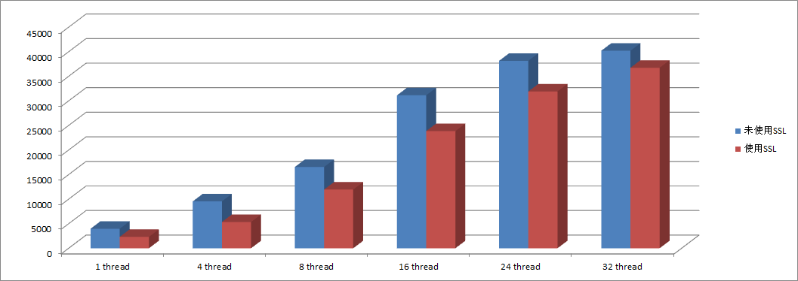

<!-- toc --> 

* * * * *

## 一、介绍
SSL（Secure Socket Layer：安全套接字层）利用数据加密、身份验证和消息完整性验证机制，为基于TCP等可靠连接的应用层协议提供安全性保证，是维护Client - Server之间加密通讯的一套安全协议。

### SSL协议提供的功能主要有：
* 数据传输的机密性：利用对称密钥算法对传输的数据进行加密。
* 身份验证机制：基于证书利用数字签名方法对服务器和客户端进行身份验证，其中客户端的身份验证是可选的。
* 消息完整性验证：消息传输过程中使用MAC算法来检验消息的完整性。

如果用户的传输不是通过SSL的方式，那么其在网络中数据都是以明文进行传输的，而这给别有用心的人带来了可乘之机。所以，现在很多大型网站都开启了SSL功能。同样地，在数据库方面，如果客户端连接服务器获取数据不是使用SSL连接，那么在传输过程中，数据就有可能被窃取。


## 二、MySQL5.7 SSL配置和启用
### 1.安装时就配置SSL
在MySQL5.7版本安装初始化阶段，我们发现比之前版本（5.6）多了一步操作，而这个操作就是安装SSL的。
```
bin/mysqld --initialize --user=mysql    
bin/mysql_ssl_rsa_setup                
```
当运行完这个命令后，默认会在data_dir目录下生成以下pem文件，这些文件就是用于启用SSL功能的：
```
[root@nazeebodan mysql_data]# ll *.pem
-rw------- 1 mysql mysql 1679 Sep 13 10:13 ca-key.pem  #CA私钥
-rw-r--r-- 1 mysql mysql 1107 Sep 13 10:13 ca.pem   #自签的CA证书，客户端连接也需要提供
-rw-r--r-- 1 mysql mysql 1107 Sep 13 10:13 client-cert.pem   #客户端连接服务器端需要提供的证书文件
-rw------- 1 mysql mysql 1679 Sep 13 10:13 client-key.pem   #客户端连接服务器端需要提供的私钥文件
-rw------- 1 mysql mysql 1679 Sep 13 10:13 private_key.pem    #私钥/公钥对的私有成员
-rw-r--r-- 1 mysql mysql  451 Sep 13 10:13 public_key.pem   #私钥/公钥对的共有成员
-rw-r--r-- 1 mysql mysql 1107 Sep 13 10:13 server-cert.pem   #服务器端证书文件
-rw------- 1 mysql mysql 1675 Sep 13 10:13 server-key.pem  #服务器端私钥文件
```

### 2.如果没有在安装，在后期配置SSL的方法
1. 重新执行mysql_ssl_rsa_setup
2. 重启数据库

```
1.重新执行mysql_ssl_rsa_setup
[root@nazeebodan mysql]# pwd
/usr/local/mysql
[root@nazeebodan mysql]# bin/mysql_ssl_rsa_setup --datadir=/u01/mysql/mysql_data --user=mysql --uid=mysql
Generating a 2048 bit RSA private key
...............+++
..........+++
writing new private key to 'ca-key.pem'
-----
Generating a 2048 bit RSA private key
..............................................+++
..........+++
writing new private key to 'server-key.pem'
-----
Generating a 2048 bit RSA private key
..............................................................+++
....+++
writing new private key to 'client-key.pem'
-----

注意：上面的 --uid=mysql加上后，就不需要再去 chown -R mysql.mysql *.pem 了

2.重启数据库
[root@nazeebodan mysql]# service suremysql stop
Shutting down MySQL..                                      [  OK  ]
[root@nazeebodan mysql]# service suremysql start
Starting MySQL..                                           [  OK  ]
```

## 三、开启SSL
### 查看ssl的是否开启

```
mysql> show variables like 'port';
+---------------+-------+
| Variable_name | Value |
+---------------+-------+
| port          | 3306  |
+---------------+-------+
1 row in set (0.00 sec)

mysql> show variables like "%ssl%";
+---------------+----------+
| Variable_name | Value    |
+---------------+----------+
| have_openssl  | DISABLED |  --SSL被禁止
| have_ssl      | DISABLED |
| ssl_ca        |          |
| ssl_capath    |          |
| ssl_cert      |          |
| ssl_cipher    |          |
| ssl_crl       |          |
| ssl_crlpath   |          |
| ssl_key       |          |
+---------------+----------+
9 rows in set (0.00 sec)
```

### 开启ssl

```
[root@nazeebodan mysql]# pwd
/usr/local/mysql
[root@nazeebodan mysql]# bin/mysql_ssl_rsa_setup --datadir=/u01/mysql/mysql_data --user=mysql --uid=mysql
Generating a 2048 bit RSA private key
...............+++
..........+++
writing new private key to 'ca-key.pem'
-----
Generating a 2048 bit RSA private key
..............................................+++
..........+++
writing new private key to 'server-key.pem'
-----
Generating a 2048 bit RSA private key
..............................................................+++
....+++
writing new private key to 'client-key.pem'
-----

注意：
上面的 --uid=mysql加上后，就不需要再去 chown -R mysql.mysql *.pem 了

[root@nazeebodan mysql]# service suremysql stop
Shutting down MySQL..                                      [  OK  ]
[root@nazeebodan mysql]# service suremysql start
Starting MySQL..                                           [  OK  ]
[root@nazeebodan mysql]# mysql -uroot -p123456
mysql: [Warning] Using a password on the command line interface can be insecure.
Welcome to the MySQL monitor.  Commands end with ; or \g.
Your MySQL connection id is 2
Server version: 5.7.23-log MySQL Community Server (GPL)

Copyright (c) 2000, 2018, Oracle and/or its affiliates. All rights reserved.

Oracle is a registered trademark of Oracle Corporation and/or its
affiliates. Other names may be trademarks of their respective
owners.

Type 'help;' or '\h' for help. Type '\c' to clear the current input statement.

mysql> show variables like "%ssl%";
+---------------+-----------------+
| Variable_name | Value           |
+---------------+-----------------+
| have_openssl  | YES             |
| have_ssl      | YES             |
| ssl_ca        | ca.pem          |
| ssl_capath    |                 |
| ssl_cert      | server-cert.pem |
| ssl_cipher    |                 |
| ssl_crl       |                 |
| ssl_crlpath   |                 |
| ssl_key       | server-key.pem  |
+---------------+-----------------+
9 rows in set (0.00 sec)

mysql> 
```

## 四、SSL的使用
### 1.默认SSL是开启的
1.创建一个用户sure，并且让用户登录时不需要使用ssl，即不授予ssl的require

```
mysql> create user 'sure'@'%' identified by '123456';
Query OK, 0 rows affected (0.00 sec)

mysql> 
mysql> grant all on *.* to 'sure'@'%';
Query OK, 0 rows affected (0.00 sec)

mysql> select * from mysql.user where user='sure'\G
*************************** 1. row ***************************
                  Host: %
                  User: sure
           Select_priv: Y
           Insert_priv: Y
           Update_priv: Y
           Delete_priv: Y
           Create_priv: Y
             Drop_priv: Y
           Reload_priv: Y
         Shutdown_priv: Y
          Process_priv: Y
             File_priv: Y
            Grant_priv: N
       References_priv: Y
            Index_priv: Y
            Alter_priv: Y
          Show_db_priv: Y
            Super_priv: Y
 Create_tmp_table_priv: Y
      Lock_tables_priv: Y
          Execute_priv: Y
       Repl_slave_priv: Y
      Repl_client_priv: Y
      Create_view_priv: Y
        Show_view_priv: Y
   Create_routine_priv: Y
    Alter_routine_priv: Y
      Create_user_priv: Y
            Event_priv: Y
          Trigger_priv: Y
Create_tablespace_priv: Y
              ssl_type:   -- 此处为空,标识没有收取ssl的权限
            ssl_cipher: 
           x509_issuer: 
          x509_subject: 
         max_questions: 0
           max_updates: 0
       max_connections: 0
  max_user_connections: 0
                plugin: mysql_native_password
 authentication_string: *6BB4837EB74329105EE4568DDA7DC67ED2CA2AD9
      password_expired: N
 password_last_changed: 2018-09-13 10:23:51
     password_lifetime: NULL
        account_locked: N
1 row in set (0.00 sec)
```

2.在其他服务器（root@lowa）上用这个新创建的用户登录

```
[root@lowa ~]# mysql -usure -p123456 -hnazeebodan
mysql: [Warning] Using a password on the command line interface can be insecure.
Welcome to the MySQL monitor.  Commands end with ; or \g.
Your MySQL connection id is 3
Server version: 5.7.23-log MySQL Community Server (GPL)

Copyright (c) 2000, 2018, Oracle and/or its affiliates. All rights reserved.

Oracle is a registered trademark of Oracle Corporation and/or its
affiliates. Other names may be trademarks of their respective
owners.

Type 'help;' or '\h' for help. Type '\c' to clear the current input statement.

mysql> \s
--------------
mysql  Ver 14.14 Distrib 5.7.23, for linux-glibc2.12 (x86_64) using  EditLine wrapper

Connection id:		3
Current database:	
Current user:		sure@172.18.53.223
SSL:			Cipher in use is DHE-RSA-AES256-SHA   --这个显示已经使用了ssl登录了
Current pager:		stdout
Using outfile:		''
Using delimiter:	;
Server version:		5.7.23-log MySQL Community Server (GPL)
Protocol version:	10
Connection:		nazeebodan via TCP/IP
Server characterset:	utf8mb4
Db     characterset:	utf8mb4
Client characterset:	utf8
Conn.  characterset:	utf8
TCP port:		3306
Uptime:			11 min 36 sec

Threads: 2  Questions: 15  Slow queries: 0  Opens: 114  Flush tables: 1  Open tables: 107  Queries per second avg: 0.021
--------------

mysql>
```

3.上面测试中我们没有使用--ssl参数，也是用了ssl登录的，原因是因为默认ssl登录是开启的

```
[root@nazeebodan ~]# mysql --help | grep ssl
  --ssl-mode=name     SSL connection mode.
  --ssl               Deprecated. Use --ssl-mode instead.
                      (Defaults to on; use --skip-ssl to disable.)
```

4.再次使用sure用户登录，并加上关闭ssl登录的参数

```
[root@lowa ~]# mysql -usure -p123456 -hnazeebodan --skip-ssl
mysql: [Warning] Using a password on the command line interface can be insecure.
WARNING: --ssl is deprecated and will be removed in a future version. Use --ssl-mode instead.
Welcome to the MySQL monitor.  Commands end with ; or \g.
Your MySQL connection id is 4
Server version: 5.7.23-log MySQL Community Server (GPL)

Copyright (c) 2000, 2018, Oracle and/or its affiliates. All rights reserved.

Oracle is a registered trademark of Oracle Corporation and/or its
affiliates. Other names may be trademarks of their respective
owners.

Type 'help;' or '\h' for help. Type '\c' to clear the current input statement.

mysql> \s
--------------
mysql  Ver 14.14 Distrib 5.7.23, for linux-glibc2.12 (x86_64) using  EditLine wrapper

Connection id:		4
Current database:	
Current user:		sure@172.18.53.223
SSL:			Not in use  --这里显示已经禁用了ssl
Current pager:		stdout
Using outfile:		''
Using delimiter:	;
Server version:		5.7.23-log MySQL Community Server (GPL)
Protocol version:	10
Connection:		nazeebodan via TCP/IP
Server characterset:	utf8mb4
Db     characterset:	utf8mb4
Client characterset:	utf8
Conn.  characterset:	utf8
TCP port:		3306
Uptime:			13 min 28 sec

Threads: 2  Questions: 20  Slow queries: 0  Opens: 114  Flush tables: 1  Open tables: 107  Queries per second avg: 0.024
--------------

mysql> 
```

5.修改用户，让用户必须使用ssl登录

```
mysql> alter user 'sure'@'%' require ssl;
Query OK, 0 rows affected (0.00 sec)

mysql> flush privileges;
Query OK, 0 rows affected (0.00 sec)
```

6.再次尝试登录，发现如果加上忽略ssl的选项，登录会报错：
```
[root@lowa ~]# mysql -usure -p123456 -hnazeebodan --skip-ssl
mysql: [Warning] Using a password on the command line interface can be insecure.
WARNING: --ssl is deprecated and will be removed in a future version. Use --ssl-mode instead.
ERROR 1045 (28000): Access denied for user 'sure'@'172.18.53.223' (using password: YES)
```

7.不忽略ssl登录，登录成功

```
[root@lowa ~]# mysql -usure -p123456 -hnazeebodan --skip-ssl
mysql: [Warning] Using a password on the command line interface can be insecure.
WARNING: --ssl is deprecated and will be removed in a future version. Use --ssl-mode instead.
ERROR 1045 (28000): Access denied for user 'sure'@'172.18.53.223' (using password: YES)
[root@lowa ~]# mysql -usure -p123456 -hnazeebodan 
mysql: [Warning] Using a password on the command line interface can be insecure.
Welcome to the MySQL monitor.  Commands end with ; or \g.
Your MySQL connection id is 6
Server version: 5.7.23-log MySQL Community Server (GPL)

Copyright (c) 2000, 2018, Oracle and/or its affiliates. All rights reserved.

Oracle is a registered trademark of Oracle Corporation and/or its
affiliates. Other names may be trademarks of their respective
owners.

Type 'help;' or '\h' for help. Type '\c' to clear the current input statement.

mysql> \s
--------------
mysql  Ver 14.14 Distrib 5.7.23, for linux-glibc2.12 (x86_64) using  EditLine wrapper

Connection id:		6
Current database:	
Current user:		sure@172.18.53.223
SSL:			Cipher in use is DHE-RSA-AES256-SHA
Current pager:		stdout
Using outfile:		''
Using delimiter:	;
Server version:		5.7.23-log MySQL Community Server (GPL)
Protocol version:	10
Connection:		nazeebodan via TCP/IP
Server characterset:	utf8mb4
Db     characterset:	utf8mb4
Client characterset:	utf8
Conn.  characterset:	utf8
TCP port:		3306
Uptime:			20 min 52 sec

Threads: 2  Questions: 27  Slow queries: 0  Opens: 115  Flush tables: 1  Open tables: 108  Queries per second avg: 0.021
--------------

mysql> 

```

### 2.使用证书认证登录
1.创建用户sure_x509，登录时需要x509的证书

```
mysql> create user 'sure_x509'@'%' identified by '123456' require x509;
Query OK, 0 rows affected (0.00 sec)

mysql> grant all on *.* to 'sure_x509'@'%';
Query OK, 0 rows affected (0.00 sec)

mysql> flush privileges;
Query OK, 0 rows affected (0.01 sec)

mysql> select * from mysql.user where user='sure_x509'\G
*************************** 1. row ***************************
                  Host: %
                  User: sure_x509
           Select_priv: Y
           Insert_priv: Y
           Update_priv: Y
           Delete_priv: Y
           Create_priv: Y
             Drop_priv: Y
           Reload_priv: Y
         Shutdown_priv: Y
          Process_priv: Y
             File_priv: Y
            Grant_priv: N
       References_priv: Y
            Index_priv: Y
            Alter_priv: Y
          Show_db_priv: Y
            Super_priv: Y
 Create_tmp_table_priv: Y
      Lock_tables_priv: Y
          Execute_priv: Y
       Repl_slave_priv: Y
      Repl_client_priv: Y
      Create_view_priv: Y
        Show_view_priv: Y
   Create_routine_priv: Y
    Alter_routine_priv: Y
      Create_user_priv: Y
            Event_priv: Y
          Trigger_priv: Y
Create_tablespace_priv: Y
              ssl_type: X509
            ssl_cipher: 
           x509_issuer: 
          x509_subject: 
         max_questions: 0
           max_updates: 0
       max_connections: 0
  max_user_connections: 0
                plugin: mysql_native_password
 authentication_string: *6BB4837EB74329105EE4568DDA7DC67ED2CA2AD9
      password_expired: N
 password_last_changed: 2018-09-13 10:36:14
     password_lifetime: NULL
        account_locked: N
1 row in set (0.00 sec)

mysql> 
```

2.不忽略ssl登录，发现登录失败

```
[root@lowa ~]# mysql -usure_x509 -p123456 -hnazeebodan 
mysql: [Warning] Using a password on the command line interface can be insecure.
ERROR 1045 (28000): Access denied for user 'sure_x509'@'172.18.53.223' (using password: YES)
[root@lowa ~]# 
```

3.将证书传到相应的登录节点

```
[root@nazeebodan mysql_data]# scp client-cert.pem client-key.pem root@lowa:/tmp
client-cert.pem                                                                                                   100% 1107     2.7MB/s   00:00    
client-key.pem                                                                                                   100% 1679     3.3MB/s   00:00    
[root@nazeebodan mysql_data]# 
```

4.再次尝试登录，登录成功

```
[root@lowa ~]# mysql -usure_x509 -p123456 -hnazeebodan --ssl-cert=/tmp/client-cert.pem --ssl-key=/tmp/client-key.pem
mysql: [Warning] Using a password on the command line interface can be insecure.
Welcome to the MySQL monitor.  Commands end with ; or \g.
Your MySQL connection id is 8
Server version: 5.7.23-log MySQL Community Server (GPL)

Copyright (c) 2000, 2018, Oracle and/or its affiliates. All rights reserved.

Oracle is a registered trademark of Oracle Corporation and/or its
affiliates. Other names may be trademarks of their respective
owners.

Type 'help;' or '\h' for help. Type '\c' to clear the current input statement.

mysql> \s
--------------
mysql  Ver 14.14 Distrib 5.7.23, for linux-glibc2.12 (x86_64) using  EditLine wrapper

Connection id:		8
Current database:	
Current user:		sure_x509@172.18.53.223
SSL:			Cipher in use is DHE-RSA-AES256-SHA   --这里使用了SSL及证书X509了
Current pager:		stdout
Using outfile:		''
Using delimiter:	;
Server version:		5.7.23-log MySQL Community Server (GPL)
Protocol version:	10
Connection:		nazeebodan via TCP/IP
Server characterset:	utf8mb4
Db     characterset:	utf8mb4
Client characterset:	utf8
Conn.  characterset:	utf8
TCP port:		3306
Uptime:			28 min 8 sec

Threads: 2  Questions: 37  Slow queries: 0  Opens: 115  Flush tables: 1  Open tables: 108  Queries per second avg: 0.021
--------------

mysql> 
```

## 五、使用SSL前后性能对比(QPS)
服务器配置：CPU:32核心       内存:128G      磁盘：SSD
为了尽量准确测试QPS，采用全内存查询，按照并发线程数分类：1线程、4线程、8线程、16线程、24线程、32线程、64线程；

具体数据如下：

从测试数据可以发现，开启SSL后，数据库QPS平均降低了23%左右，相对还是比较影响性能的。从SSL实现方式来看，建立连接时需要进行握手、加密、解密等操作。所以耗时基本都在建立连接阶段，这对于使用短链接的应用程序可能产生更大的性能损耗，比如采用PHP开发。不过如果使用连接池或者长连接可能会好许多。

## 六、总结
* MySQL5.7默认是开启SSL连接，如果强制用户使用SSL连接，那么应用程序的配置也需要明确指定SSL相关参数，否则程序会报错。
* 虽然SSL方式使得安全性提高了，但是相对地使得QPS也降低23%左右。所以要谨慎选择：
    * 对于非常敏感核心的数据，或者QPS本来就不高的核心数据，可以采用SSL方式保障数据安全性；
    * 对于采用短链接、要求高性能的应用，或者不产生核心敏感数据的应用，性能和可用性才是首要，建议不要采用SSL方式；