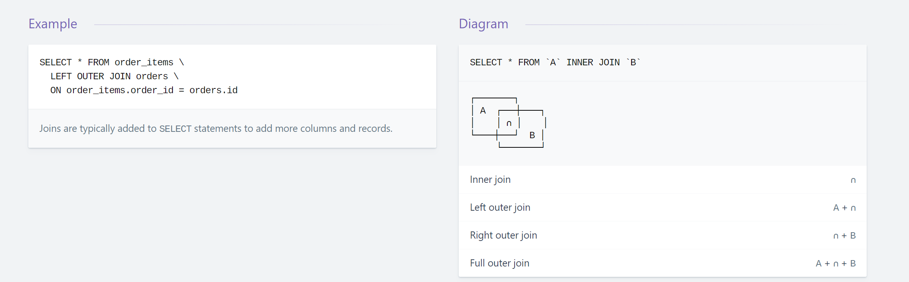

```sql
SELECT * FROM `A` INNER JOIN `B`
┌────────┐
│ A  ┌───┼────┐
│    │ ∩ │    │
└────┼───┘  B │
     └────────┘
Inner join	∩
Left outer join	A + ∩
Right outer join	∩ + B
Full outer join	A + ∩ + B
```

参考：
https://devhints.io/sql-join
