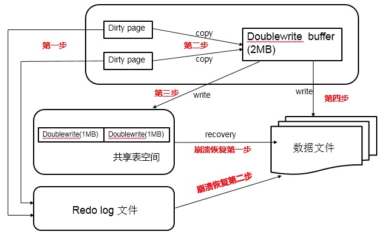

https://www.cnblogs.com/mydriverc/p/8301797.html


一、经典Partial page write问题？

介绍double write之前我们有必要了解partial page write（部分页失效）问题。

InnoDB中有记录（Row）被更新时，先将其在Buffer Pool中的page更新，并将这次更新记录到Redo Log file中，这时候Buffer Pool中的该page就是被标记为Dirty。在适当的时候（Buffer Pool不够、Redo不够，系统闲置等），这些Dirty Page会被flush到磁盘上。

InnoDB的Page Size一般是16KB，其数据校验也是针对这16KB来计算的，将数据写入到磁盘是以Page为单位进行操作的。我们知道磁盘在写入时，都是以512字节为单位，不能保证MySQL数据页面16KB的一次性原子写。试想，在某个Dirty Page flush的过程中，发生了系统断电（或者OS崩溃），16K的数据只有8K被写到磁盘上，只有一部分写是成功的，这种现象被称为（partial page writes、torn pages、fractured writes）。一旦partial page writes发生，那么在InnoDB恢复时就很尴尬：在InnoDB的Redo Log file中虽然知道这个数据页被修改了，但是却无法知道这个页被修改到什么程度，和这个页面相关的redo也就无法应用了。

有经验的DBA可能会想到，如果发生写失效，MySQL可以根据redo log进行恢复。这是一个办法，但是必须清楚地认识到，redo log中记录的是对页的物理修改，如偏移量800，写’aaaa’记录。如果这个页本身已经发生了损坏，再对其进行重做是没有意义的。MySQL在恢复的过程中检查page的checksum，checksum就是检查page的最后事务号，发生partial page write问题时，page已经损坏，找不到该page中的事务号。在InnoDB看来，这样的数据页是无法通过checksum验证的，就无法恢复。即时我们强制让其通过验证，也无法从崩溃中恢复，因为当前InnoDB存在的一些日志类型，有些是逻辑操作，并不能做到幂等。

为了解决这个问题，InnoDB实现了double write buffer，简单来说，就是在写数据页之前，先把这个数据页写到一块独立的物理文件位置（ibdata），然后再写到数据页。这样在宕机重启时，如果出现数据页损坏，那么在应用redo log之前，需要通过该页的副本来还原该页，然后再进行redo log重做，这就是double write。double write技术带给innodb存储引擎的是数据页的可靠性，下面对doublewrite技术进行解析，让大家充分理解double write是如何做到保障数据页的可靠性。

二、double write体系结构及工作流程？

double write由两部分组成，一部分是InnoDB内存中的double write buffer，大小为2M，另一部分是物理磁盘上ibdata系统表空间中大小为2MB，共128个连续的Page，既2个分区。其中120个用于批量写脏，另外8个用于Single Page Flush。做区分的原因是批量刷脏是后台线程做的，不影响前台线程。而Single page flush是用户线程发起的，需要尽快的刷脏并替换出一个空闲页出来。

对于批量刷脏，每次找到一个可做flush的page，对其持有S lock，然后将该page拷贝到dblwr中，当dblwr满后者一次批量刷脏结束时，将dblwr中的page全部刷到ibdata中，注意这是同步写操作；然后再唤醒后台IO线程去写数据页。当后台IO线程完成写操作后，会去更新dblwr中的计数以腾出空间，释放block上的S锁，完成写入。

对于Single Page Flush，则做的是同步写操作，在挑出一个可以刷脏的page后，先加入到dblwr中，刷到ibdata，然后写到用户表空间，完成后，会对该用户表空间做一次fsync操作。

Single Page Flush在buffer pool中free page不够时触发，通常由前台线程发起，由于每次single page flush都会导致一次fsync操作，在大并发负载下，如果大量线程去做flush，很显然会产生严重的性能下降。Percona在5.6版本中做了优化，可以选择由后台线程lru manager来做预刷，避免用户线程陷入其中。

如果发生了极端情况（断电），InnoDB再次启动后，发现了一个Page数据已经损坏，那么此时就可以从double write buffer中进行数据恢复了。

double write工作流程如下：

当一系列机制（main函数触发、checkpoint等）触发数据缓冲池中的脏页进行刷新到data file的时候，并不直接写磁盘，而是会通过memcpy函数将脏页先复制到内存中的double write buffer，之后通过double write buffer再分两次、每次1MB顺序写入共享表空间的物理磁盘上。然后马上调用fsync函数，同步脏页进磁盘上。由于在这个过程中，double write页的存储时连续的，因此写入磁盘为顺序写，性能很高；完成double write后，再将脏页写入实际的各个表空间文件，这时写入就是离散的了。各模块协作情况如下图（第一步应为脏页产生的redo记录log buffer，然后log buffer写入redo log file，为简化次要步骤直接连线表示）：




查看doublewrite工作情况，可以执行命令：

```
mysql> show status like "%InnoDB_dblwr%";
+----------------------------+------------+
| Variable_name              | Value      |
+----------------------------+------------+
| Innodb_dblwr_pages_written |61932183    |
| Innodb_dblwr_writes        |15237891    |
+----------------------------+------------+
2 rows in set (0.01 sec)
```

以上数据显示，double write一共写了 61932183个页，一共写了15237891次，从这组数据我们可以分析，之前讲过在开启double write后，每次脏页刷新必须要先写double write，而double write存在于磁盘上的是两个连续的区，每个区由连续的页组成，一般情况下一个区最多有64个页，所以一次IO写入应该可以最多写64个页。而根据以上我这个系统Innodb_dblwr_pages_written与Innodb_dblwr_writes的比例来看，一次大概在4个页左右，远远还没到64，所以从这个角度也可以看出，系统写入压力并不高。

如果操作系统在将页写入磁盘的过程中发送了崩溃，在恢复过程中，InnoDB存储引擎可以从工序表空间中的double write中找到该页的副本，将其复制到表空间文件，再应用redo log。下面显示了一个由double write进行恢复的过程：

```
090924 11:36:32  mysqld restarted
090924 11:26:33  InnoDB: Database was not shut down normally!
InnoDB: Starting crash recovery.
InnoDB: Reading tablespace information from the .ibd files...
InnoDB: Crash recovery may have faild for some .ibd files!
InnoDB: Restoring possible half-written data pages from the doublewrite.
InnoDB: buffer...
```

三、double write的缺点?

dblwr位于共享表空间上的double write buffer实际上也是一个文件，引入了一次额外写的开销，每个数据页都被要求写两次。由于需要大量的fsync操作，所以它会降低MySQL的整体性能，但是并不会降低到原来的50%（网上有人测试过，大概10%左右）。这主要是因为：

1) double write是一个连接的存储空间，所以硬盘在写数据的时候是顺序写，而不是随机写，这样性能更高。对于目前比较流行的SSD来说，随机写已经不是问题，性能影响可能更小。

2) 将数据从double write buffer写到真正的segment中的时候，系统会自动合并连接空间刷新的方式，每次可以刷新多个pages。

double write默认开启，参数skip_innodb_doublewrite虽然可以禁止使用double write功能，但还是强烈建议大家使用double write。避免部分写失效问题，当然，如果你的数据表空间放在本身就提供了部分写失效防范机制的文件系统上，如ZFS/FusionIO/DirectFS文件系统，在这种情况下，就可以不开启doublewrite了。

其实两次写并不是什么特性或优点，它只是一个被动解决方案而已。这个问题的本质就是磁盘在写入时，都是以512字节为单位，不能保证MySQL数据页面16KB的一次性原子写，所以才有可能产生页面断裂的问题。而目前有些厂商从硬件驱动层面做了优化，可以保证16KB（或其他配置）数据的原子性写入。如果真是这样，那么两次写就完全没有必要了，取消两次写，才是最终级优化，值得期待。

四、double write在恢复的时候是如何工作的？

如果是写double write buffer本身失败，那么这些数据不会被写到磁盘，InnoDB此时会从磁盘载入原始的数据，然后通过InnoDB的事务日志来计算出正确的数据，重新写入到double write buffer。

如果double write buffer写成功的话，但是写磁盘失败，InnoDB就不用通过事务日志来计算了，而是直接用buffer的数据再写一遍。如上图中显示，在恢复的时候，InnoDB直接比较页面的checksum，如果不对的话，Innodb存储引擎可以从共享表空间的double write中找到该页的一个最近的副本，将其复制到表空间文件，再应用redo log，就完成了恢复过程。因为有副本所以也不担心表空间中数据页是否损坏，但InnoDB的恢复通常需要较长的时间。

五、MariaDB/MySQL/Facebook/Percona 5.7的改进

MariaDB/MySQL改进

MariaDB使用参数innodb_use_atomic_writes来控制原子写行为，当打开该选项时，会使用O_DIRECT模式打表空间，通过posix_fallocate来扩展文件（而不是写0扩展），当在启动时检查到支持atomic write时，即使开启了innodb_doublewrite，也会关闭掉。

Oracle MySQL同样支持FusionIO的Atomic Write特性（Fusion-io Non-Volatile Memory (NVM) file system），对于支持原子写的文件系统，也会自动关闭double write buffer。

Facebook改进

实际上这不能算是改进，只是提供了一个新的选项。在现实场景中，宕机是非常低概率的事件。大部分情况下dblwr都是用不上的。但如果我们直接关闭dblwr，如果真的发生例如掉电宕机了，我们需要知道哪些page可能损坏了。

因此Facebook MySQL提供了一个选项，可以写page之前，只将对应的page number写到dblwr中（而不是写全page），在崩溃恢复时，先读出记录在dblwr中的page号，检查对应的数据页是否损坏，如果损坏了，那就需要从备库重新恢复该实例。

Percona 5.7改进

Percona Server的每个版本都对InnoDB的刷脏逻辑做了不少的优化，进入5.7版本也不例外。在官方5.7中已经实现了多个Page Cleaner，我们可以把Page Cleaner配置成和buffer pool instance的个数相同，可以更好的实现并行刷脏。

但是官方版本中，Page cleaner既要负责刷FLUSH LIST，同时也要做LRU FLUSH(但每个bp instance不超过innodb_lru_scan_depth)。而这两部分任务是可以独立进行的。

因此Percona Server增加了多个LRU FLUSH线程，可以更高效的进行lru flush，避免用户线程陷入single page flush状态。每个buffer pool instance拥有自己的lru flush线程和page cleaner线程。lru flush基于当前free list的长度进行自适应计算。 每个lru线程负责自己的那个Buffer pool。因此不同lru flush线程的繁忙程度可能是不一样的。

在解决上述问题后，bp flush的并行效率大大的提升了。但是对于所有的刷脏操作，都需要走到double write buffer。这意味着dblwr成为了新的瓶颈。为了解决这个问题，dblwr进行了拆分，每个bp instance都有自己的dblwr区域。这样各个Lru flush线程及Page cleaner线程在做page flush时就不会相互间产生锁冲突，从而提升了系统的扩展性。

你可以通过参数来配置一个独立于ibdata之外的文件来存储dblwr，文件被划分成多个区域，分区数为bp instance的个数，每个分区的大小为2 * srv_doublewrite_batch_size，每个batch size默认配置为120个page，其中一个用于刷FLUSH LIST，一个用于刷LRU。

如果fast shutdown设置为2，dblwr文件在正常shutdown时会被删除掉，并在重启后重建。


https://mp.weixin.qq.com/s?src=11&timestamp=1586825661&ver=2277&signature=e95dQ48KUykYwiyPpap5DzeoCQ*MHtccyTXrbgYXu51TiHJnN1*0vvlkEn2zQ1x3G0WldSQbnCrsnwn*uG5aB1WW1jhwSa-WaoQI4w4W3eSbA4RXRxqUJIxKYZsAC87w&new=1
